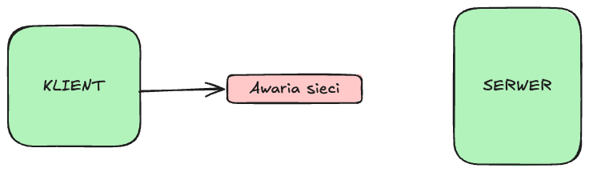

# Problemy systemów scentralizowanych

### Skalowanie
- **Trudności w skalowaniu horyzontalnym**: Wszystkie żądania i przetwarzanie danych odbywają się w jednym centralnym punkcie.
- **Ograniczona wydajność**: Centralny serwer musi obsługiwać większe obciążenie, co prowadzi do konieczności kosztownej modernizacji sprzętu (np. większa moc procesora, pamięć).

### Przepustowość
- **Wąskie gardło**: Wszystkie dane muszą przechodzić przez centralny serwer, co ogranicza przepustowość systemu.
- **Zwiększona latencja**: Wzrost liczby użytkowników i przesyłanych danych może powodować opóźnienia w odpowiedziach systemu.

### Problemy sieciowe
- **Centralny punkt zależności**: Problemy z siecią (np. opóźnienia, utrata pakietów) między klientami a serwerem mogą prowadzić do przerw w dostępie do usług.
- **Nieelastyczność**: Awaria łącza prowadzi do odcięcia wszystkich klientów od systemu.

### Utrata danych
- **Centralna baza danych**: Dane są przechowywane w jednym miejscu, co zwiększa ryzyko utraty danych w przypadku awarii, ataków lub błędów.
- **Brak replikacji**: Zazwyczaj scentralizowane systemy opierają się na pojedynczej kopii danych, co ogranicza możliwości odzyskiwania po awarii.

### Single Point of Failure (SPOF)
- **Punkt krytyczny**: Awaria centralnego serwera powoduje niedostępność całego systemu.
- **Zwiększone ryzyko ataku**: Centralny serwer jest łatwym celem dla ataków DDoS, ponieważ cały ruch przechodzi przez jedno miejsce.

---

# Atrybuty jakości systemów rozproszonych

### Skalowalność
- **Horyzontalna skalowalność**: Dodawanie kolejnych węzłów zwiększa wydajność systemu bez zmiany jego architektury.
- **Dynamiczne zarządzanie obciążeniem**: Obciążenie jest równomiernie rozkładane między węzły.

### Wysoka dostępność
- **Odporność na awarie**: Węzły są replikowane, a awaria jednego z nich nie wpływa na działanie całego systemu.
- **Geograficzna redundancja**: Usługi mogą działać z różnych lokalizacji.

### Elastyczność sieciowa
- **Adaptacja do problemów sieciowych**: Mechanizmy takie jak retries, load balancing czy partitioning zapewniają działanie nawet przy częściowej awarii sieci.
- **Niskie opóźnienia lokalne**: Węzły mogą być blisko klientów, co zmniejsza latencję.

### Odporność na utratę danych
- **Replikacja danych**: Dane są kopiowane na wiele węzłów, co minimalizuje ryzyko ich utraty.
- **Konsensus i spójność**: Protokoły takie jak Paxos lub Raft gwarantują spójność danych między węzłami.

### Brak SPOF
- **Rozproszona kontrola**: Brak centralnego punktu decyzyjnego eliminuje pojedyncze punkty awarii.
- **Automatyczne przełączanie awaryjne**: System automatycznie wybiera nowe węzły liderów w przypadku awarii.

---

# Porównanie architektury scentralizowanej i zdecentralizowanej

| **Cechy**               | **Scentralizowana**                     | **Zdecentralizowana**                 |
|--------------------------|------------------------------------------|----------------------------------------|
| **Skalowalność**         | Trudna (wąskie gardło w jednym punkcie) | Łatwa (dodanie nowych węzłów)         |
| **Przepustowość**        | Ograniczona przez centralny serwer      | Równomiernie rozłożona na węzły       |
| **Zarządzanie danymi**   | Dane w jednym miejscu                  | Dane replikowane na wiele węzłów      |
| **Odporność na awarie**  | Wysokie ryzyko SPOF                     | Wysoka, dzięki redundancji            |
| **Problemy sieciowe**    | Silny wpływ na cały system              | Lokalne problemy mają ograniczony zasięg |
| **Latencja**             | Wyższa, szczególnie przy dużych odległościach | Niższa, dzięki lokalnym węzłom         |
| **Złożoność**            | Prosta implementacja                   | Wyższa złożoność zarządzania          |

---

# Koordynacja systemów rozproszonych

Systemy rozproszone muszą koordynować działania między węzłami, aby zapewnić spójność i poprawne działanie w obliczu opóźnień sieci, awarii oraz braku globalnej synchronizacji czasu. Kluczowe elementy koordynacji to:

---

## Wybór lidera w systemie rozproszonym
- **Lider**:
    - Węzeł pełniący kluczową rolę w systemie, np. zarządzanie metadanymi, delegowanie zadań, synchronizacja.

- **Wyzwania wyboru lidera**:
    - Jednoznaczny wybór: System musi wybrać dokładnie jednego lidera.
    - Tolerancja na awarie: Wybór lidera musi działać nawet w obliczu awarii części węzłów.
    - Reelekcja: W przypadku awarii lidera, system musi automatycznie wybrać nowego lidera.

- **Algorytmy wyboru lidera**:
    - **Bully Algorithm**: Węzeł o najwyższym identyfikatorze zostaje liderem.
    - **Raft**: Wybór lidera jest wbudowany w mechanizm konsensusu (węzły głosują na lidera w określonym czasie).
    - **Kto pierwszy ten lepszy**: Pierwszy węzeł, który zgłosi swoją kandydaturę, zostaje liderem.
---

## Algorytmy konsensusu
- **Cel**:
    - Zapewnienie, że wszystkie węzły w systemie podejmują zgodne decyzje (np. dotyczące konfiguracji, transakcji).

- **Wyzwania**:
    - Awaria węzłów: System musi osiągnąć konsensus nawet przy częściowych awariach.
    - Opóźnienia sieciowe: Niepewność co do statusu węzłów może utrudniać konsensus.
    - Spójność vs dostępność: Decyzje o konsensusie muszą uwzględniać kompromisy między tymi dwoma cechami.

- **Popularne algorytmy konsensusu**:
    - **Paxos**: Zapewnia spójność w systemie, ale jest skomplikowany w implementacji.
    - **Raft**: Prostszy i bardziej zrozumiały algorytm konsensusu, powszechnie używany w praktyce.
    - **Zab**: Używany w Apache Zookeeper, zaprojektowany z myślą o zarządzaniu liderem i transakcjami w rozproszonych systemach.

---

## Przykład: Raft https://raft.github.io/ 
Raft to algorytm konsensusu zaprojektowany z naciskiem na prostotę i łatwość implementacji.

### Kluczowe komponenty Raft:
1. **Leader Election**:
    - Węzły głosują, aby wybrać lidera w przypadku jego awarii.
    - Wybór lidera następuje, gdy węzeł osiąga timeout bez komunikacji z liderem.
2. **Log Replication**:
    - Lider zarządza replikacją logów między węzłami.
    - Każdy wpis w logu musi zostać potwierdzony przez większość węzłów (quorum), zanim stanie się "zatwierdzony".
3. **Safety**:
    - Gwarancja, że dane nie zostaną utracone nawet w przypadku awarii lidera.
    - Każdy nowy lider posiada najnowszą wersję logów.

### Przykład działania:
1. Lider proponuje wpis do logu (np. zmianę konfiguracji).
2. Węzły głosują, czy zaakceptować wpis (quorum).
3. Po zatwierdzeniu lider powiadamia klientów o sukcesie.

---

# Modele spójności w systemach rozproszonych

Systemy rozproszone używają różnych modeli spójności w zależności od wymagań dotyczących dokładności danych, wydajności i tolerancji na awarie. Oto omówienie najważniejszych modeli:

---

## 1. **Linearizability (Linearność)**

### Definicja:
- Operacje wydają się wykonywać atomowo i w porządku globalnym, jakby były przetwarzane przez pojedynczy węzeł.
- Każda operacja ma określony punkt w czasie, w którym jej wynik jest widoczny dla wszystkich.

### Właściwości:
- Gwarantuje **najsilniejszą spójność**.
- Każde odczytanie zawsze zwraca najbardziej aktualny zapis.
- W praktyce oznacza, że system "zachowuje się" jak system jednowęzłowy.

### Zastosowania:
- Krytyczne aplikacje finansowe (np. przelewy bankowe).
- Systemy zarządzania transakcjami.

### Wady:
- Wysokie opóźnienia: Wymaga synchronizacji między węzłami.
- Trudne do osiągnięcia w dużych, geograficznie rozproszonych systemach.

---

## 2. **Strong Consistency (Silna spójność)**

### Definicja:
- Każda operacja odczytu zwraca najnowszą wartość zapisaną w systemie, niezależnie od tego, który węzeł odczytuje dane.
- Osiąga się to przez mechanizmy konsensusu (np. Raft, Paxos).

### Właściwości:
- Zapewnia spójność między wszystkimi węzłami w czasie rzeczywistym.
- Operacje są natychmiast widoczne dla wszystkich.

### Zastosowania:
- Systemy baz danych wymagające transakcji ACID.
- Aplikacje wymagające absolutnej zgodności danych.

### Wady:
- Wysoka latencja.
- Słaba wydajność w środowiskach o wysokiej dynamice.

---

## 3. **Causal Consistency (Spójność przyczynowa)**

### Definicja:
- Operacje są widoczne w takiej kolejności, która zachowuje relacje przyczynowe (jeśli A powoduje B, to A zawsze będzie widoczne przed B).
- Operacje niezależne (niepowiązane przyczynowo) mogą być widoczne w dowolnej kolejności.

### Właściwości:
- Silniejsza niż **eventual consistency**, ale słabsza niż **strong consistency**.
- Nie wymaga globalnego porządku operacji.

### Przykład:
1. Węzeł A zapisuje wartość `x = 1`.
2. Węzeł B odczytuje `x = 1` i na tej podstawie zapisuje `y = 2`.
3. Każdy węzeł odczytujący `y = 2` zobaczy także `x = 1`.

### Zastosowania:
- Media społecznościowe (np. "polubienia" widoczne po publikacji posta).
- Systemy kolaboracyjne (np. edytory dokumentów).

### Wady:
- Nie gwarantuje globalnej spójności (kolejność operacji zależy od relacji przyczynowych).

---

## 4. **Eventual Consistency (Spójność ostateczna)**

### Definicja:
- W systemie, który nie doświadcza nowych operacji, wszystkie kopie danych z czasem staną się zgodne.
- Nie ma gwarancji, że odczyt zawsze zwróci najnowszą wartość.

### Właściwości:
- Najsłabsza forma spójności.
- Bardzo wydajna, ponieważ nie wymaga natychmiastowej synchronizacji.

### Przykład:
1. Wartość `x = 1` jest zapisana na jednym węźle.
2. Z czasem aktualizacja zostanie zreplikowana na inne węzły, ale podczas propagacji węzły mogą zwracać różne wartości.

### Zastosowania:
- Systemy o dużej dostępności, takie jak DNS.
- Bazy danych NoSQL (np. DynamoDB, Cassandra).

### Wady:
- Dane mogą być niespójne przez pewien czas.
- Utrudnia implementację logiki biznesowej opartej na natychmiastowej spójności.

---

# Porównanie modeli spójności

| **Model**              | **Spójność**       | **Opóźnienia**  | **Wydajność**       | **Przykłady zastosowań**                      |
|-------------------------|--------------------|-----------------|---------------------|-----------------------------------------------|
| **Linearizability**     | Najsilniejsza     | Wysokie         | Niska               | Systemy finansowe, zarządzanie krytycznymi danymi |
| **Strong Consistency**  | Silna             | Wysokie         | Średnia             | Bazy danych ACID, transakcje                  |
| **Causal Consistency**  | Średnia           | Średnie         | Wysoka              | Media społecznościowe, współpraca w czasie rzeczywistym |
| **Eventual Consistency**| Najsłabsza        | Niskie          | Bardzo wysoka       | DNS, systemy NoSQL                            |

---

# Architektura Consistent Core

> "Implement a smaller cluster of 3 to 5 nodes which provides linearizability guarantee as well as fault tolerance. A separate data cluster can use the small consistent cluster to manage metadata and for taking cluster-wide decisions with primitives like Lease. This way, the data cluster can grow to a large number of servers but still be able to do certain actions that need strong consistency guarantees using the smaller metadata cluster."
> 
> Martin Fowler
 

### Czym jest Consistent Core?
Consistent Core to architektura stosowana w systemach rozproszonych, w której:
- **Jądro systemu (Core)**:
    - Odpowiada za spójność krytycznych danych i decyzji.
    - Używa mechanizmów konsensusu (np. Raft) do zapewnienia spójności między węzłami.
- **Otoczka systemu (Outer Layer)**:
    - Wspiera skalowalność i wysoką dostępność.
    - Może działać w trybie "eventual consistency" (spójność ostateczna), co zwiększa wydajność.

### Zalety Consistent Core:
1. **Spójność krytycznych operacji**:
    - Decyzje dotyczące konfiguracji, metadanych czy transakcji są podejmowane w sposób spójny i niezawodny.
2. **Skalowalność operacji niekrytycznych**:
    - Dane o mniejszym znaczeniu mogą być zarządzane w sposób mniej rygorystyczny (np. z opóźnioną synchronizacją).
3. **Redundancja**:
    - Jądro systemu jest silnie replikowane, co minimalizuje ryzyko utraty danych.

### Przykład zastosowania:
- **Kubernetes**:
    - Etcd działa jako consistent core do zarządzania konfiguracją i stanem klastra.
    - Kontenery i aplikacje mogą działać w sposób elastyczny (eventual consistency).

---

