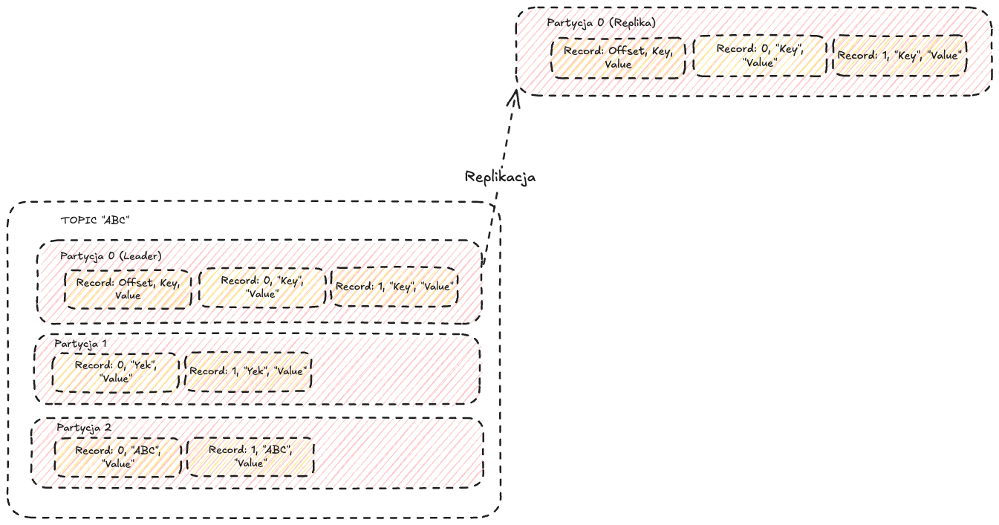
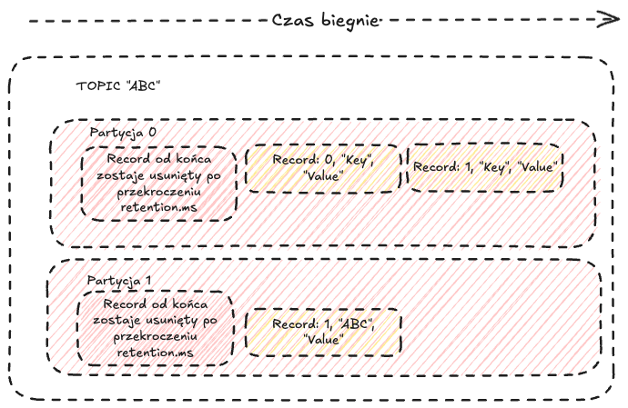
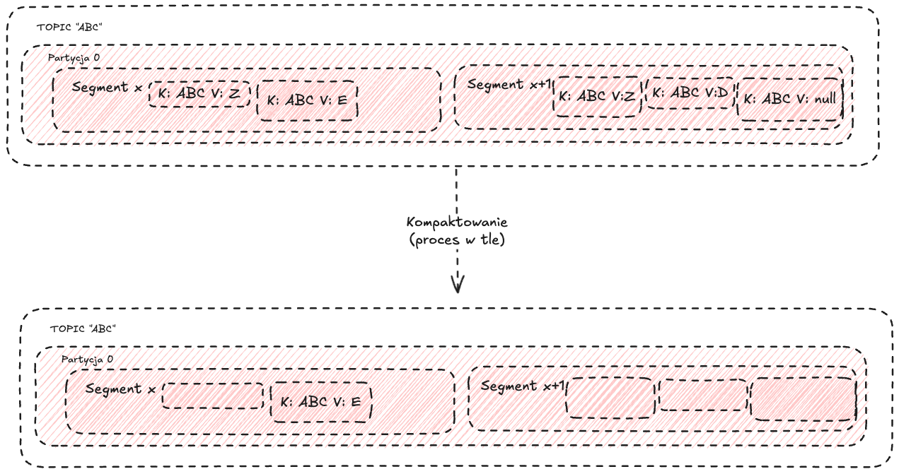

# Kafka

#### Uruchom cluster kafki
```bash
  docker run -d --name=kafka-1 -p 29092:29092 --network mynetwork -e KAFKA_ZOOKEEPER_CONNECT=zzk-1:22181,zzk-2:32181,zzk-3:42181 -e KAFKA_ADVERTISED_LISTENERS=PLAINTEXT://kafka-1:29092 -e KAFKA_MIN_INSYNC_REPLICAS=2 confluentinc/cp-kafka:7.7.1
```

```bash
  docker run -d --name=kafka-2 -p 39092:39092 --network mynetwork -e KAFKA_ZOOKEEPER_CONNECT=zzk-1:22181,zzk-2:32181,zzk-3:42181 -e KAFKA_ADVERTISED_LISTENERS=PLAINTEXT://kafka-2:39092 -e KAFKA_MIN_INSYNC_REPLICAS=2 confluentinc/cp-kafka:7.7.1
```

```bash
  docker run -d --name=kafka-3 -p 49092:49092 --network mynetwork -e KAFKA_ZOOKEEPER_CONNECT=zzk-1:22181,zzk-2:32181,zzk-3:42181 -e KAFKA_ADVERTISED_LISTENERS=PLAINTEXT://kafka-3:49092 -e KAFKA_MIN_INSYNC_REPLICAS=2 confluentinc/cp-kafka:7.7.1
```

### Sprawdź logi kontenerów

```bash
  docker ps
```

```bash
  docker logs kafka-1 | grep started
```

```bash
  docker logs kafka-2 | grep started
```

```bash
  docker logs kafka-3 | grep started
```

### Uruchom Kafka UI

```bash
  docker run -d -p 8080:8080  --network mynetwork  --name=kafka-ui -e DYNAMIC_CONFIG_ENABLED=true provectuslabs/kafka-ui
```

### Stwórzmy kilka tematów

### Prosty temat z 1 partycją i 3 replikami
```bash
  docker run --rm --network mynetwork confluentinc/cp-kafka:7.7.1 kafka-topics --create --topic test --partitions 1 --replication-factor 3 --if-not-exists --bootstrap-server kafka-1:29092,kafka-2:39092,kafka-3:49092
```

```bash
  docker run --network mynetwork --rm confluentinc/cp-kafka:7.7.1 kafka-topics --describe --topic test --bootstrap-server kafka-1:29092,kafka-2:39092,kafka-3:49092
```

### Temat z wieloma partycjami



```bash
  docker run --rm --network mynetwork confluentinc/cp-kafka:7.7.1 kafka-topics --create --topic test-multi-partitions --partitions 3 --replication-factor 3 --if-not-exists --bootstrap-server kafka-1:29092,kafka-2:39092,kafka-3:49092
```
```bash
  docker run --network mynetwork --rm confluentinc/cp-kafka:7.7.1 kafka-topics --describe --topic test-multi-partitions --bootstrap-server kafka-1:29092,kafka-2:39092,kafka-3:49092
```
### Temat o niskiej czasowej retencji

```bash
  docker run --network mynetwork --rm confluentinc/cp-kafka:7.7.1 kafka-topics --create --topic retention-bytes-topic --bootstrap-server kafka-1:29092,kafka-2:39092,kafka-3:49092 --partitions 3 --replication-factor 2 --config retention.ms=60000
````

### Temat o niskiej ilości rozmiaru danych retencji



```bash
  docker run --network mynetwork --rm confluentinc/cp-kafka:7.7.1 kafka-topics --create --topic retention-bytes-topic --bootstrap-server kafka-1:29092,kafka-2:39092,kafka-3:49092 --partitions 3 --replication-factor 2 --config retention.bytes=10240
```

### Parametr min insync inny dla tematu niż domyślny

```bash
  docker run --network mynetwork --rm confluentinc/cp-kafka:7.7.1 kafka-topics --create --topic in-sync-topic --bootstrap-server kafka-1:29092,kafka-2:39092,kafka-3:49092 --partitions 1 --replication-factor 3 --config min.insync.replicas=1
```
### Agresywne compactowanie



```bash
  docker run --network mynetwork --rm confluentinc/cp-kafka:7.7.1 kafka-topics --create --topic compacted-aggressive-topic --bootstrap-server kafka-1:29092,kafka-2:39092,kafka-3:49092 --partitions 2 --replication-factor 3 --config cleanup.policy=compact --config min.cleanable.dirty.ratio=0.01 --config segment.ms=1000 --config segment.bytes=1048576
```

#### Producent konsolowy

```bash
  docker run -it --network mynetwork --rm confluentinc/cp-kafka:7.7.1 /bin/bash
```

```
kafka-console-producer --topic test --bootstrap-server kafka-1:29092,kafka-2:39092,kafka-3:49092 
```

```
kafka-console-producer --topic test-multi-partitions --bootstrap-server kafka-1:29092,kafka-2:39092,kafka-3:49092 --property "parse.key=true" --property "key.separator=:"
```

#### Konsument konsolowy

```bash
  docker run --rm --network mynetwork confluentinc/cp-kafka:7.7.1 kafka-console-consumer --topic test --bootstrap-server kafka-1:29092,kafka-2:39092,kafka-3:49092 --from-beginning
```

```bash
  docker run --rm --network mynetwork confluentinc/cp-kafka:7.7.1 kafka-console-consumer --topic test-multi-partitions --bootstrap-server kafka-1:29092,kafka-2:39092,kafka-3:49092 --group my-consumer-group --from-beginning
```

### Co Zookeeper przechowuje dla Kafki?

```bash
  docker exec -it zzk-1 zookeeper-shell localhost:22181
```

#### Ta komenda wyświetla wszystkie identyfikatory brokerów zarejestrowanych obecnie w klastrze Kafka.
```
ls /brokers/ids
```

#### Ta komenda pobiera metadane dla konkretnego brokera.
```
get /brokers/ids/<broker-id>
```

#### Ta komenda wyświetla wszystkie tematy w klastrze Kafka.
```
ls /brokers/topics
```

#### Ta komenda pobiera konfigurację dla konkretnego tematu.
```
get /brokers/topics/<topic-name>
```

#### Ta komenda pobiera informacje o bieżącym węźle kontrolera, który zarządza klastrem.
```
get /controller
```

#### Ta komenda wyświetla wszystkie aktywne węzły w klastrze.
```
ls /zookeeper/quota
```

#### Ta komenda wyświetla wszystkie grupy konsumentów w klastrze Kafka.
```
ls /consumers
```

