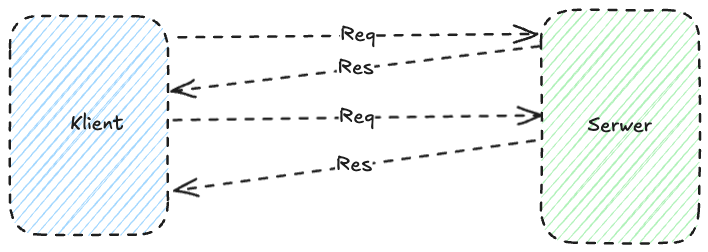
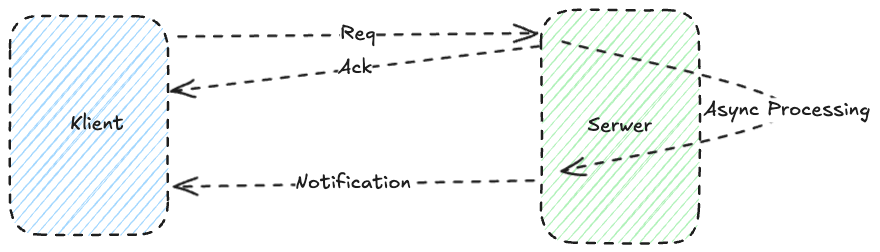
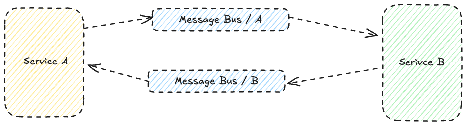
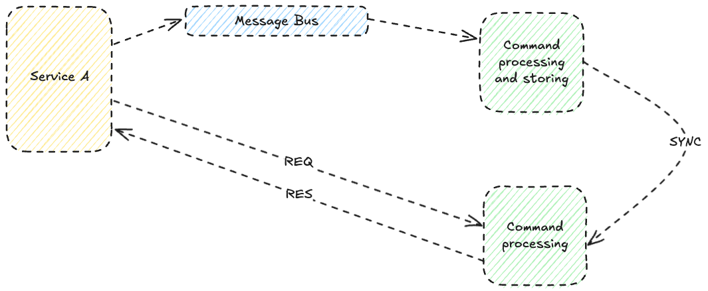
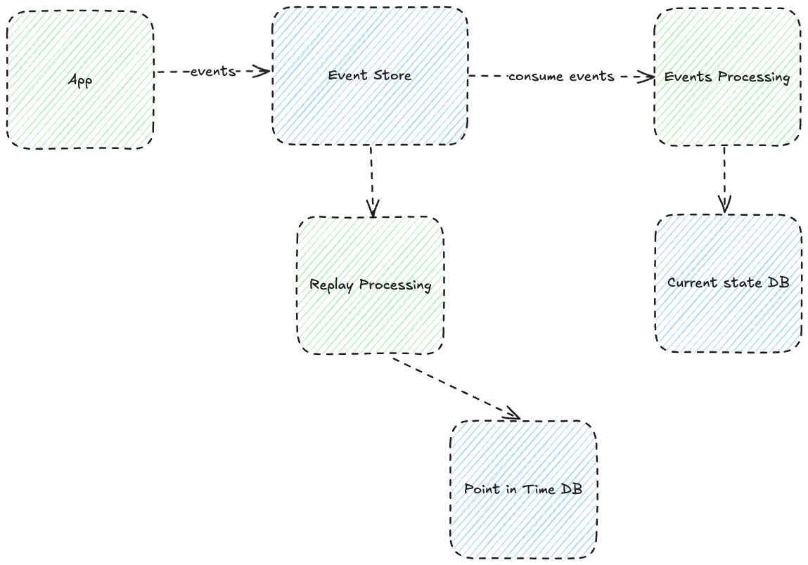
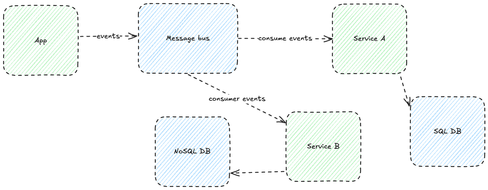

# Komunikacja synchroniczna vs asynchroniczna

## Komunikacja synchroniczna:
### Definicja:
Synchroniczna komunikacja wymaga natychmiastowej odpowiedzi od odbiorcy po wysłaniu żądania. Klient blokuje się, czekając na odpowiedź.

### Charakterystyka:
- **Czas oczekiwania:** Klient musi poczekać, aż serwer przetworzy żądanie i wyśle odpowiedź.
- **Niezależność:** Systemy są silnie powiązane; awaria serwera może zatrzymać operacje klienta.
- **Przykłady:** HTTP REST, SOAP.
- **Zalety:** Prosta implementacja, łatwe debugowanie.
- **Wady:** Wysoka zależność od dostępności serwera, trudności w skalowaniu.

## Komunikacja asynchroniczna:
### Definicja:
W modelu asynchronicznym klient wysyła żądanie i nie musi czekać na odpowiedź, może kontynuować swoje działanie. Odpowiedź jest przetwarzana w późniejszym czasie.

### Charakterystyka:
- **Czas oczekiwania:** Klient może zająć się innymi zadaniami podczas oczekiwania na odpowiedź.
- **Niezależność:** Systemy są mniej powiązane; awarie serwera nie blokują działania klienta.
- **Przykłady:** RabbitMQ, Kafka, WebSockets.
- **Zalety:** Lepsze skalowanie, większa odporność na awarie.
- **Wady:** Większa złożoność implementacyjna, trudniejsze debugowanie.

---

# Porównanie: REST API vs Event-Driven API

## Przypadek biznesowy: Zarządzanie zamówieniami w sklepie internetowym
Załóżmy, że mamy system e-commerce, w którym użytkownicy mogą składać zamówienia, a dział obsługi klienta musi aktualizować ich status.

### REST API (Synchroniczne):

#### Proces:
1. Klient (np. aplikacja mobilna) wysyła żądanie HTTP POST do serwera w celu utworzenia zamówienia.
2. Serwer przetwarza żądanie i odpowiada HTTP 200 z informacją o powodzeniu.
3. Kolejne żądania (GET, PUT, DELETE) aktualizują status zamówienia.

#### Plusy:
- Prosta komunikacja: klient wie od razu, czy operacja się powiodła.
- Idealne do operacji wymagających natychmiastowego potwierdzenia.

#### Minusy:
- Wysoka zależność od dostępności serwera.
- Problemy z rozproszeniem: trudności w koordynacji wielu serwerów.

---

### Event-Driven API (Asynchroniczne):

#### Proces:
1. Klient publikuje zdarzenie (np. "Utworzono zamówienie") do brokera komunikacyjnego (np. Kafka, RabbitMQ).
2. Inne mikroserwisy, subskrybujące to zdarzenie (np. "Przetwarzanie płatności", "Aktualizacja zapasów"), reagują asynchronicznie.
3. Klient otrzymuje potwierdzenie, gdy zdarzenie zostanie przetworzone.

#### Plusy:
- Skalowalność: łatwe dodawanie nowych subskrybentów.
- Odporność na błędy: awaria jednego serwisu nie zatrzymuje systemu.
- Asynchroniczne przetwarzanie pozwala na realizację wielu zadań równolegle.

#### Minusy:
- Brak natychmiastowego potwierdzenia dla klienta (trzeba zaimplementować mechanizmy kolejek lub powiadomień).
- Trudności w debugowaniu i śledzeniu cyklu życia zdarzenia.

---

# Paradygmaty komunikacji asynchronicznej

## 1. CQRS (Command Query Responsibility Segregation):
****
### Opis:
Oddzielenie logiki odpowiedzialnej za zapisy (komendy) od logiki odpowiedzialnej za odczyty (zapytania).

### Zastosowanie:
- W systemach o dużej liczbie odczytów i relatywnie małej liczbie zapisów (np. systemy analityczne).

### Zalety:
- Możliwość optymalizacji odczytów i zapisów niezależnie.
- Zwiększona wydajność i skalowalność.

### Przykład:
W e-commerce, osobna baza danych dla przetwarzania zamówień i osobna do generowania raportów sprzedaży.

---

## 2. Event Sourcing:

### Opis:
Przechowywanie stanu aplikacji jako serii zdarzeń (eventów) opisujących zmiany stanu.

### Zastosowanie:
- Systemy wymagające pełnej historii zmian (np. bankowość).

### Zalety:
- Możliwość odtworzenia każdego stanu systemu.
- Śledzenie każdej zmiany w systemie.

### Przykład:
W systemie płatności można śledzić każdą operację na koncie klienta (wpłaty, wypłaty, przelewy).

---

## 3. Polyglot Persistence:

### Opis:
Używanie różnych typów baz danych w zależności od wymagań aplikacji.

### Zastosowanie:
- Systemy o zróżnicowanych wymaganiach (np. e-commerce: baza relacyjna dla zamówień, NoSQL dla katalogu produktów).

### Zalety:
- Optymalizacja wydajności dla różnych typów danych.
- Możliwość korzystania z narzędzi najlepiej dopasowanych do problemu.

### Przykład:
W e-commerce można użyć MongoDB dla katalogu produktów (struktura dokumentowa), PostgreSQL dla danych transakcyjnych (relacyjność) i Elasticsearch dla wyszukiwania.

---
