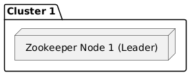
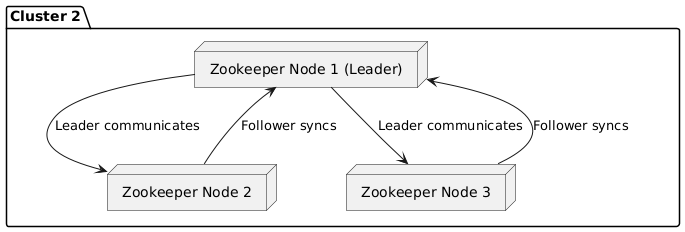
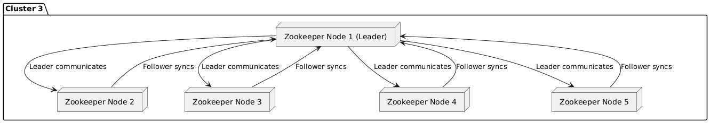

### Uruchom Zookeeper i zapoznaj się z jego podstawowymi funkcjonalnościami

```bash
  docker run -d -p 22181:22181 -p 23888:23888 --name=zzk-1 --network mynetwork -e ZOOKEEPER_SERVER_ID=1 -e ZOOKEEPER_CLIENT_PORT=22181 -e ZOOKEEPER_TICK_TIME=2000 -e ZOOKEEPER_INIT_LIMIT=5 -e ZOOKEEPER_SYNC_LIMIT=2 -e ZOOKEEPER_SERVERS="zzk-1:22888:23888;zzk-2:32888:33888;zzk-3:42888:43888" confluentinc/cp-zookeeper:7.7.1
```
```bash
  docker run -d -p 32181:32181 -p 33888:33888 --name=zzk-2 --network mynetwork -e ZOOKEEPER_SERVER_ID=2 -e ZOOKEEPER_CLIENT_PORT=32181 -e ZOOKEEPER_TICK_TIME=2000 -e ZOOKEEPER_INIT_LIMIT=5 -e ZOOKEEPER_SYNC_LIMIT=2 -e ZOOKEEPER_SERVERS="zzk-1:22888:23888;zzk-2:32888:33888;zzk-3:42888:43888" confluentinc/cp-zookeeper:7.7.1   
```

```bash
  docker run -d -p 42181:42181 -p 43888:43888 --name=zzk-3 --network mynetwork -e ZOOKEEPER_SERVER_ID=3 -e ZOOKEEPER_CLIENT_PORT=42181 -e ZOOKEEPER_TICK_TIME=2000 -e ZOOKEEPER_INIT_LIMIT=5 -e ZOOKEEPER_SYNC_LIMIT=2 -e ZOOKEEPER_SERVERS="zzk-1:22888:23888;zzk-2:32888:33888;zzk-3:42888:43888" confluentinc/cp-zookeeper:7.7.1
   
```

# Sprawdź logi kontenerów

```bash
  docker ps
```

```bash
  docker logs zzk-1 | grep "binding to port"
```

```bash
  docker logs zzk-2 | grep "binding to port"
```

```bash
  docker logs zzk-3 | grep "binding to port"
````

### Uruchom Zookeeper shell


```bash
  docker exec -it zzk-1 zookeeper-shell localhost:22181
```


### Wykonaj poniższe polecenia w Zookeeper shell

```
help
```

```
ls /
```

### Podstawowe funkcje Znode API

```
create /my-node "foo"
```

```
ls /
```

``` 
get /my-node
```

```
get /zookeeper
```    
  
```
create /my-node/deeper-node "bar"
```  
    
```
ls /
```

```
ls /my-node
```
    
```  
ls /my-node/deeper-node
```

```
get /my-node/deeper-node
```

### Zmiana wartości znode

```
set /my-node/deeper-node "newdata"
```

```
get /my-node/deeper-node
```

### Utwórz znode do obserwacji

```
create /node-to-watch ""
```

```
get -w /node-to-watch
```

```
set /node-to-watch "hhhas-changeddddd"
```


### Usuń znode
```
deleteall /node-to-watch
```

### Utwórz znode tymczasowy (zostanie usunięty po rozłączeniu klienta)

```
create -e /ephemeral-node "ephemeral"
```

```
ls /
```

```
get /ephemeral-node
```

#### Utwórz sekwencyjny znode
#### Znode zostanie utworzony z sufiksem liczbowym
#### Sufiks jest unikalny w ramach danego znode
#### Sufiks jest zwiększany o 1 w stosunku do poprzedniego znode

```
create -s /sequence-node "sequence"
```
```
ls /parent-node
```

## Klaster ZooKeeper

### 1 węzeł
### Dla eksperymentów i testów



### 3 węzły
### Dla małych i średnich obciążeń, tolerancji na awarie 1 węzła. Najczęściej stosowane wdrożenie.



### 5 węzłów
### Dla dużych obciążeń, tolerancji na awarie 2 węzłów. Dla dużych klastrów Kafka od 10+ węzłów.


