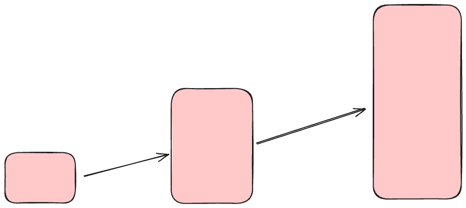
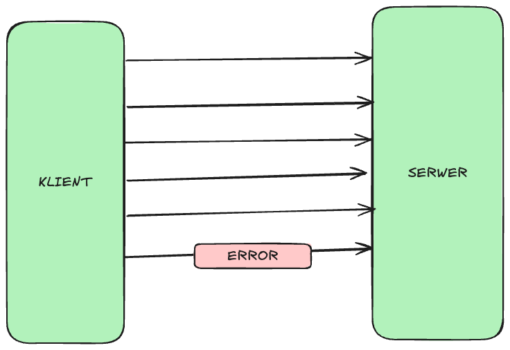
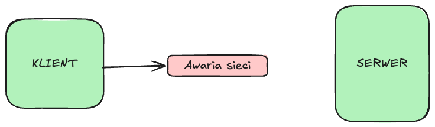
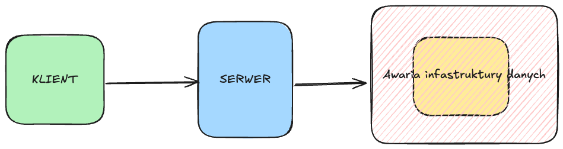
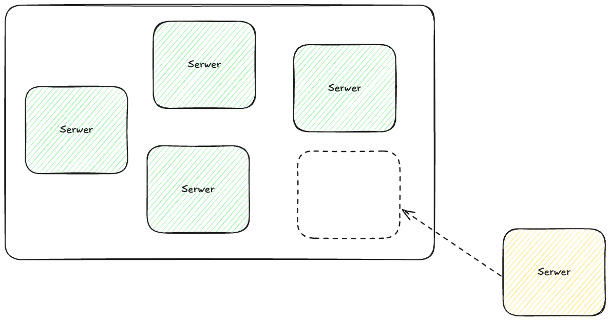
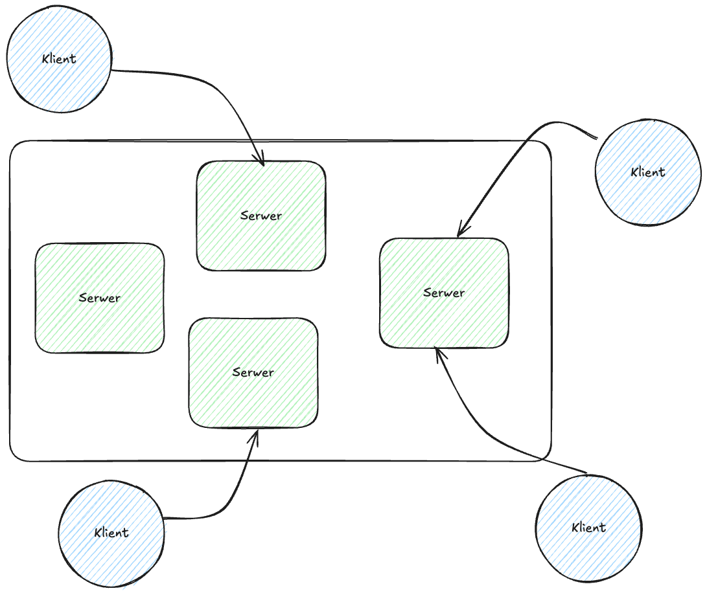
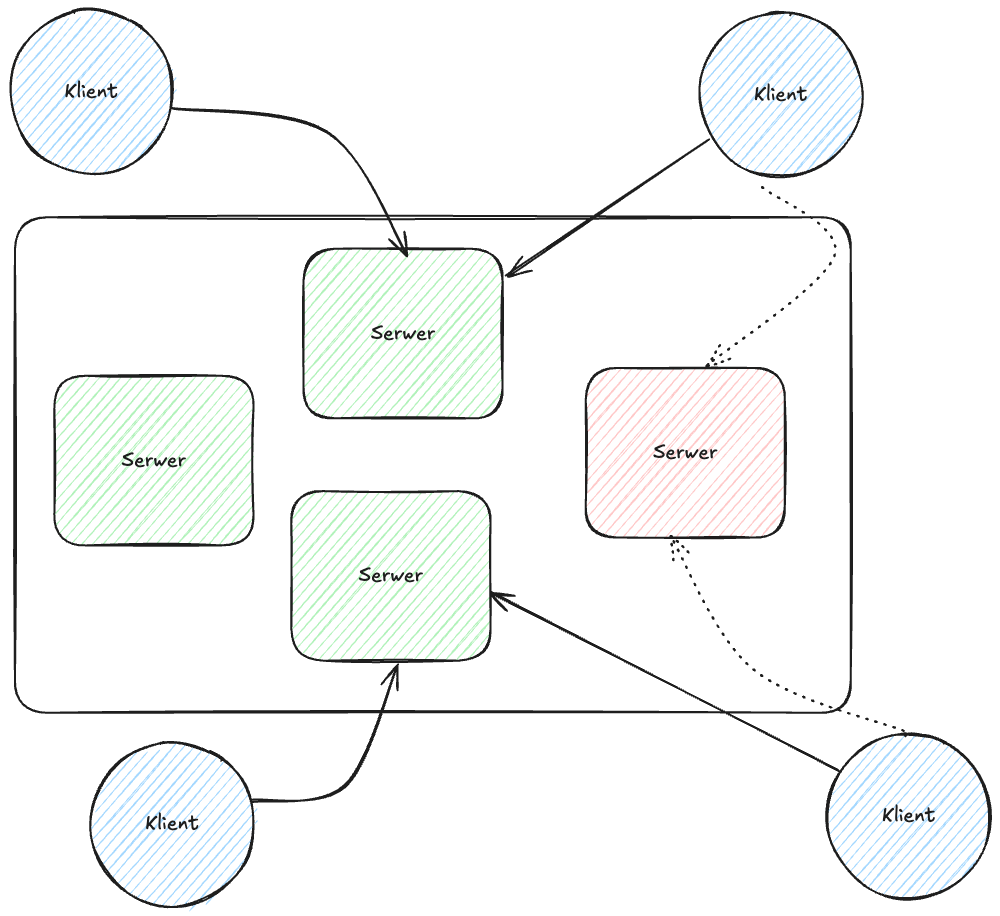
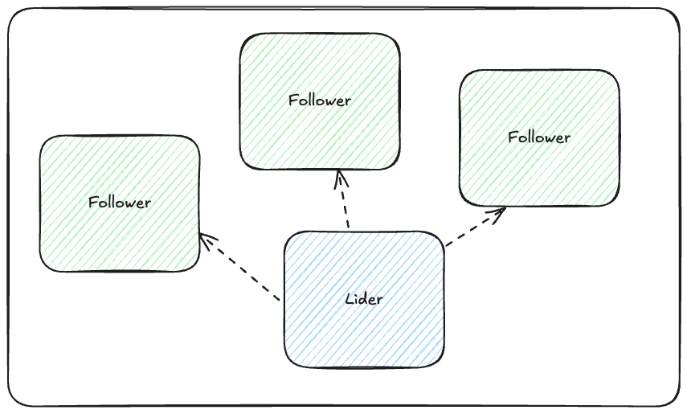
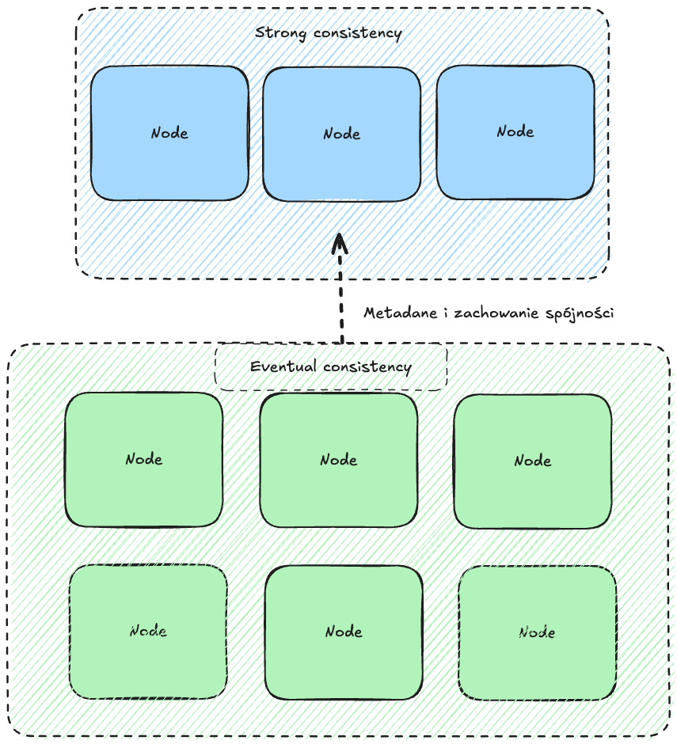

# Problems of Centralized Systems

### Scalability
- **Difficulties in horizontal scaling**: All requests and data processing happen at a single central point.
- **Limited performance**: The central server must handle increased load, requiring expensive hardware upgrades (e.g., more CPU power, memory).

### Throughput
- **Bottleneck**: All data must go through the central server, which limits system throughput.
- **Increased latency**: A growing number of users and data can lead to delays in system responses.

### Network Issues
- **Single point of dependency**: Network issues (e.g., delays, packet loss) between clients and the server can cause service interruptions.
- **Inflexibility**: A link failure cuts off all clients from the system.

### Data Loss
- **Centralized database**: Data stored in a single place increases the risk of data loss due to failures, attacks, or errors.
- **No replication**: Centralized systems typically rely on a single data copy, limiting recovery options.

### Single Point of Failure (SPOF)
- **Critical point**: Failure of the central server makes the entire system unavailable.
- **Increased attack risk**: The central server is an easy target for DDoS attacks since all traffic goes through one point.

---

# Quality Attributes of Distributed Systems

### Scalability
- **Horizontal scalability**: Adding more nodes improves system performance without changing the architecture.
- **Dynamic load management**: Load is evenly distributed across nodes.

### High Availability
- **Fault tolerance**: Nodes are replicated; failure of one does not affect the entire system.
- **Geographic redundancy**: Services can operate from multiple locations.

### Network Flexibility
- **Adaptation to network problems**: Mechanisms like retries, load balancing, and partitioning keep the system running even during partial network failures.
- **Low local latency**: Nodes close to clients reduce latency.

### Data Loss Resilience
- **Data replication**: Data is copied across many nodes to minimize the risk of loss.
- **Consensus and consistency**: Protocols like Paxos or Raft ensure data consistency between nodes.

### No SPOF
- **Distributed control**: No central decision point eliminates single points of failure.
- **Automatic failover**: The system automatically selects new leader nodes in case of failure.

---

# Centralized vs Decentralized Architecture Comparison

| **Feature**              | **Centralized**                        | **Decentralized**                      |
|--------------------------|----------------------------------------|----------------------------------------|
| **Scalability**          | Difficult (bottleneck at a single point) | Easy (add new nodes)                  |
| **Throughput**           | Limited by central server              | Evenly distributed across nodes        |
| **Data Management**      | Data in one place                      | Data replicated across many nodes      |
| **Fault Tolerance**      | High SPOF risk                         | High, thanks to redundancy             |
| **Network Issues**       | Strong impact on the whole system      | Local issues have limited impact       |
| **Latency**              | Higher, especially over long distances | Lower, due to local nodes              |
| **Complexity**           | Simple implementation                  | Higher management complexity           |

---

# Distributed Systems Coordination

Distributed systems must coordinate node actions to ensure consistency and correct operation despite network delays, failures, and lack of global time sync. Key coordination elements:

---

## Leader Election in Distributed Systems
- **Leader**:
    - A node with a key role, e.g., managing metadata, delegating tasks, synchronization.

- **Leader Election Challenges**:
    - Unambiguous selection: The system must select exactly one leader.
    - Fault tolerance: Leader election must work despite some node failures.
    - Reelection: A new leader must be automatically chosen if the current one fails.

- **Leader Election Algorithms**:
    - **Bully Algorithm**: Node with the highest ID becomes the leader.
    - **Raft**: Leader election is part of the consensus process (nodes vote within a time window).
    - **First-Come-First-Served**: First node to nominate itself becomes leader.

---

## Consensus Algorithms
- **Goal**:
    - Ensure all nodes make consistent decisions (e.g., on configuration, transactions).

- **Challenges**:
    - Node failures: Consensus must be possible even if some nodes fail.
    - Network delays: Uncertainty in node status can hinder consensus.
    - Consistency vs availability: Trade-offs must be considered.

- **Popular Consensus Algorithms**:
    - **Paxos**: Guarantees consistency but is complex to implement.
    - **Raft**: Simpler and more understandable; widely used in practice.
    - **Zab**: Used in Apache Zookeeper, designed for leader management and transactions.

---

## Example: Raft https://raft.github.io/
Raft is a consensus algorithm designed for simplicity and ease of implementation.

### Key Components of Raft:
1. **Leader Election**:
    - Nodes vote to elect a leader if the current one fails.
    - Leader election happens when a node times out without hearing from the leader.
2. **Log Replication**:
    - The leader manages log replication between nodes.
    - Each log entry must be confirmed by a majority (quorum) before being committed.
3. **Safety**:
    - Ensures data is not lost even if the leader fails.
    - A new leader always has the most up-to-date log.

### Example Operation:
1. The leader proposes a log entry (e.g., a config change).
2. Nodes vote to accept the entry (quorum).
3. Once confirmed, the leader notifies clients of success.

---

# Consistency Models in Distributed Systems

Distributed systems use different consistency models depending on data accuracy, performance, and fault tolerance requirements. Here's an overview:

---

## 1. **Linearizability**

### Definition:
- Operations appear atomic and in global order, as if processed by a single node.
- Each operation has a specific moment when its result becomes visible to all.

### Properties:
- **Strongest consistency** guarantee.
- Each read always returns the most recent write.
- System behaves like a single-node system.

### Use Cases:
- Critical financial apps (e.g., bank transfers).
- Transaction management systems.

### Drawbacks:
- High latency: Requires node synchronization.
- Hard to achieve in large, geographically distributed systems.

---

## 2. **Strong Consistency**

### Definition:
- Every read returns the most recent value written, no matter which node reads it.
- Achieved through consensus mechanisms (e.g., Raft, Paxos).

### Properties:
- Ensures real-time consistency between all nodes.
- All operations are immediately visible to everyone.

### Use Cases:
- ACID-compliant databases.
- Apps requiring absolute data accuracy.

### Drawbacks:
- High latency.
- Poor performance in highly dynamic environments.

---

## 3. **Causal Consistency**

### Definition:
- Operations are visible in a sequence that preserves causal relationships (if A causes B, A is always seen before B).
- Independent operations may be seen in any order.

### Properties:
- Stronger than **eventual consistency**, weaker than **strong consistency**.
- No need for a global operation order.

### Example:
1. Node A writes `x = 1`.
2. Node B reads `x = 1` and writes `y = 2`.
3. Any node reading `y = 2` will also see `x = 1`.

### Use Cases:
- Social media (e.g., likes appearing after posts).
- Collaborative tools (e.g., document editors).

### Drawbacks:
- No guarantee of global consistency (order depends on causality).

---

## 4. **Eventual Consistency**

### Definition:
- In a system with no new updates, all replicas will eventually become consistent.
- No guarantee that a read returns the latest value.

### Properties:
- **Weakest** form of consistency.
- Very high performance as no immediate sync is needed.

### Example:
1. `x = 1` is written to one node.
2. The update eventually propagates to others, but interim reads may return different values.

### Use Cases:
- Highly available systems like DNS.
- NoSQL databases (e.g., DynamoDB, Cassandra).

### Drawbacks:
- Data may be inconsistent for some time.
- Difficult to implement business logic needing immediate consistency.

---

# Consistency Model Comparison

| **Model**              | **Consistency**   | **Latency**   | **Performance**     | **Example Use Cases**                        |
|------------------------|-------------------|---------------|----------------------|----------------------------------------------|
| **Linearizability**     | Strongest         | High          | Low                  | Financial systems, critical data management  |
| **Strong Consistency**  | Strong            | High          | Medium               | ACID databases, transactions                 |
| **Causal Consistency**  | Medium            | Medium        | High                 | Social media, real-time collaboration        |
| **Eventual Consistency**| Weakest           | Low           | Very high            | DNS, NoSQL systems                           |

---

# Consistent Core Architecture

> "Implement a smaller cluster of 3 to 5 nodes which provides linearizability guarantee as well as fault tolerance. A separate data cluster can use the small consistent cluster to manage metadata and for taking cluster-wide decisions with primitives like Lease. This way, the data cluster can grow to a large number of servers but still be able to do certain actions that need strong consistency guarantees using the smaller metadata cluster."
>
> Martin Fowler

### What is Consistent Core?
Consistent Core is an architecture in distributed systems where:
- **System Core**:
    - Responsible for consistent critical data and decisions.
    - Uses consensus mechanisms (e.g., Raft) to ensure node agreement.
- **Outer Layer**:
    - Supports scalability and high availability.
    - May operate with eventual consistency to boost performance.

### Benefits of Consistent Core:
1. **Consistency for critical operations**:
    - Configuration, metadata, and transactions are managed reliably and consistently.
2. **Scalability for non-critical operations**:
    - Less critical data can be managed with delayed synchronization.
3. **Redundancy**:
    - The core is strongly replicated, minimizing data loss risk.

### Example Use Case:
- **Kubernetes**:
    - Etcd acts as the consistent core managing cluster configuration and state.
    - Containers and apps run with flexibility (eventual consistency).

