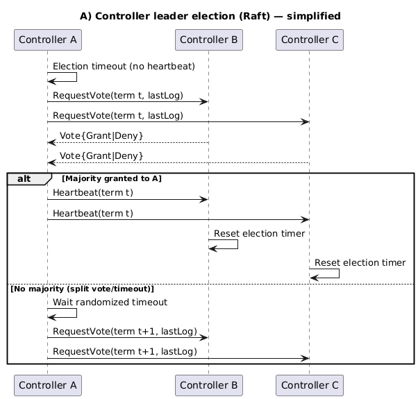
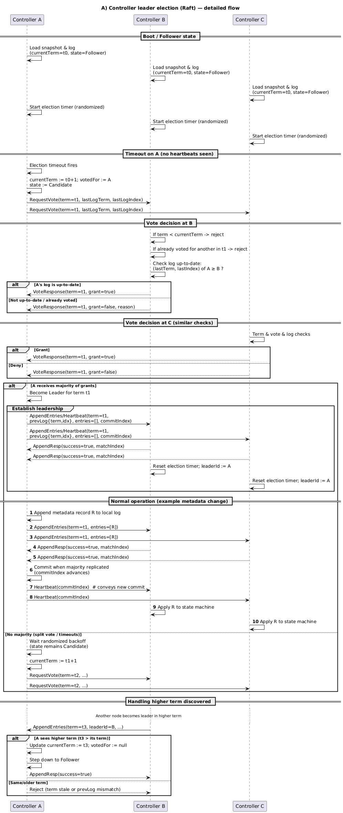
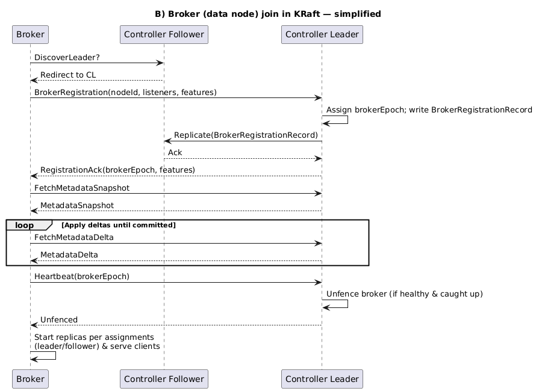

# KRaft

### Generate a cluster ID

```bash
    docker run --rm confluentinc/cp-kafka:7.7.1 kafka-storage random-uuid
```

### For this exercise, we’ll use a custom ID: `PBjDYCIhSEeWDX8tWbRJkg`

### Start the brokers

```bash
    docker run -d --name=kraft-1 \
  -p 30092:30092 -p 30093:30093 \
  --network mynetwork \
  -e KAFKA_NODE_ID=1 \
  -e KAFKA_PROCESS_ROLES=broker,controller \
  -e KAFKA_LOG_DIRS=/tmp/kraft-logs \
  -e KAFKA_CONTROLLER_QUORUM_VOTERS=1@kraft-1:30093,2@kraft-2:40093,3@kraft-3:50093 \
  -e KAFKA_LISTENERS=PLAINTEXT://:30092,CONTROLLER://:30093 \
  -e KAFKA_ADVERTISED_LISTENERS=PLAINTEXT://kraft-1:30092 \
  -e KAFKA_CONTROLLER_LISTENER_NAMES=CONTROLLER \
  -e KAFKA_MIN_INSYNC_REPLICAS=2 \
  -e KAFKA_OFFSETS_TOPIC_REPLICATION_FACTOR=3 \
  -e KAFKA_TRANSACTION_STATE_LOG_REPLICATION_FACTOR=3 \
  -e CLUSTER_ID=PBjDYCIhSEeWDX8tWbRJkg \
  confluentinc/cp-kafka:7.7.1
```

```bash
    docker run -d --name=kraft-2 \
  -p 40092:40092 -p 40093:40093 \
  --network mynetwork \
  -e KAFKA_NODE_ID=2 \
  -e KAFKA_PROCESS_ROLES=broker,controller \
  -e KAFKA_LOG_DIRS=/tmp/kraft-logs \
  -e KAFKA_CONTROLLER_QUORUM_VOTERS=1@kraft-1:30093,2@kraft-2:40093,3@kraft-3:50093 \
  -e KAFKA_LISTENERS=PLAINTEXT://:40092,CONTROLLER://:40093 \
  -e KAFKA_ADVERTISED_LISTENERS=PLAINTEXT://kraft-2:40092 \
  -e KAFKA_CONTROLLER_LISTENER_NAMES=CONTROLLER \
  -e KAFKA_MIN_INSYNC_REPLICAS=2 \
  -e KAFKA_OFFSETS_TOPIC_REPLICATION_FACTOR=3 \
  -e KAFKA_TRANSACTION_STATE_LOG_REPLICATION_FACTOR=3 \
  -e CLUSTER_ID=PBjDYCIhSEeWDX8tWbRJkg \
  confluentinc/cp-kafka:7.7.1
```

```bash
    docker run -d --name=kraft-3 \
  -p 50092:50092 -p 50093:50093 \
  --network mynetwork \
  -e KAFKA_NODE_ID=3 \
  -e KAFKA_PROCESS_ROLES=broker,controller \
  -e KAFKA_LOG_DIRS=/tmp/kraft-logs \
  -e KAFKA_CONTROLLER_QUORUM_VOTERS=1@kraft-1:30093,2@kraft-2:40093,3@kraft-3:50093 \
  -e KAFKA_LISTENERS=PLAINTEXT://:50092,CONTROLLER://:50093 \
  -e KAFKA_ADVERTISED_LISTENERS=PLAINTEXT://kraft-3:50092 \
  -e KAFKA_CONTROLLER_LISTENER_NAMES=CONTROLLER \
  -e KAFKA_MIN_INSYNC_REPLICAS=2 \
  -e KAFKA_OFFSETS_TOPIC_REPLICATION_FACTOR=3 \
  -e KAFKA_TRANSACTION_STATE_LOG_REPLICATION_FACTOR=3 \
  -e CLUSTER_ID=PBjDYCIhSEeWDX8tWbRJkg \
  confluentinc/cp-kafka:7.7.1
```

```bash
    docker exec -it kraft-2 kafka-metadata-quorum --bootstrap-server kraft-1:30092 describe --status
```

# KRAFT Election process (Simplified)



# KRAFT Election Process 



# KRAFT Data Nodes Joining the Cluster



# **Confluent's Recommendations for Kafka KRaft Cluster Configuration**

Confluent recommends choosing between **separating controllers and brokers** or **mixing roles** based on cluster size, workload, and environment. Here's a summary:

---

## **Recommendations by Scenario**

| **Scenario**                                 | **Confluent Recommendation**                      |
|----------------------------------------------|--------------------------------------------------|
| **Large production clusters**                | Separate controllers and brokers                 |
| **High partition count (e.g. thousands)**    | Separate controllers and brokers                 |
| **Small/medium clusters (3–6 nodes)**        | Mixed roles (controllers + brokers) are acceptable |
| **Dev/test environments**                    | Mixed roles are acceptable                        |

---

## **Why Separate Controllers from Brokers?**

| **Benefit**                | **Description**                                                                 |
|----------------------------|----------------------------------------------------------------------------------|
| **Failure isolation**      | A controller failure does not impact broker data processing and vice versa.     |
| **Resource optimization**  | Assign more CPU/memory to controllers and more disk/network to brokers.         |
| **Scalability**            | Independently scale brokers and controllers as needed.                          |
| **High performance**       | Dedicated controllers ensure fast metadata operations in large clusters.        |
| **Stability at scale**     | Thousands of partitions are more manageable with dedicated metadata nodes.      |

---

## **Why Mixing Roles Might Be Appropriate**

| **Benefit**                   | **Description**                                                                   |
|-------------------------------|------------------------------------------------------------------------------------|
| **Simpler architecture**      | Fewer nodes to configure, deploy, and monitor.                                    |
| **Better resource usage**     | In small clusters, nodes handle both data and metadata efficiently.               |
| **Lower infrastructure cost** | Fewer nodes mean reduced hardware and operational expenses.                       |
| **Easier scaling in small clusters** | Adding a node increases both data and metadata capacity.                     |

---

## **Approach Comparison**

| **Aspect**                 | **Separate Controllers**                         | **Mixed Roles (Broker + Controller)**               |
|----------------------------|--------------------------------------------------|-----------------------------------------------------|
| **Failure isolation**      | Better – controller failure does not affect brokers | Worse – node failure impacts both roles             |
| **Scalability**            | Better – scale brokers/controllers independently | Limited – both roles scale together                 |
| **Performance in large clusters** | Better – dedicated metadata handling           | Limited – metadata load may affect data handling    |
| **Infrastructure cost**    | Higher – more nodes required                    | Lower – fewer nodes                                 |
| **Management complexity**  | Higher – separate configurations                 | Lower – unified node configuration                  |

---

## **Confluent Recommendations**

1. **For large production clusters**:
    - Separate controllers and brokers to improve scalability, stability, and performance.

2. **For small/medium clusters**:
    - Mixing roles is acceptable to simplify architecture and reduce costs.

3. **For development or test environments**:
    - Mixed roles are sufficient to enable fast deployment and minimize complexity.
