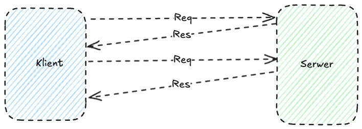
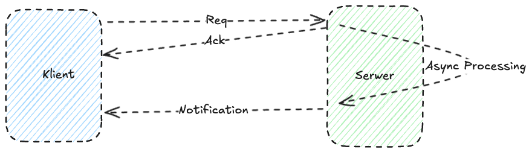
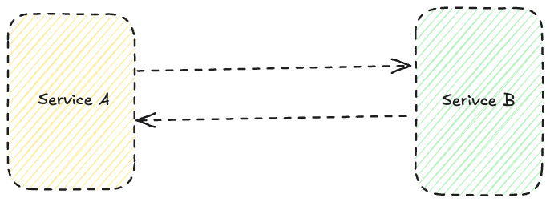
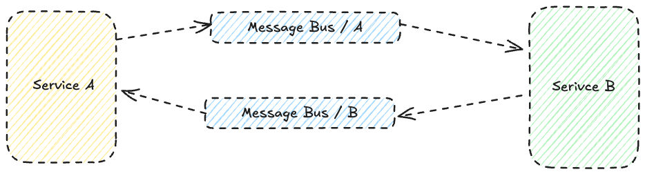
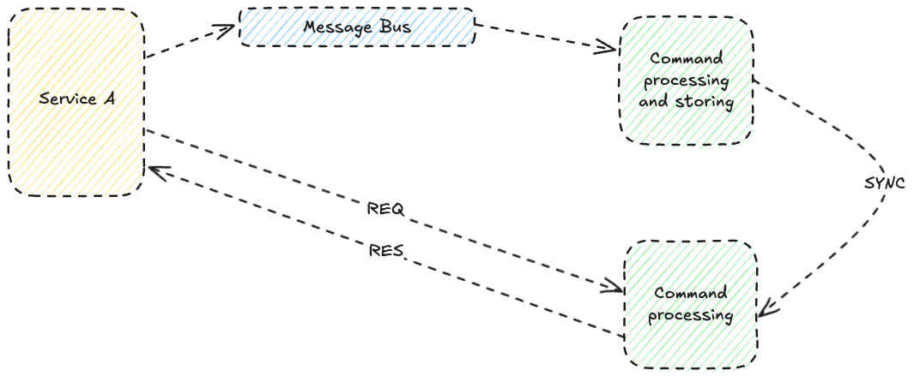
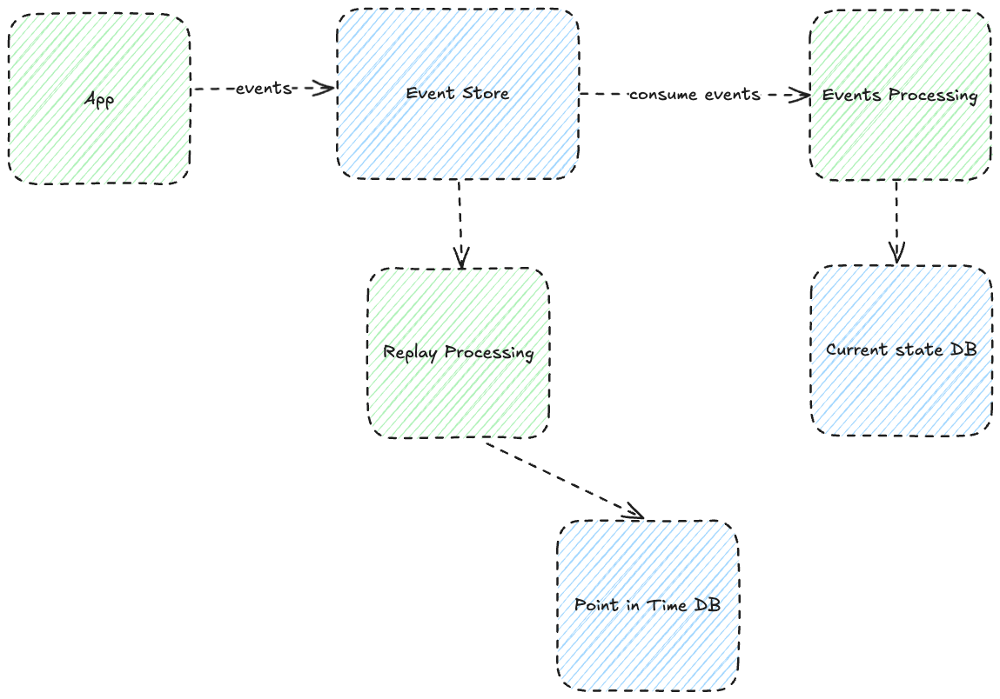
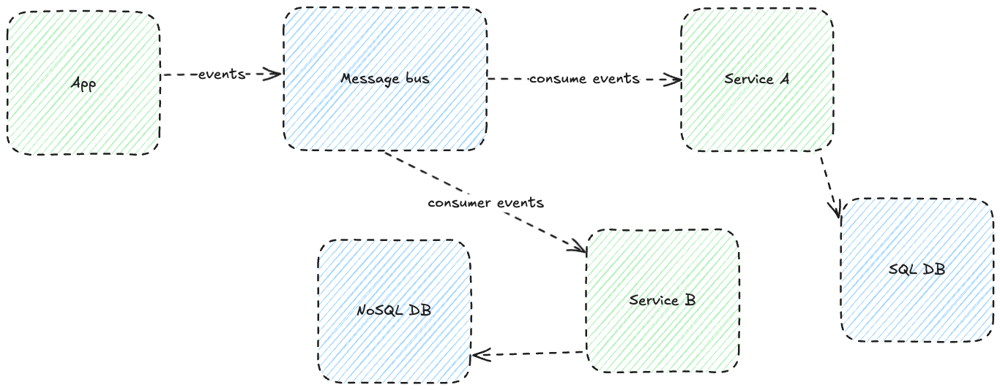

# Synchronous vs Asynchronous Communication

## Synchronous Communication
### Definition:
Synchronous communication requires an immediate response from the receiver after the request is sent. The client is blocked while waiting for a reply.

### Characteristics:
- **Waiting time:** The client must wait until the server processes the request and returns a response.
- **Dependency:** Systems are tightly coupled; a server failure can stop client operations.
- **Examples:** HTTP REST, SOAP.
- **Advantages:** Simple implementation, easy to debug.
- **Disadvantages:** High dependency on server availability, difficult to scale.

## Asynchronous Communication
### Definition:
In the asynchronous model, the client sends a request and doesn’t wait for a response, continuing its work. The response is handled later.

### Characteristics:
- **Waiting time:** The client can do other tasks while waiting for a response.
- **Dependency:** Systems are loosely coupled; server failures don’t block the client.
- **Examples:** RabbitMQ, Kafka, WebSockets.
- **Advantages:** Better scalability, greater fault tolerance.
- **Disadvantages:** More complex to implement, harder to debug.

---

# Comparison: REST API vs Event-Driven API

## Business Case: Order Management in an Online Store
Assume we have an e-commerce system where users place orders, and customer service needs to update their status.

### REST API (Synchronous):

#### Process:
1. The client (e.g. mobile app) sends an HTTP POST request to the server to create an order.
2. The server processes the request and returns an HTTP 200 response with confirmation.
3. Further requests (GET, PUT, DELETE) update the order status.

#### Pros:
- Simple communication: the client immediately knows whether the operation succeeded.
- Ideal for operations requiring instant confirmation.

#### Cons:
- High dependency on server availability.
- Hard to coordinate across distributed systems.

---

### Event-Driven API (Asynchronous):

#### Process:
1. The client publishes an event (e.g. "Order Created") to a message broker (e.g. Kafka, RabbitMQ).
2. Other microservices (e.g. "Payment Processing", "Inventory Update") subscribe and react asynchronously.
3. The client receives confirmation once the event has been processed.

#### Pros:
- Scalability: easy to add new subscribers.
- Fault tolerance: failure in one service doesn’t halt the system.
- Asynchronous processing enables parallel execution of multiple tasks.

#### Cons:
- No immediate confirmation to the client (requires queues or notifications).
- Harder to debug and trace the event lifecycle.

---

# Asynchronous Communication Paradigms

## 1. CQRS (Command Query Responsibility Segregation)

### Description:
Separates logic responsible for **writes (commands)** from logic for **reads (queries)**.

### Use Cases:
- Systems with high read volumes and relatively low write activity (e.g. analytics systems).

### Benefits:
- Independent optimization of read and write paths.
- Improved performance and scalability.

### Example:
In e-commerce, one database is used for order processing and another for generating sales reports.

---

## 2. Event Sourcing

### Description:
Application state is stored as a sequence of **events** describing state changes.

### Use Cases:
- Systems requiring full history tracking (e.g. banking).

### Benefits:
- Any past state can be reconstructed.
- Every change in the system is traceable.

### Example:
In a payment system, every account operation (deposit, withdrawal, transfer) is logged and auditable.

---

## 3. Polyglot Persistence

### Description:
Using different types of databases depending on the specific application requirements.

### Use Cases:
- Systems with diverse needs (e.g. e-commerce: relational DB for orders, NoSQL for product catalog).

### Benefits:
- Performance optimization for different data types.
- Ability to use the best tools for each specific problem.

### Example:
In e-commerce, use MongoDB for the product catalog (document structure), PostgreSQL for transactions (relational), and Elasticsearch for search functionality.

---
