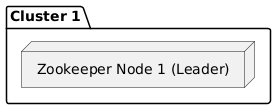
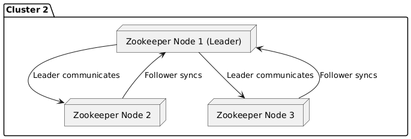
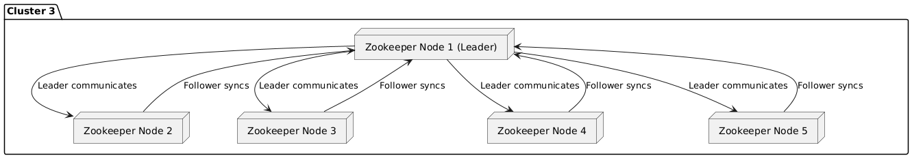
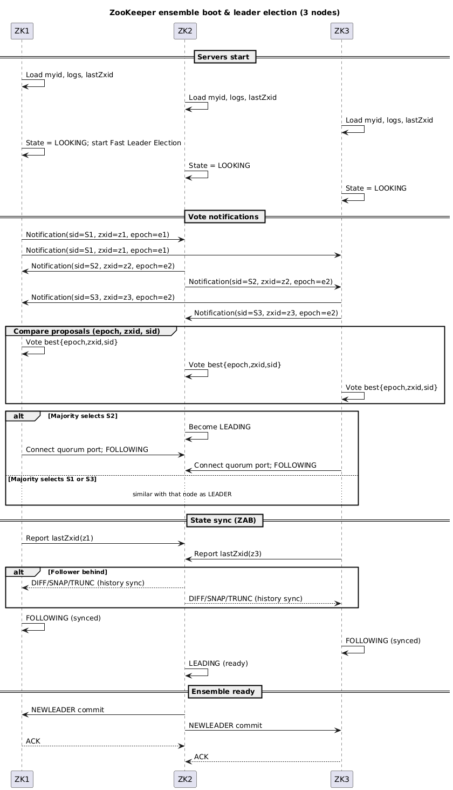

### Start ZooKeeper and explore its basic functionalities

```bash
    docker run -d -p 22181:22181 -p 23888:23888 --name=zzk-1 --network mynetwork -e ZOOKEEPER_SERVER_ID=1 -e ZOOKEEPER_CLIENT_PORT=22181 -e ZOOKEEPER_TICK_TIME=2000 -e ZOOKEEPER_INIT_LIMIT=5 -e ZOOKEEPER_SYNC_LIMIT=2 -e ZOOKEEPER_SERVERS="zzk-1:22888:23888;zzk-2:32888:33888;zzk-3:42888:43888" confluentinc/cp-zookeeper:7.7.1
```

```bash
    docker run -d -p 32181:32181 -p 33888:33888 --name=zzk-2 --network mynetwork -e ZOOKEEPER_SERVER_ID=2 -e ZOOKEEPER_CLIENT_PORT=32181 -e ZOOKEEPER_TICK_TIME=2000 -e ZOOKEEPER_INIT_LIMIT=5 -e ZOOKEEPER_SYNC_LIMIT=2 -e ZOOKEEPER_SERVERS="zzk-1:22888:23888;zzk-2:32888:33888;zzk-3:42888:43888" confluentinc/cp-zookeeper:7.7.1
```

```bash
    docker run -d -p 42181:42181 -p 43888:43888 --name=zzk-3 --network mynetwork -e ZOOKEEPER_SERVER_ID=3 -e ZOOKEEPER_CLIENT_PORT=42181 -e ZOOKEEPER_TICK_TIME=2000 -e ZOOKEEPER_INIT_LIMIT=5 -e ZOOKEEPER_SYNC_LIMIT=2 -e ZOOKEEPER_SERVERS="zzk-1:22888:23888;zzk-2:32888:33888;zzk-3:42888:43888" confluentinc/cp-zookeeper:7.7.1
```

# Check container logs

```bash
    docker ps
```

```bash
    docker logs zzk-1 | grep "binding to port"
```

```bash
    docker logs zzk-2 | grep "binding to port"
```

```bash
    docker logs zzk-3 | grep "binding to port"
```

### Start ZooKeeper shell

```bash
    docker exec -it zzk-1 zookeeper-shell localhost:22181
```

### Run the following commands in the ZooKeeper shell

```
help
```

```
ls /
```

### Basic Znode API functions

```
create /my-node "foo"
```

```
ls /
```

```
get /my-node
```

```
get /zookeeper
```

```
create /my-node/deeper-node "bar"
```

```
ls /
```

```
ls /my-node
```

```
ls /my-node/deeper-node
```

```
get /my-node/deeper-node
```

### Modify the value of a znode

```
set /my-node/deeper-node "newdata"
```

```
get /my-node/deeper-node
```

### Create a znode for watching

```
create /node-to-watch ""
```

```
get -w /node-to-watch
```

```
set /node-to-watch "hhhas-changeddddd"
```

### Delete a znode

```
deleteall /node-to-watch
```

### Create an ephemeral znode (deleted after client disconnects)

```
create -e /ephemeral-node "ephemeral"
```

```
ls /
```

```
get /ephemeral-node
```

#### Create a sequential znode
#### The znode will be created with a numeric suffix
#### The suffix is unique within the znode
#### The suffix increments by 1 from the previous znode

```
create -s /sequence-node "sequence"
```

```
ls /parent-node
```

## ZooKeeper Cluster

### 1 Node
### For experiments and testing



### 3 Nodes
### For small and medium workloads, tolerates failure of 1 node. Most common deployment.



### 5 Nodes
### For high workloads, tolerates failure of 2 nodes. Used in large Kafka clusters (10+ nodes).



### Zookeeper enseble boot & leader election


