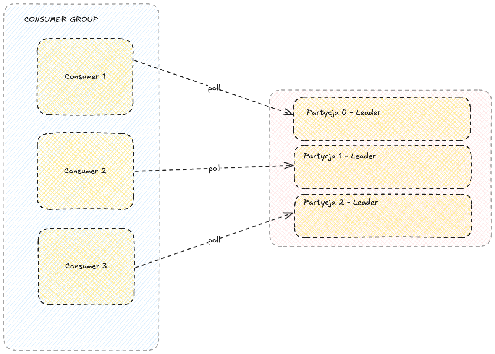
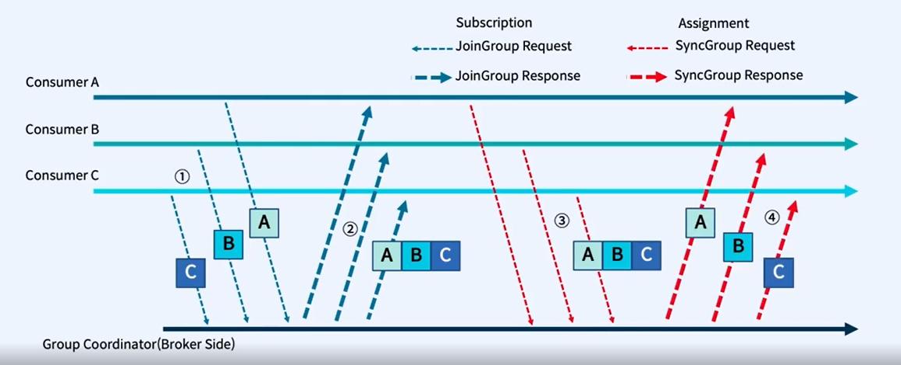
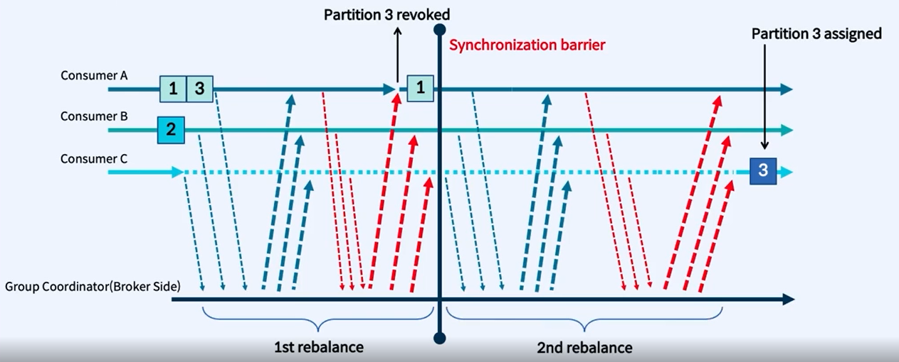

# Java Kafka Consumer

### Budowanie aplikacji i uruchmienie aplikacji

```bash
  mvn clean package
```

```bash
  docker build -t java-kafka-consumer .   
```

```bash
  docker run --network  mynetwork java-kafka-consumer
```

### Konfiguracja i uruchomienie Kafka Consumer



```java
public static KafkaConsumer<String, String> createConsumer() {
    Properties properties = new Properties();
    properties.setProperty(ConsumerConfig.BOOTSTRAP_SERVERS_CONFIG, "kafka-1:29092,kafka-2:39092,kafka-3:49092");
    properties.setProperty(ConsumerConfig.KEY_DESERIALIZER_CLASS_CONFIG, StringDeserializer.class.getName());
    properties.setProperty(ConsumerConfig.VALUE_DESERIALIZER_CLASS_CONFIG, StringDeserializer.class.getName());
    properties.setProperty(ConsumerConfig.GROUP_ID_CONFIG, "java-kafka-clients-consumer");
    properties.setProperty(ConsumerConfig.AUTO_OFFSET_RESET_CONFIG, "earliest");
    properties.setProperty(ConsumerConfig.ENABLE_AUTO_COMMIT_CONFIG, "false");
    return new KafkaConsumer<>(properties);
}
```

### Zaimplementuj polling wiadomości z topicu w nieskończonej pętli

```java
public static void main(String[] args) {
    KafkaConsumer<String, String> consumer = createConsumer();
    consumer.subscribe(List.of("kafka-client-exercises"));
    while (true) {
        consumer.poll(Duration.ofMillis(100)).forEach(record -> 
                logger.info("Key: {}, Value: {}, Partition: {}, Offset: {}", record.key(), record.value(), record.partition(), record.offset()));
        consumer.commitSync();
    }
}
```

### Przebuduj i uruchom aplikację
```bash
  mvn clean package
  docker build -t java-kafka-consumer .   
  docker run --network  mynetwork java-kafka-consumer
```

### Zatrzymaj aplikację i przejdźmy do Kafka UI

### Resetowanie offsetów grupy

```bash
  docker run --rm --network mynetwork confluentinc/cp-kafka:7.7.1 kafka-consumer-groups --bootstrap-server kafka-1:29092,kafka-2:39092,kafka-3:49092 --group java-kafka-clients-consumer --reset-offsets --to-earliest --execute --topic kafka-client-exercises
```

### Ustaw auto.offset.reset na latest

```java
public static KafkaConsumer<String, String> createConsumer() {
    Properties properties = new Properties();
    properties.setProperty(ConsumerConfig.BOOTSTRAP_SERVERS_CONFIG, "kafka-1:29092,kafka-2:39092,kafka-3:49092");
    properties.setProperty(ConsumerConfig.KEY_DESERIALIZER_CLASS_CONFIG, StringDeserializer.class.getName());
    properties.setProperty(ConsumerConfig.VALUE_DESERIALIZER_CLASS_CONFIG, StringDeserializer.class.getName());
    properties.setProperty(ConsumerConfig.GROUP_ID_CONFIG, "java-kafka-clients-consumer");
    properties.setProperty(ConsumerConfig.AUTO_OFFSET_RESET_CONFIG, "latest");
    properties.setProperty(ConsumerConfig.ENABLE_AUTO_COMMIT_CONFIG, "false");
    return new KafkaConsumer<>(properties);
}
```

### Przebuduj i uruchom aplikację
```bash
  mvn clean package
  docker build -t java-kafka-consumer .   
  docker run --network  mynetwork java-kafka-consumer
```

### Consumer Group i Rebalance

### Uruchom 2 dodatkowe instancje aplikacji w innych kartach terminala i za każdym razem obserwuj logi

```bash
  docker run --network  mynetwork java-kafka-consumer
```

### Problem auto skalowania i coupling między HTTP/GRPC a Kafka!!!

### STOP THE WORLD - REBALANCE


### Inkrementalny rebalance



### Alternatywne strategie przypisywania partycji

| **Strategia**             | **Opis**                                                                                                                                                         | **Kiedy używać?**                                                                                   |
|---------------------------|-----------------------------------------------------------------------------------------------------------------------------------------------------------------|-----------------------------------------------------------------------------------------------------|
| **RangeAssignor**         | Domyślna strategia. Partycje są przypisywane do konsumentów w ramach zakresu (range) w oparciu o alfabetyczną kolejność tematów i partycji. Konsument otrzymuje ciągły zakres partycji. | Gdy liczba partycji jest proporcjonalna do liczby konsumentów, a równomierne przypisanie nie jest krytyczne.                             |
| **RoundRobinAssignor**    | Partycje są przypisywane do konsumentów w sposób okrężny (round-robin). Każdy konsument otrzymuje po jednej partycji na zmianę, aż wszystkie zostaną przydzielone. | Gdy równomierne przypisanie partycji między konsumentami jest kluczowe, np. w systemach przetwarzania strumieniowego.                   |
| **StickyAssignor**        | Partycje są przypisywane w sposób równomierny z zachowaniem przypisania z poprzedniego rebalansowania, jeśli to możliwe.                                       | Gdy minimalizacja zmian przypisania partycji pomiędzy rebalansami jest ważna dla stabilności lub optymalizacji wydajności.              |
| **CooperativeStickyAssignor** | Wersja StickyAssignor, która pozwala na bardziej stopniowe rebalansowanie. Konsumenci mogą przejmować partycje w sposób incrementalny, minimalizując przestoje. | Gdy konieczne jest ograniczenie przestojów podczas rebalansowania, np. w systemach o wysokiej dostępności.                              |
| **Custom (własna strategia)** | Możesz zaimplementować własną strategię przypisywania poprzez rozszerzenie klasy `PartitionAssignor`.                                                         | Gdy żadna z dostępnych strategii nie spełnia wymagań, np. specyficzne reguły biznesowe dla przypisywania partycji.                      |

---

### Przykłady zastosowań

1. **RangeAssignor**:
      - Tematy z partycjami przypisanymi w naturalnej kolejności, np. przetwarzanie danych z logów.
      - Prosty podział w systemach z niewielką liczbą partycji i konsumentów.

2. **RoundRobinAssignor**:
      - Systemy wymagające równomiernego rozłożenia obciążenia, np. analizy danych w czasie rzeczywistym.

3. **StickyAssignor**:
      - Przetwarzanie krytycznych danych, gdzie zmiany w przypisaniach partycji mogą prowadzić do problemów z wydajnością.

4. **CooperativeStickyAssignor**:
      - Systemy o dużej liczbie konsumentów, gdzie rebalansowanie musi być jak najmniej inwazyjne, np. przetwarzanie transakcji finansowych.


---

### Jak ustawić strategię w konsumerze?

Dodaj właściwość `partition.assignment.strategy` do konfiguracji konsumenta:

```java
public static KafkaConsumer<String, String> createConsumer() {
      Properties properties = new Properties();
      properties.setProperty(ConsumerConfig.BOOTSTRAP_SERVERS_CONFIG, "kafka-1:29092,kafka-2:39092,kafka-3:49092");
      properties.setProperty(ConsumerConfig.KEY_DESERIALIZER_CLASS_CONFIG, StringDeserializer.class.getName());
      properties.setProperty(ConsumerConfig.VALUE_DESERIALIZER_CLASS_CONFIG, StringDeserializer.class.getName());
      properties.setProperty(ConsumerConfig.GROUP_ID_CONFIG, "java-kafka-clients-consumer");
      properties.setProperty(ConsumerConfig.AUTO_OFFSET_RESET_CONFIG, "latest");
      properties.setProperty(ConsumerConfig.ENABLE_AUTO_COMMIT_CONFIG, "false");
      props.put(ConsumerConfig.PARTITION_ASSIGNMENT_STRATEGY_CONFIG, "org.apache.kafka.clients.consumer.CooperativeStickyAssignor");
      return new KafkaConsumer<>(properties);
}
```

Oraz usuń z przetwarzania rekordów `consumer.commitSync();`

### Przebuduj i uruchom aplikację
```bash
  mvn clean package
  docker build -t java-kafka-consumer .   
  docker run --network  mynetwork java-kafka-consumer
```

### Zatrzymaj jedną z instancji aplikacji i zaobserwuj, że pozostałe instancje nadal odbierają wiadomości.

### Pozostałe interesujące właściwości konfiguracyjne

| **Ustawienie**                      | **Opis**                                                                                                                                                          | **Dlaczego jest interesujące?**                                                                                                                |
|-------------------------------------|------------------------------------------------------------------------------------------------------------------------------------------------------------------|------------------------------------------------------------------------------------------------------------------------------------------------|
| **`max.poll.records`**              | Maksymalna liczba rekordów zwracanych przez jedno wywołanie `poll()`.                                                                                            | Pozwala kontrolować wielkość partii do przetwarzania, co wpływa na równowagę między przepustowością a opóźnieniem.                             |
| **`fetch.min.bytes`**               | Minimalna liczba bajtów, które konsument pobiera w jednym żądaniu od brokera.                                                                                     | Optymalizuje wykorzystanie sieci, zmuszając brokera do grupowania większej liczby rekordów przed odpowiedzią.                                  |
| **`fetch.max.wait.ms`**             | Maksymalny czas oczekiwania konsumenta na osiągnięcie `fetch.min.bytes` przed zwróceniem wyników.                                                                 | Umożliwia balansowanie między opóźnieniem a wykorzystaniem zasobów.                                                                            |
| **`isolation.level`**               | Określa, czy konsument widzi tylko zatwierdzone transakcje (`read_committed`) czy wszystkie wiadomości (`read_uncommitted`).                                      | Kluczowe przy pracy z dokładnie raz przetwarzaniem (exactly-once semantics) i transakcjami w Kafka.                                             |
| **`partition.assignment.strategy`** | Strategia przypisywania partycji do konsumentów, np. `RangeAssignor`, `RoundRobinAssignor`, `CooperativeStickyAssignor`.                                           | Możliwość zmiany sposobu dystrybucji partycji w grupie konsumenckiej, co ma wpływ na równowagę obciążenia i stabilność przypisań.               |
| **`max.poll.interval.ms`**          | Maksymalny czas między kolejnymi wywołaniami `poll()` przed uznaniem konsumenta za nieaktywnego i rozpoczęciem rebalansowania.                                    | Ważne w scenariuszach, gdzie przetwarzanie partii rekordów zajmuje dużo czasu.                                                                 |
| **`session.timeout.ms`**            | Czas, po którym brak heartbeatów od konsumenta powoduje uznanie go za nieaktywnego i uwolnienie jego partycji.                                                    | Kluczowe dla stabilności grupy konsumenckiej. Zbyt niski czas może powodować fałszywe rebalansowanie, a zbyt wysoki opóźnienia w wykrywaniu awarii. |
| **`client.id`**                     | Identyfikator klienta używany w logach brokera do rozróżniania konsumentów.                                                                                       | Przydatne do monitorowania i debugowania, szczególnie w dużych klastrach z wieloma konsumentami.                                               |
| **`metadata.max.age.ms`**           | Maksymalny czas przechowywania informacji o metadanych (np. partycjach) przed ich odświeżeniem.                                                                   | Ważne w dynamicznych środowiskach, gdzie partycje mogą być dodawane lub zmieniane.                                                             |
| **`allow.auto.create.topics`**      | Czy konsument może automatycznie tworzyć brakujące tematy.                                                                                                        | Przydatne w środowiskach deweloperskich, ale niezalecane w produkcji, gdzie kontrola nad tematami jest krytyczna.                              |
| **`retry.backoff.ms`**              | Czas oczekiwania przed ponownym żądaniem danych w przypadku błędu.                                                                                                | Pozwala zrozumieć, jak konsumenci radzą sobie z chwilowymi problemami, np. niedostępnością brokera.                                             |

