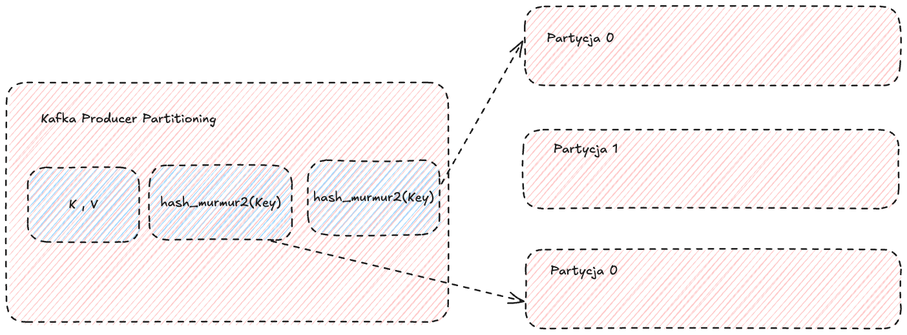
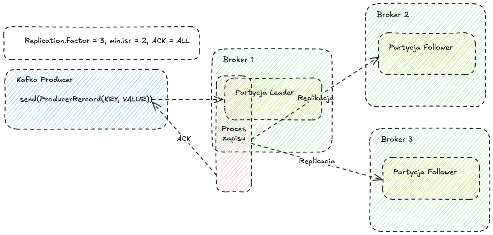
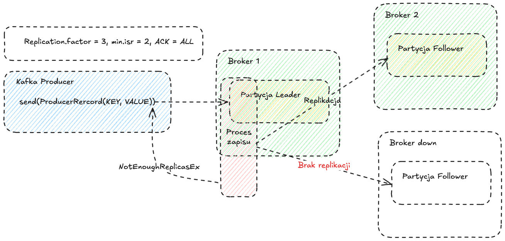
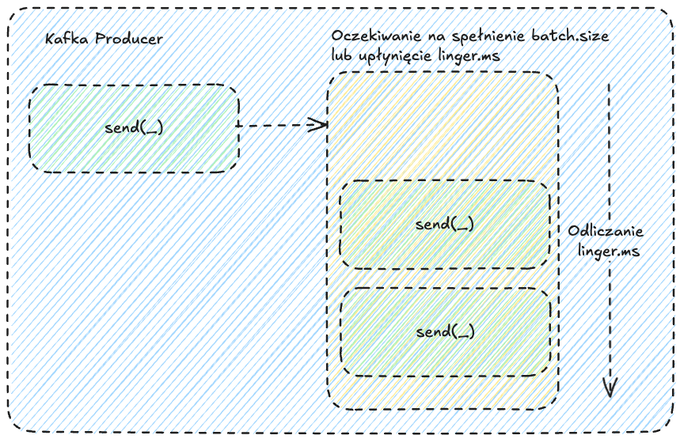
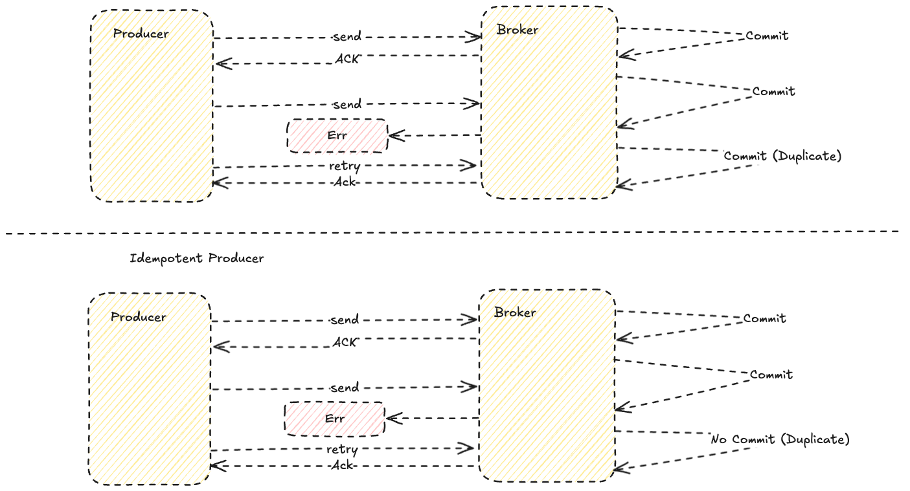

# Java Kafka Producer

### Budowanie i uruchamianie aplikacji

```bash
    mvn clean package
```

```bash
    docker build -t java-kafka-producer .   
```

```bash
  docker run --network  mynetwork java-kafka-producer
```

# Przygotowanie środowiska

```bash
   docker run --rm --network mynetwork confluentinc/cp-kafka:7.7.1 kafka-topics --create --topic kafka-client-exercises --partitions 3 --replication-factor 3 --if-not-exists --bootstrap-server kafka-1:29092,kafka-2:39092,kafka-3:49092
```

### Przyogotwanie consumera w osobnej karcie terminala
```bash
  docker run --rm --network mynetwork confluentinc/cp-kafka:7.7.1 kafka-console-consumer --topic kafka-client-exercises --bootstrap-server kafka-1:29092,kafka-2:39092,kafka-3:49092 --from-beginning
```

### Konfiguracja i uruchomienie Kafka Producer

```java
public static KafkaProducer<String, String> createProducer() {
    // Ustawienie właściwości w properties
    Properties properties = new Properties();
    properties.put(ProducerConfig.BOOTSTRAP_SERVERS_CONFIG, "kafka-1:29092,kafka-2:39092,kafka-3:49092");
    properties.put(ProducerConfig.KEY_SERIALIZER_CLASS_CONFIG, StringSerializer.class.getName());
    properties.put(ProducerConfig.VALUE_SERIALIZER_CLASS_CONFIG, StringSerializer.class.getName());
    // Stworzenie instancji KafkaProducer
    return new KafkaProducer<>(properties);
}
```
### Wysłanie wiadomości do topicu

```java
public static void main(String[] args) throws Exception{
    // Stworzenie instancji KafkaProducer
    KafkaProducer<String, String> producer = createProducer();
    
    // Stworzenie instancji ProducerRecord
    ProducerRecord<String, String> record = new ProducerRecord<>("kafka-client-exercises", "key-" + Math.random(), "value-" + Math.random());
    
    // Wysłanie wiadomości do topicu !!!Uwaga!!! - metoda send jest asynchroniczna
    producer.send(record).get();
}
```
### Przebuduj i uruchom aplikację

```bash
    mvn clean package
    docker build -t java-kafka-producer .   
    docker run --network  mynetwork java-kafka-producer
```

### Sprawdź czy wiadomość została wysłana

### Partycjonowanie wiadomości

#### Partycjonowanie wiadomości w Kafce jest kluczowym mechanizmem, który pozwala na równomierne rozłożenie obciążenia na poszczególnych brokerach. Dzięki partycjonowaniu możemy również kontrolować kolejność wiadomości w obrębie jednej partycji.
#### Wartość klucza wiadomości jest używana do określenia partycji, do której zostanie wysłana wiadomość. Domyślnie Kafka używa algorytmu haszującego, aby przypisać wiadomość do konkretnej partycji.



#### W przypadku braku klucza, wiadomość zostanie wysłana do losowej partycji. Wartość klucza jest opcjonalna, ale zalecane jest jej użycie, aby zapewnić zachowanie kolejności wiadomości w obrębie jednej partycji.


### ACKS_CONFIG na "all" oraz RETRIES_CONFIG na "1000000"

Zmodyfikuj metodę createProducer

```java
public static KafkaProducer<String, String> createProducer() {
    // Ustawienie właściwości w properties
    Properties properties = new Properties();
    properties.put(ProducerConfig.BOOTSTRAP_SERVERS_CONFIG, "kafka-1:29092,kafka-2:39092,kafka-3:49092");
    properties.put(ProducerConfig.KEY_SERIALIZER_CLASS_CONFIG, StringSerializer.class.getName());
    properties.put(ProducerConfig.VALUE_SERIALIZER_CLASS_CONFIG, StringSerializer.class.getName());
    properties.put(ProducerConfig.ACKS_CONFIG, "all");
    properties.put(ProducerConfig.RETRIES_CONFIG, "1000000");
    // Stworzenie instancji KafkaProducer
    return new KafkaProducer<>(properties);
}
```

### Wyłącz 2 z 3 brokerów i spróbuj wysłać wiadomość do topicu test

```bash 
  docker stop kafka-2 kafka-3
```
### Przebuduj i uruchom aplikację

```bash
    mvn clean package
    docker build -t java-kafka-producer .   
    docker run --network  mynetwork java-kafka-producer
```

### Sprawdź co loguje aplikacja??

### Włącz jeden z brokerów i sprawdź czy wiadomość została wysłana

```bash 
  docker start kafka-2
```

### Sprawdź czy wiadomość została wysłana

### Włącz drugiego brokera

```bash 
  docker start kafka-3
```

### Proces zapisu wiadomości w Kafce



### Błąd w zapisie wiadomości



| **ACK**   | **Opis**                                                                                       | **Zastosowanie**                                                                                     |
|-----------|-----------------------------------------------------------------------------------------------|-----------------------------------------------------------------------------------------------------|
| `acks=0`  | Producent nie oczekuje potwierdzenia od brokera.                                               | - Najszybsze przesyłanie. <br> - Ryzyko utraty danych w przypadku awarii.                          |
| `acks=1`  | Producent oczekuje potwierdzenia od lidera partycji, ale nie od replik.                        | - Kompromis między szybkością a niezawodnością. <br> - Możliwe ryzyko utraty danych przy awarii lidera. |
| `acks=all` (lub `acks=-1`) | Producent oczekuje potwierdzenia od lidera oraz wszystkich replik w partycji. | - Największa niezawodność. <br> - Większa latencja. <br> - Gwarancja, że dane są w pełni zreplikowane. |

### Wyjaśnienia
- **`acks=0`**: Dane są wysyłane bez oczekiwania na jakiekolwiek potwierdzenie. Broker może nie otrzymać wiadomości w przypadku problemów sieciowych lub awarii.
- **`acks=1`**: Lider partycji potwierdza odbiór danych. Jeśli lider ulegnie awarii przed replikacją, dane mogą zostać utracone.
- **`acks=all` (lub `acks=-1`)**: Dane są potwierdzane dopiero po zapisaniu przez lidera i pełnej replikacji na wszystkie węzły ISR (in-sync replicas).


### Zmień wartość linger.ms na 10000

Zmodyfikuj metodę createProducer

```java
public static KafkaProducer<String, String> createProducer() {
    // Ustawienie właściwości w properties
    Properties properties = new Properties();
    properties.put(ProducerConfig.BOOTSTRAP_SERVERS_CONFIG, "kafka-1:29092,kafka-2:39092,kafka-3:49092");
    properties.put(ProducerConfig.KEY_SERIALIZER_CLASS_CONFIG, StringSerializer.class.getName());
    properties.put(ProducerConfig.VALUE_SERIALIZER_CLASS_CONFIG, StringSerializer.class.getName());
    properties.put(ProducerConfig.ACKS_CONFIG, "all");
    properties.put(ProducerConfig.RETRIES_CONFIG, "1000000");
    properties.put(ProducerConfig.LINGER_MS_CONFIG, "20000");
}
```

### Przebuduj i uruchom aplikację

```bash
    mvn clean package
    docker build -t java-kafka-producer .   
    docker run --network  mynetwork java-kafka-producer
```

### Sprawdź w consumerze czy wiadomość została wysłana (cierpliwości)

### Czym jest relacja batch.size i linger.ms?



### Zmień batch.size na 5

Zmodyfikuj metodę createProducer

```java
public static KafkaProducer<String, String> createProducer() {
    // Ustawienie właściwości w properties
    Properties properties = new Properties();
    properties.put(ProducerConfig.BOOTSTRAP_SERVERS_CONFIG, "kafka-1:29092,kafka-2:39092,kafka-3:49092");
    properties.put(ProducerConfig.KEY_SERIALIZER_CLASS_CONFIG, StringSerializer.class.getName());
    properties.put(ProducerConfig.VALUE_SERIALIZER_CLASS_CONFIG, StringSerializer.class.getName());
    properties.put(ProducerConfig.ACKS_CONFIG, "all");
    properties.put(ProducerConfig.RETRIES_CONFIG, "1000000");
    properties.put(ProducerConfig.LINGER_MS_CONFIG, "20000");
    properties.put(ProducerConfig.BATCH_SIZE_CONFIG, "5");
}
```

### Zmodyfikuj main aby wyslac 5 rekordów

### Przebuduj i uruchom aplikację

```bash
    mvn clean package
    docker build -t java-kafka-producer .   
    docker run --network  mynetwork java-kafka-producer
```

### Sprawdź w consumerze czy wiadomości zostały wysłane bez opóźnienia

### Zmień wartość idempotence na true

Zmodyfikuj metodę createProducer

```java
public static KafkaProducer<String, String> createProducer() {
    // Ustawienie właściwości w properties
    Properties properties = new Properties();
    properties.put(ProducerConfig.BOOTSTRAP_SERVERS_CONFIG, "kafka-1:29092,kafka-2:39092,kafka-3:49092");
    properties.put(ProducerConfig.KEY_SERIALIZER_CLASS_CONFIG, StringSerializer.class.getName());
    properties.put(ProducerConfig.VALUE_SERIALIZER_CLASS_CONFIG, StringSerializer.class.getName());
    
    // Włączenie idempotence
    properties.put(ProducerConfig.ENABLE_IDEMPOTENCE_CONFIG, "true");
}
```

### Idempotence równoznaczne z acks=all, retries=Integer.MAX_VALUE

### Przebuduj i uruchom aplikację

```bash
    mvn clean package
    docker build -t java-kafka-producer .   
    docker run --network  mynetwork java-kafka-producer
```



| **Funkcja**                           | **Opis**                                                                                                                                             | **Dlaczego warto używać?**                                                                                                                                                   |
|---------------------------------------|-----------------------------------------------------------------------------------------------------------------------------------------------------|-----------------------------------------------------------------------------------------------------------------------------------------------------------------------------|
| **Zapobieganie duplikatom**           | Gwarancja, że każda wiadomość zostanie zapisana dokładnie raz, nawet jeśli wystąpią ponowne próby wysyłania.                                         | Uniknięcie sytuacji, w której komunikaty są zapisywane wielokrotnie, co mogłoby powodować błędy w aplikacji lub bazie danych.                                               |
| **Zachowanie kolejności wiadomości**  | Wiadomości są zapisywane w tej samej kolejności, w jakiej zostały wysłane przez producenta (w obrębie jednej partycji).                              | Kluczowe w systemach, w których kolejność wiadomości jest ważna, np. w przetwarzaniu transakcji finansowych.                                                                |
| **Bezpieczne ponowne próby (retries)**| Producent może wielokrotnie próbować wysyłać komunikaty w przypadku awarii sieci lub brokera, bez ryzyka wprowadzenia duplikatów.                    | Zwiększa niezawodność aplikacji, minimalizując ryzyko utraty danych w przypadku chwilowych błędów.                                                                           |
| **Wymuszona konfiguracja**            | Automatycznie ustawia `retries` na wysoki poziom (domyślnie `MAX_INT`) i ogranicza `max.in.flight.requests.per.connection` do 5.                    | Eliminuje konieczność ręcznej konfiguracji producenta, zapewniając, że idempotencja działa poprawnie.                                                                       |
| **Integracja z exactly-once**         | Umożliwia wykorzystanie semantyki dokładnie raz (exactly-once semantics) w połączeniu z transakcjami Kafki.                                          | Idealne rozwiązanie w przypadkach, gdy wymagane jest absolutne uniknięcie błędów, np. w przetwarzaniu krytycznych danych biznesowych.                                       |
| **Minimalizacja złożoności aplikacji**| Kafka sama zarządza mechanizmem identyfikacji i odrzucania duplikatów (za pomocą `Producer ID` i `Sequence Number`).                                | Redukuje ilość kodu, który programista musi napisać, aby uniknąć problemów z duplikatami i zachować kolejność wiadomości.                                                   |

### Przykładowe scenariusze użycia:
- **Systemy finansowe**: Przetwarzanie transakcji, gdzie duplikaty mogą prowadzić do powielonych płatności.
- **Logistyka i śledzenie przesyłek**: Zapewnienie, że zdarzenia dotyczące przesyłek są przetwarzane w kolejności.
- **Integracja danych**: Bezpieczne przesyłanie i aktualizacja danych w systemach rozproszonych.

```bash
    mvn clean package
    docker build -t java-kafka-producer .   
    docker run --network  mynetwork java-kafka-producer
```

### Zmień wartość compression type na snappy

Zmodyfikuj metodę createProducer

```java
public static KafkaProducer<String, String> createProducer() {
    // Ustawienie właściwości w properties
    Properties properties = new Properties();
    properties.put(ProducerConfig.BOOTSTRAP_SERVERS_CONFIG, "kafka-1:29092,kafka-2:39092,kafka-3:49092");
    properties.put(ProducerConfig.KEY_SERIALIZER_CLASS_CONFIG, StringSerializer.class.getName());
    properties.put(ProducerConfig.VALUE_SERIALIZER_CLASS_CONFIG, StringSerializer.class.getName());
    properties.put(ProducerConfig.ENABLE_IDEMPOTENCE_CONFIG, "true");
    
    // Ustawienie kompresji na snappy
    properties.put(ProducerConfig.COMPRESSION_TYPE_CONFIG, "snappy");
}
```

### Przebuduj i uruchom aplikację

```bash
    mvn clean package
    docker build -t java-kafka-producer .   
    docker run --network  mynetwork java-kafka-producer
```

### Wejdź do Kafka UI i sprawdź, czy widziałeś zmniejszenie rozmiaru wiadomości

```
http://localhost:8080
```  

### Na koniec zaimplementuj nieskończoną pętlę, która będzie wysyłać wiadomości co 5 sekund (to tylko ćwiczenie Thread.sleep jest OK)

### Przebuduj i uruchom aplikację

```bash
    mvn clean package
    docker build -t java-kafka-producer .   
    docker run --network  mynetwork java-kafka-producer
```

### Sprawdź w consumerze czy wiadomości są wysyłane co 5 sekund i zamknij conusmera