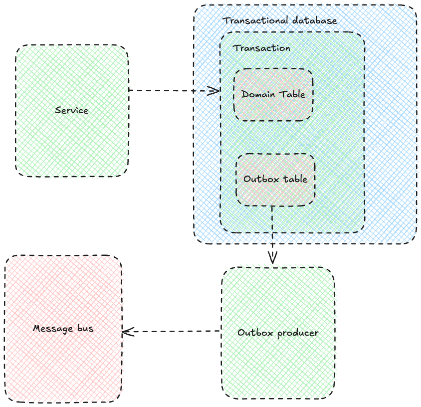
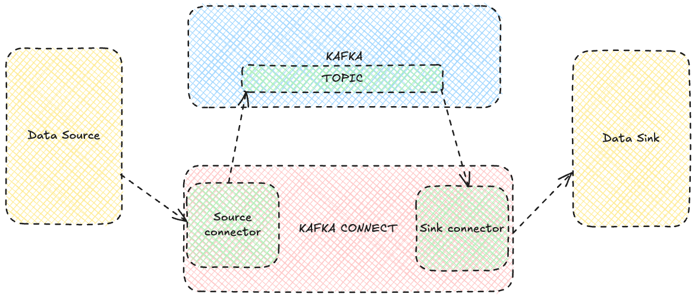

# Kafka Connect

### Transaction Outbox Pattern



### Najważniejsze informacje o Kafka Connect



| **Kategoria**                | **Opis**                                                                                                                                             | **Dlaczego ważne?**                                                                                                   |
|-------------------------------|-------------------------------------------------------------------------------------------------------------------------------------------------------|-----------------------------------------------------------------------------------------------------------------------|
| **Czym jest Kafka Connect?**  | Narzędzie Kafka do łatwej integracji systemów zewnętrznych z Apache Kafka (źródła danych i cele).                                                    | Umożliwia przesyłanie danych między systemami bez konieczności pisania kodu od zera.                                  |
| **Typy konektorów**           | - **Źródła**: Pobierają dane z zewnętrznych systemów do tematów Kafka. <br> - **Cele**: Wysyłają dane z Kafka do zewnętrznych systemów.              | Umożliwiają integrację Kafka z bazami danych, plikami, systemami chmurowymi (np. S3), i innymi aplikacjami.           |
| **Tryby pracy**               | - **Standalone**: Jeden proces worker.<br> - **Distributed**: Klaster workerów dla skalowalności i wysokiej dostępności.                             | Distributed jest idealny do środowisk produkcyjnych wymagających skalowalności i odporności na awarie.                |
| **Główne komponenty**         | - **Worker**: Uruchamia konektory.<br> - **Connector**: Odpowiada za logikę źródła lub celu.<br> - **Task**: Jednostka przetwarzania danych w workerze. | Podział odpowiedzialności umożliwia lepsze zarządzanie i skalowanie w Kafka Connect.                                   |
| **Tematy systemowe**          | - `connect-configs`: Przechowuje konfigurację konektorów.<br> - `connect-offsets`: Przechowuje offsety przetwarzania.<br> - `connect-statuses`: Statusy konektorów. | Konfiguracja i statusy są przechowywane w Kafka, co zapewnia trwałość i łatwość odtworzenia stanu po awarii.           |
| **REST API**                  | Kafka Connect udostępnia REST API do zarządzania konektorami, np.: <br> - Tworzenie (`POST /connectors`) <br> - Status (`GET /connectors/{name}/status`) <br> - Usuwanie (`DELETE /connectors/{name}`). | REST API pozwala na łatwe zautomatyzowanie zarządzania Kafka Connect z poziomu aplikacji zewnętrznych.                |
| **Konektory popularne**       | - **JDBC**: Do integracji z bazami danych.<br> - **FileStream**: Czyta i zapisuje dane z/do plików.<br> - **S3 Sink**: Eksportuje dane do AWS S3.    | Popularne konektory pozwalają na natychmiastową integrację z najczęściej używanymi systemami.                         |
| **Skalowalność**              | Workerzy mogą dynamicznie dzielić zadania (`tasks`) pomiędzy sobą w trybie distributed.                                                              | Umożliwia równoległe przetwarzanie dużych ilości danych i zapewnia wysoką dostępność.                                  |
| **Mechanizmy błędów**         | Kafka Connect obsługuje mechanizmy takie jak Retry, Dead Letter Queue (DLQ) do obsługi błędów przetwarzania wiadomości.                              | Zapewnia niezawodność systemu nawet w przypadku problematycznych wiadomości.                                          |
| **Monitorowanie**             | Kafka Connect oferuje metryki JMX i tematy statusowe (`connect-statuses`) do monitorowania stanu konektorów i workerów.                              | Ułatwia diagnostykę problemów i monitorowanie wydajności konektorów.                                                 |
| **Konfiguracja konektora**    | Każdy konektor wymaga pliku JSON z konfiguracją (np. `name`, `connector.class`, `tasks.max`, `topics`).                                               | Prosty format JSON umożliwia łatwe zarządzanie konfiguracją konektorów.                                               |
| **Proces dodania konektora**  | 1. Stwórz konfigurację JSON. <br> 2. Użyj REST API do rejestracji konektora. <br> 3. Monitoruj status za pomocą API (`GET /connectors/{name}/status`). | Jasny proces dodawania konektorów umożliwia szybkie rozpoczęcie pracy z Kafka Connect.                                |
| **Retry i DLQ**               | Kafka Connect wspiera ponowne próby przetwarzania błędnych wiadomości (`retry`) oraz przekierowanie do Dead Letter Queue (`DLQ`).                     | Ważne w przypadku błędnych wiadomości, aby uniknąć blokowania przepływu danych.                                        |


### Uruchomienie środowiska

```bash
  docker run -d --name postgres --network mynetwork -e POSTGRES_USER=youruser -e POSTGRES_PASSWORD=yourpassword -e POSTGRES_DB=yourdatabase -p 5432:5432 postgres:latest -c wal_level=logical -c max_replication_slots=4 -c max_wal_senders=4 -c shared_preload_libraries='pgoutput'
```

```bash
    docker build -t kafka-connect-custom:latest .
```

```bash
  docker run -d --name kafka-connect-1 --network mynetwork -p 8083:8083 -e CONNECT_BOOTSTRAP_SERVERS=kafka-1:29092,kafka-2:29092 -e CONNECT_REST_PORT=8083 -e CONNECT_REST_ADVERTISED_HOST_NAME=kafka-connect-1 -e CONNECT_GROUP_ID=kafka-connect-cluster -e CONNECT_CONFIG_STORAGE_TOPIC=connect-configs -e CONNECT_OFFSET_STORAGE_TOPIC=connect-offsets -e CONNECT_STATUS_STORAGE_TOPIC=connect-status -e CONNECT_PLUGIN_PATH="/usr/share/java" -e CONNECT_KEY_CONVERTER=org.apache.kafka.connect.json.JsonConverter -e CONNECT_VALUE_CONVERTER=org.apache.kafka.connect.json.JsonConverter -e CONNECT_KEY_CONVERTER_SCHEMAS_ENABLE=true -e CONNECT_VALUE_CONVERTER_SCHEMAS_ENABLE=true kafka-connect-custom:latest
```

```bash
  docker run -d --name kafka-connect-2 --network mynetwork -p 8084:8083 -e CONNECT_BOOTSTRAP_SERVERS=kafka-1:29092,kafka-2:29092 -e CONNECT_REST_PORT=8083 -e CONNECT_REST_ADVERTISED_HOST_NAME=kafka-connect-2 -e CONNECT_GROUP_ID=kafka-connect-cluster -e CONNECT_CONFIG_STORAGE_TOPIC=connect-configs -e CONNECT_OFFSET_STORAGE_TOPIC=connect-offsets -e CONNECT_STATUS_STORAGE_TOPIC=connect-status -e CONNECT_PLUGIN_PATH="/usr/share/java" -e CONNECT_KEY_CONVERTER=org.apache.kafka.connect.json.JsonConverter -e CONNECT_VALUE_CONVERTER=org.apache.kafka.connect.json.JsonConverter -e CONNECT_KEY_CONVERTER_SCHEMAS_ENABLE=true -e CONNECT_VALUE_CONVERTER_SCHEMAS_ENABLE=true kafka-connect-custom:latest
```

```bash
  docker run -d --name kafka-connect-3 --network mynetwork -p 8085:8083 -e CONNECT_BOOTSTRAP_SERVERS=kafka-1:29092,kafka-2:29092 -e CONNECT_REST_PORT=8083 -e CONNECT_REST_ADVERTISED_HOST_NAME=kafka-connect-3 -e CONNECT_GROUP_ID=kafka-connect-cluster -e CONNECT_CONFIG_STORAGE_TOPIC=connect-configs -e CONNECT_OFFSET_STORAGE_TOPIC=connect-offsets -e CONNECT_STATUS_STORAGE_TOPIC=connect-status -e CONNECT_PLUGIN_PATH="/usr/share/java" -e CONNECT_KEY_CONVERTER=org.apache.kafka.connect.json.JsonConverter -e CONNECT_VALUE_CONVERTER=org.apache.kafka.connect.json.JsonConverter -e CONNECT_KEY_CONVERTER_SCHEMAS_ENABLE=true -e CONNECT_VALUE_CONVERTER_SCHEMAS_ENABLE=true kafka-connect-custom:latest
```


# Postgres Source Connector, CDC i WAL w Kafka Connect

| **Kategoria**              | **Opis**                                                                                                                                                     | **Dlaczego ważne?**                                                                                              |
|-----------------------------|---------------------------------------------------------------------------------------------------------------------------------------------------------------|------------------------------------------------------------------------------------------------------------------|
| **Postgres Source Connector** | Konektor Kafka Connect, który pobiera dane z PostgreSQL i przesyła je do tematów w Kafka.                                                                  | Umożliwia łatwą integrację PostgreSQL z Apache Kafka bez konieczności pisania własnego kodu.                     |
| **CDC (Change Data Capture)** | Mechanizm przechwytywania zmian w danych (insert, update, delete) w czasie rzeczywistym z PostgreSQL i przesyłania ich do Kafka.                             | Zapewnia, że zmiany w bazie danych są natychmiast widoczne w systemach korzystających z Kafka.                   |
| **WAL (Write-Ahead Logging)** | Technologia PostgreSQL używana do przechwytywania zmian w danych. WAL rejestruje zmiany przed ich zastosowaniem w bazie.                                     | Postgres Source Connector opiera się na WAL, aby śledzić zmiany w tabelach i przekazywać je do Kafka.            |
| **Debezium**                | Popularny framework oparty na Kafka Connect, wspierający Postgres Source Connector z funkcją CDC.                                                            | Umożliwia łatwe wykorzystanie CDC z PostgreSQL dzięki gotowym konektorom i funkcjom.                             |
| **Typy zmian obsługiwane przez CDC** | - **INSERT**: Dodawanie nowych rekordów. <br> - **UPDATE**: Modyfikacja istniejących rekordów. <br> - **DELETE**: Usuwanie rekordów.                        | Pozwala na pełne śledzenie operacji CRUD w systemie źródłowym.                                                  |
| **Tematy Kafka generowane przez konektor** | - `db.server_name.schema.table`: Temat przechowujący zmiany danych dla konkretnej tabeli.                                                              | Struktura tematów pozwala na precyzyjne odczytywanie danych z odpowiednich tabel w Kafka.                        |
| **Konfiguracja Postgres Source Connectora** | Kluczowe pola konfiguracji: <br> - `connector.class`: Klasa konektora (np. `io.debezium.connector.postgresql.PostgresConnector`). <br> - `database.hostname`, `database.port`: Informacje o bazie. <br> - `table.include.list`: Lista tabel do monitorowania. | Zapewnia elastyczność w konfiguracji, umożliwiając monitorowanie tylko wybranych tabel.                          |
| **Snapshotting**            | Funkcja umożliwiająca przechwycenie początkowego stanu danych w tabelach, zanim CDC zacznie działać.                                                          | Pozwala rozpocząć replikację od pełnych danych historycznych, a nie tylko od bieżących zmian.                    |
| **Funkcje WAL**             | Konektor korzysta z `logical decoding` w PostgreSQL, aby odczytywać wpisy w WAL i przekazywać je jako zdarzenia do Kafka.                                      | Mechanizm `logical decoding` jest wydajny i umożliwia filtrowanie nieistotnych zmian w danych.                   |
| **Ustawienia PostgreSQL dla CDC** | Wymagane zmiany w PostgreSQL: <br> - `wal_level=logical`: Ustawienie poziomu logów. <br> - `max_replication_slots`: Liczba gniazd replikacji. <br> - `max_wal_senders`: Maksymalna liczba procesów wysyłających WAL. | Niezbędne do poprawnego działania CDC z Kafka Connect.                                                          |
| **Replikacja logiczna**     | PostgreSQL umożliwia replikację logiczną, która przesyła zmiany danych w formacie logicznym zamiast binarnym.                                                  | Umożliwia precyzyjne przechwytywanie i przesyłanie zmian danych do systemów zewnętrznych, takich jak Kafka.      |
| **Idempotencja i kolejność** | Postgres Source Connector zapewnia identyfikatory zdarzeń i kolejność zmian, dzięki czemu konsument może unikać duplikatów i zachować porządek.               | Kluczowe dla aplikacji wymagających dokładnie raz przetwarzania (exactly-once semantics).                        |
| **Obsługa schematów**       | Dzięki integracji z Apache Avro lub JSON Schema, konektor zapewnia zgodność schematów danych między PostgreSQL a Kafka.                                        | Umożliwia walidację danych i minimalizację problemów wynikających ze zmian w schemacie źródłowym.                |
| **Przykładowa konfiguracja konektora** | ```json<br>{<br>  "name": "postgres-connector",<br>  "config": {<br>    "connector.class": "io.debezium.connector.postgresql.PostgresConnector",<br>    "database.hostname": "localhost",<br>    "database.port": "5432",<br>    "database.user": "user",<br>    "database.password": "password",<br>    "database.dbname": "exampledb",<br>    "table.include.list": "public.customers",<br>    "plugin.name": "pgoutput"<br>  }<br>}<br>``` | Pozwala na szybkie rozpoczęcie pracy z Postgres Source Connector w oparciu o gotową konfigurację.                |
| **Monitorowanie**           | Kafka Connect generuje metryki JMX i tematy statusowe (`connect-statuses`) dla monitorowania stanu konektora i tasków.                                         | Ułatwia diagnostykę i zarządzanie konektorami w środowisku produkcyjnym.                                         |
| **Retry i DLQ**             | Obsługa błędów w Kafka Connect, np. ponowne próby przetwarzania błędnych wiadomości (retry) i kierowanie ich do Dead Letter Queue (DLQ).                       | Zapewnia niezawodność przetwarzania, nawet w przypadku błędnych danych.                                          |
| **Przykładowe zastosowania**| - Replikacja danych z PostgreSQL do hurtowni danych. <br> - Synchronizacja z systemami chmurowymi, np. S3, Elasticsearch.                                      | Łatwość integracji pozwala na budowę nowoczesnych systemów przetwarzania danych w czasie rzeczywistym.           |


```bash
  docker exec -it postgres psql -U youruser -d yourdatabase
```

```
CREATE TABLE test_table (
id SERIAL PRIMARY KEY,
name VARCHAR(100) NOT NULL
);
```

```
CREATE TABLE target_table AS TABLE test_table WITH NO DATA;

```

```
ALTER TABLE target_table ADD CONSTRAINT target_table_pk PRIMARY KEY (id);
```


# Kafka Connect API

| **API/Endpoint**                  | **Opis**                                                                                                   | **Przykład użycia**                                                                                       |
|-----------------------------------|-----------------------------------------------------------------------------------------------------------|-----------------------------------------------------------------------------------------------------------|
| **GET /connectors**               | Zwraca listę wszystkich zarejestrowanych konektorów.                                                      | Pobranie listy wszystkich dostępnych konektorów.                                                          |
| **POST /connectors**              | Tworzy nowy konektor.                                                                                     | Dodanie nowego konektora z konfiguracją źródła lub celu.                                                  |
| **GET /connectors/{name}**        | Zwraca szczegóły konfiguracji konkretnego konektora.                                                      | Pobranie informacji o konektorze o nazwie `my-connector`.                                                 |
| **PUT /connectors/{name}/config** | Aktualizuje konfigurację istniejącego konektora.                                                          | Modyfikacja konfiguracji konektora np. zmiana lokalizacji danych.                                         |
| **GET /connectors/{name}/status** | Zwraca status konektora, w tym stan zadań (tasks) oraz błędy.                                              | Monitoring stanu konektora, np. czy działa poprawnie.                                                     |
| **DELETE /connectors/{name}**     | Usuwa wskazany konektor.                                                                                  | Usunięcie konektora `my-connector`.                                                                       |
| **GET /connectors/{name}/tasks**  | Zwraca listę wszystkich zadań (`tasks`) powiązanych z konektorem.                                          | Sprawdzenie zadań w ramach konektora `my-connector`.                                                      |
| **GET /connectors/{name}/tasks/{taskId}/status** | Zwraca status konkretnego zadania (`task`) konektora.                                                     | Monitoring stanu zadania `taskId` w konektorze `my-connector`.                                            |
| **POST /connectors/{name}/restart** | Restartuje wskazany konektor, w tym jego zadania (`tasks`).                                               | Restart konektora po błędach lub zmianach konfiguracji.                                                   |
| **GET /connectors/{name}/config/validate** | Waliduje konfigurację konektora bez jego uruchamiania.                                                    | Sprawdzenie poprawności konfiguracji konektora przed jego dodaniem.                                       |
| **GET /connectors/{name}/topics** | Zwraca listę tematów (topics) powiązanych z konektorem.                                                   | Pobranie tematów odczytywanych/zapisywanych przez konektor.                                               |
| **GET /connector-plugins**        | Zwraca listę wszystkich dostępnych pluginów konektorów w systemie.                                        | Pobranie listy dostępnych pluginów np. do źródeł danych takich jak JDBC, S3 itp.                          |
| **POST /connectors/{name}/pause** | Wstrzymuje działanie konektora.                                                                           | Zatrzymanie konektora w celu tymczasowego wstrzymania przetwarzania danych.                                |
| **POST /connectors/{name}/resume** | Wznawia działanie wstrzymanego konektora.                                                                 | Ponowne uruchomienie konektora po wstrzymaniu.                                                            |
| **GET /config/worker**            | Zwraca konfigurację workerów Kafka Connect.                                                               | Pobranie informacji o workerach i ich konfiguracji.                                                       |
| **GET /cluster/status**           | Zwraca informacje o stanie całego klastra Kafka Connect, w tym dostępnych workerach i ich statusie.        | Monitoring stanu klastra Kafka Connect.                                                                   |
| **POST /connectors/{name}/tasks/{taskId}/restart** | Restartuje konkretne zadanie konektora (`task`).                                                          | Restart zadania `taskId` w konektorze `my-connector`.                                                     |

### Uruchom connector source

```bash
  curl -X POST -H "Content-Type: application/json" --data @postgres-connector.json http://localhost:8083/connectors
```

### Sprawdź czy konektor działa

```bash
    curl -X GET http://localhost:8083/connectors/postgres-source-connector/tasks/0/status
```

### Uruchom connector sink

```bash
  curl -X POST -H "Content-Type: application/json" --data @jdbc-sink-connector.json http://localhost:8083/connectors
```

### Sprawdź czy konektor działa

```bash
    curl -X GET http://localhost:8083/connectors/jdbc-sink-connector/tasks/0/status
```

### Wejdź do kontenera z bazą danych i wykonaj zapytania, zmiany będą widoczne w Kafka UI

```bash
  docker exec -it postgres psql -U youruser -d yourdatabase
```

```
INSERT INTO test_table (name) VALUES ('Alice');
INSERT INTO test_table (name) VALUES ('Bob');

```

```
UPDATE test_table SET name = 'MODED' WHERE id = 1;
```

```
DELETE FROM test_table WHERE id = 1;
```

```
DELETE FROM test_table;
```

### Usuń konektory

```bash
    curl -X DELETE http://localhost:8083/connectors/postgres-source-connector
```

```bash
    curl -X DELETE http://localhost:8083/connectors/jdbc-sink-connector
```

