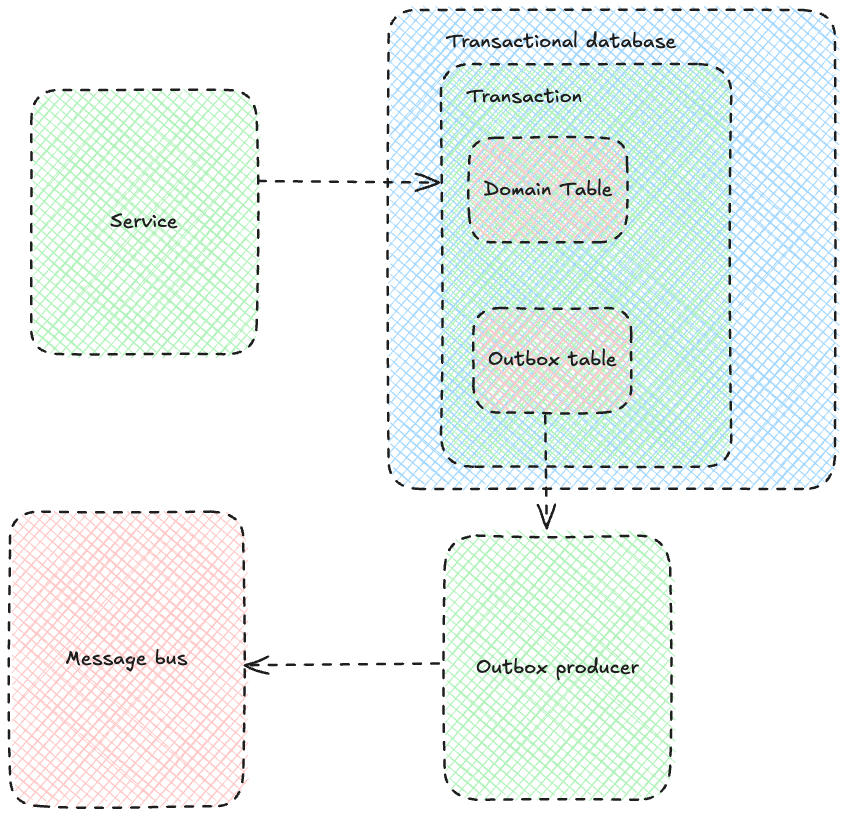
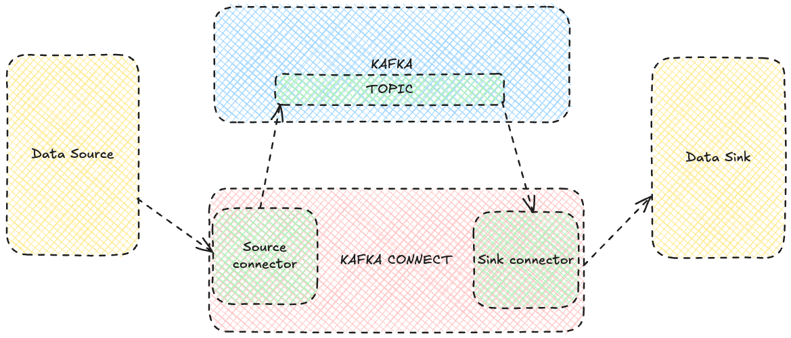

# Kafka Connect

### Transaction Outbox Pattern



### Najważniejsze informacje o Kafka Connect



| **Kategoria**                | **Opis**                                                                                                                                             | **Dlaczego ważne?**                                                                                                   |
|-------------------------------|-------------------------------------------------------------------------------------------------------------------------------------------------------|-----------------------------------------------------------------------------------------------------------------------|
| **Czym jest Kafka Connect?**  | Narzędzie Kafka do łatwej integracji systemów zewnętrznych z Apache Kafka (źródła danych i cele).                                                    | Umożliwia przesyłanie danych między systemami bez konieczności pisania kodu od zera.                                  |
| **Typy konektorów**           | - **Źródła**: Pobierają dane z zewnętrznych systemów do tematów Kafka. <br> - **Cele**: Wysyłają dane z Kafka do zewnętrznych systemów.              | Umożliwiają integrację Kafka z bazami danych, plikami, systemami chmurowymi (np. S3), i innymi aplikacjami.           |
| **Tryby pracy**               | - **Standalone**: Jeden proces worker.<br> - **Distributed**: Klaster workerów dla skalowalności i wysokiej dostępności.                             | Distributed jest idealny do środowisk produkcyjnych wymagających skalowalności i odporności na awarie.                |
| **Główne komponenty**         | - **Worker**: Uruchamia konektory.<br> - **Connector**: Odpowiada za logikę źródła lub celu.<br> - **Task**: Jednostka przetwarzania danych w workerze. | Podział odpowiedzialności umożliwia lepsze zarządzanie i skalowanie w Kafka Connect.                                   |
| **Tematy systemowe**          | - `connect-configs`: Przechowuje konfigurację konektorów.<br> - `connect-offsets`: Przechowuje offsety przetwarzania.<br> - `connect-statuses`: Statusy konektorów. | Konfiguracja i statusy są przechowywane w Kafka, co zapewnia trwałość i łatwość odtworzenia stanu po awarii.           |
| **REST API**                  | Kafka Connect udostępnia REST API do zarządzania konektorami, np.: <br> - Tworzenie (`POST /connectors`) <br> - Status (`GET /connectors/{name}/status`) <br> - Usuwanie (`DELETE /connectors/{name}`). | REST API pozwala na łatwe zautomatyzowanie zarządzania Kafka Connect z poziomu aplikacji zewnętrznych.                |
| **Konektory popularne**       | - **JDBC**: Do integracji z bazami danych.<br> - **FileStream**: Czyta i zapisuje dane z/do plików.<br> - **S3 Sink**: Eksportuje dane do AWS S3.    | Popularne konektory pozwalają na natychmiastową integrację z najczęściej używanymi systemami.                         |
| **Skalowalność**              | Workerzy mogą dynamicznie dzielić zadania (`tasks`) pomiędzy sobą w trybie distributed.                                                              | Umożliwia równoległe przetwarzanie dużych ilości danych i zapewnia wysoką dostępność.                                  |
| **Mechanizmy błędów**         | Kafka Connect obsługuje mechanizmy takie jak Retry, Dead Letter Queue (DLQ) do obsługi błędów przetwarzania wiadomości.                              | Zapewnia niezawodność systemu nawet w przypadku problematycznych wiadomości.                                          |
| **Monitorowanie**             | Kafka Connect oferuje metryki JMX i tematy statusowe (`connect-statuses`) do monitorowania stanu konektorów i workerów.                              | Ułatwia diagnostykę problemów i monitorowanie wydajności konektorów.                                                 |
| **Konfiguracja konektora**    | Każdy konektor wymaga pliku JSON z konfiguracją (np. `name`, `connector.class`, `tasks.max`, `topics`).                                               | Prosty format JSON umożliwia łatwe zarządzanie konfiguracją konektorów.                                               |
| **Proces dodania konektora**  | 1. Stwórz konfigurację JSON. <br> 2. Użyj REST API do rejestracji konektora. <br> 3. Monitoruj status za pomocą API (`GET /connectors/{name}/status`). | Jasny proces dodawania konektorów umożliwia szybkie rozpoczęcie pracy z Kafka Connect.                                |
| **Retry i DLQ**               | Kafka Connect wspiera ponowne próby przetwarzania błędnych wiadomości (`retry`) oraz przekierowanie do Dead Letter Queue (`DLQ`).                     | Ważne w przypadku błędnych wiadomości, aby uniknąć blokowania przepływu danych.                                        |


### Uruchomienie środowiska

```bash
  docker run -d --name postgres --network mynetwork -e POSTGRES_USER=youruser -e POSTGRES_PASSWORD=yourpassword -e POSTGRES_DB=yourdatabase -p 5432:5432 postgres:latest -c wal_level=logical -c max_replication_slots=4 -c max_wal_senders=4 -c shared_preload_libraries='pgoutput'
```

```bash
    docker build -t kafka-connect-custom:latest .
```

```bash
  docker run -d --name kafka-connect-1 --network mynetwork -p 8083:8083 -e CONNECT_BOOTSTRAP_SERVERS=kafka-1:29092,kafka-2:29092 -e CONNECT_REST_PORT=8083 -e CONNECT_REST_ADVERTISED_HOST_NAME=kafka-connect-1 -e CONNECT_GROUP_ID=kafka-connect-cluster -e CONNECT_CONFIG_STORAGE_TOPIC=connect-configs -e CONNECT_OFFSET_STORAGE_TOPIC=connect-offsets -e CONNECT_STATUS_STORAGE_TOPIC=connect-status -e CONNECT_PLUGIN_PATH="/usr/share/java" -e CONNECT_KEY_CONVERTER=org.apache.kafka.connect.json.JsonConverter -e CONNECT_VALUE_CONVERTER=org.apache.kafka.connect.json.JsonConverter -e CONNECT_KEY_CONVERTER_SCHEMAS_ENABLE=true -e CONNECT_VALUE_CONVERTER_SCHEMAS_ENABLE=true kafka-connect-custom:latest
```

```bash
  docker run -d --name kafka-connect-2 --network mynetwork -p 8084:8083 -e CONNECT_BOOTSTRAP_SERVERS=kafka-1:29092,kafka-2:29092 -e CONNECT_REST_PORT=8083 -e CONNECT_REST_ADVERTISED_HOST_NAME=kafka-connect-2 -e CONNECT_GROUP_ID=kafka-connect-cluster -e CONNECT_CONFIG_STORAGE_TOPIC=connect-configs -e CONNECT_OFFSET_STORAGE_TOPIC=connect-offsets -e CONNECT_STATUS_STORAGE_TOPIC=connect-status -e CONNECT_PLUGIN_PATH="/usr/share/java" -e CONNECT_KEY_CONVERTER=org.apache.kafka.connect.json.JsonConverter -e CONNECT_VALUE_CONVERTER=org.apache.kafka.connect.json.JsonConverter -e CONNECT_KEY_CONVERTER_SCHEMAS_ENABLE=true -e CONNECT_VALUE_CONVERTER_SCHEMAS_ENABLE=true kafka-connect-custom:latest
```

```bash
  docker run -d --name kafka-connect-3 --network mynetwork -p 8085:8083 -e CONNECT_BOOTSTRAP_SERVERS=kafka-1:29092,kafka-2:29092 -e CONNECT_REST_PORT=8083 -e CONNECT_REST_ADVERTISED_HOST_NAME=kafka-connect-3 -e CONNECT_GROUP_ID=kafka-connect-cluster -e CONNECT_CONFIG_STORAGE_TOPIC=connect-configs -e CONNECT_OFFSET_STORAGE_TOPIC=connect-offsets -e CONNECT_STATUS_STORAGE_TOPIC=connect-status -e CONNECT_PLUGIN_PATH="/usr/share/java" -e CONNECT_KEY_CONVERTER=org.apache.kafka.connect.json.JsonConverter -e CONNECT_VALUE_CONVERTER=org.apache.kafka.connect.json.JsonConverter -e CONNECT_KEY_CONVERTER_SCHEMAS_ENABLE=true -e CONNECT_VALUE_CONVERTER_SCHEMAS_ENABLE=true kafka-connect-custom:latest
```


# Postgres Source Connector, CDC i WAL w Kafka Connect

```bash
  docker exec -it postgres psql -U youruser -d yourdatabase
```

```sql
CREATE TABLE test_table (
id SERIAL PRIMARY KEY,
name VARCHAR(100) NOT NULL
);
```

```sql
CREATE TABLE target_table AS TABLE test_table WITH NO DATA;

```

```sql
ALTER TABLE target_table ADD CONSTRAINT target_table_pk PRIMARY KEY (id);
```


# Kafka Connect API

| **API/Endpoint**                  | **Opis**                                                                                                   | **Przykład użycia**                                                                                       |
|-----------------------------------|-----------------------------------------------------------------------------------------------------------|-----------------------------------------------------------------------------------------------------------|
| **GET /connectors**               | Zwraca listę wszystkich zarejestrowanych konektorów.                                                      | Pobranie listy wszystkich dostępnych konektorów.                                                          |
| **POST /connectors**              | Tworzy nowy konektor.                                                                                     | Dodanie nowego konektora z konfiguracją źródła lub celu.                                                  |
| **GET /connectors/{name}**        | Zwraca szczegóły konfiguracji konkretnego konektora.                                                      | Pobranie informacji o konektorze o nazwie `my-connector`.                                                 |
| **PUT /connectors/{name}/config** | Aktualizuje konfigurację istniejącego konektora.                                                          | Modyfikacja konfiguracji konektora np. zmiana lokalizacji danych.                                         |
| **GET /connectors/{name}/status** | Zwraca status konektora, w tym stan zadań (tasks) oraz błędy.                                              | Monitoring stanu konektora, np. czy działa poprawnie.                                                     |
| **DELETE /connectors/{name}**     | Usuwa wskazany konektor.                                                                                  | Usunięcie konektora `my-connector`.                                                                       |
| **GET /connectors/{name}/tasks**  | Zwraca listę wszystkich zadań (`tasks`) powiązanych z konektorem.                                          | Sprawdzenie zadań w ramach konektora `my-connector`.                                                      |
| **GET /connectors/{name}/tasks/{taskId}/status** | Zwraca status konkretnego zadania (`task`) konektora.                                                     | Monitoring stanu zadania `taskId` w konektorze `my-connector`.                                            |
| **POST /connectors/{name}/restart** | Restartuje wskazany konektor, w tym jego zadania (`tasks`).                                               | Restart konektora po błędach lub zmianach konfiguracji.                                                   |
| **GET /connectors/{name}/config/validate** | Waliduje konfigurację konektora bez jego uruchamiania.                                                    | Sprawdzenie poprawności konfiguracji konektora przed jego dodaniem.                                       |
| **GET /connectors/{name}/topics** | Zwraca listę tematów (topics) powiązanych z konektorem.                                                   | Pobranie tematów odczytywanych/zapisywanych przez konektor.                                               |
| **GET /connector-plugins**        | Zwraca listę wszystkich dostępnych pluginów konektorów w systemie.                                        | Pobranie listy dostępnych pluginów np. do źródeł danych takich jak JDBC, S3 itp.                          |
| **POST /connectors/{name}/pause** | Wstrzymuje działanie konektora.                                                                           | Zatrzymanie konektora w celu tymczasowego wstrzymania przetwarzania danych.                                |
| **POST /connectors/{name}/resume** | Wznawia działanie wstrzymanego konektora.                                                                 | Ponowne uruchomienie konektora po wstrzymaniu.                                                            |
| **GET /config/worker**            | Zwraca konfigurację workerów Kafka Connect.                                                               | Pobranie informacji o workerach i ich konfiguracji.                                                       |
| **GET /cluster/status**           | Zwraca informacje o stanie całego klastra Kafka Connect, w tym dostępnych workerach i ich statusie.        | Monitoring stanu klastra Kafka Connect.                                                                   |
| **POST /connectors/{name}/tasks/{taskId}/restart** | Restartuje konkretne zadanie konektora (`task`).                                                          | Restart zadania `taskId` w konektorze `my-connector`.                                                     |

### Uruchom connector source

```bash
  curl -X POST -H "Content-Type: application/json" --data @postgres-connector.json http://localhost:8083/connectors
```

### Sprawdź czy konektor działa

```bash
    curl -X GET http://localhost:8083/connectors/postgres-source-connector/tasks/0/status
```

### Uruchom connector sink

```bash
  curl -X POST -H "Content-Type: application/json" --data @jdbc-sink-connector.json http://localhost:8083/connectors
```

### Sprawdź czy konektor działa

```bash
    curl -X GET http://localhost:8083/connectors/jdbc-sink-connector/tasks/0/status
```

### **Transformacje danych w Kafka Connect (SMT)**

Kafka Connect oferuje wbudowane transformacje danych (*Single Message Transforms*, SMT), które umożliwiają przekształcanie wiadomości podczas ich przesyłania między źródłem a miejscem docelowym. Poniżej znajduje się podsumowanie najważniejszych transformacji i ich zastosowań:

---

### **Podsumowanie wbudowanych transformacji**

| **Transformacja**    | **Opis**                                   | **Zastosowanie**                                      |
|-----------------------|-------------------------------------------|------------------------------------------------------|
| **AddField**          | Dodaje nowe pole z wartością stałą.       | Dodanie metadanych, np. `source` lub `environment`.  |
| **ExtractField**      | Wyodrębnia jedno pole jako wartość rekordu. | Upraszczanie struktury danych.                       |
| **InsertField**       | Dodaje informacje o źródle, np. `topic`.  | Śledzenie pochodzenia wiadomości.                    |
| **MaskField**         | Maskuje lub usuwa wrażliwe dane.          | Ochrona danych, np. numerów identyfikacyjnych.       |
| **Drop**              | Usuwa całe rekordy spełniające warunek.   | Filtracja niepotrzebnych lub błędnych danych.         |
| **ReplaceField**      | Zmienia nazwy pól lub usuwa wybrane pola. | Uporządkowanie struktury danych.                     |
| **Cast**              | Konwertuje typy danych w rekordzie.       | Dopasowanie do wymagań docelowego systemu.           |
| **Flatten**           | Spłaszcza zagnieżdżone struktury JSON.    | Przygotowanie danych do systemów wymagających płaskich struktur. |
| **HoistField**        | Opakowuje rekord w pole nadrzędne.        | Dodanie pola nadrzędnego, np. `payload`.             |
| **TimestampConverter**| Konwertuje format znaczników czasu.       | Dopasowanie czasu do wymagań docelowego systemu.     |
| **ValueToKey**        | Ustawia klucz wiadomości na podstawie wartości pola. | Partycjonowanie zależne od klucza.                   |
| **RegexRouter**       | Zmienia nazwę tematu za pomocą regex.     | Przekierowanie wiadomości do odpowiednich tematów.   |

---

### Wejdź do kontenera z bazą danych i wykonaj zapytania, zmiany będą widoczne w Kafka UI

```bash
  docker exec -it postgres psql -U youruser -d yourdatabase
```

```sql
INSERT INTO test_table (name) VALUES ('Alice');
INSERT INTO test_table (name) VALUES ('Bob');
```

```sql
UPDATE test_table SET name = 'MODED' WHERE id = 1;
```

```sql
DELETE FROM test_table WHERE id = 1;
```

```sql
DELETE FROM test_table;
```

### Usuń konektory

```bash
    curl -X DELETE http://localhost:8083/connectors/postgres-source-connector
```

```bash
    curl -X DELETE http://localhost:8083/connectors/jdbc-sink-connector
```

# ENG


# Kafka Connect

### Transaction Outbox Pattern


### Key Kafka Connect information


| **Category**                   | **Description**                                                                                                                                          | **Why it matters**                                                                                                    |
|--------------------------------|----------------------------------------------------------------------------------------------------------------------------------------------------------|-----------------------------------------------------------------------------------------------------------------------|
| **What is Kafka Connect?**     | A Kafka tool for easy integration of external systems with Apache Kafka (sources and sinks).                                                             | Enables data transfer between systems without writing custom code from scratch.                                       |
| **Types of connectors**        | - **Sources**: Pull data from external systems into Kafka topics.<br>- **Sinks**: Send data from Kafka to external systems.                             | Allows Kafka to integrate with databases, files, cloud services (e.g., S3), and other applications.                  |
| **Operating modes**            | - **Standalone**: Single worker process.<br>- **Distributed**: Cluster of workers for scalability and high availability.                                 | Distributed mode is ideal for production environments requiring scalability and fault tolerance.                     |
| **Main components**            | - **Worker**: Runs connectors.<br>- **Connector**: Implements source or sink logic.<br>- **Task**: Data-processing unit within a worker.                 | Separation of responsibilities enables better management and scaling in Kafka Connect.                                |
| **Internal topics**            | - `connect-configs`: Stores connector configurations.<br>- `connect-offsets`: Stores processing offsets.<br>- `connect-statuses`: Stores connector statuses.| Configuration and state are stored in Kafka, ensuring durability and easy state recovery after failures.              |
| **REST API**                   | Kafka Connect provides a REST API for connector management, e.g.:<br>- Create (`POST /connectors`)<br>- Status (`GET /connectors/{name}/status`)<br>- Delete (`DELETE /connectors/{name}`) | The REST API allows easy automation of Kafka Connect management from external applications.                          |
| **Popular connectors**         | - **JDBC**: For database integration.<br>- **FileStream**: Reads/writes data from/to files.<br>- **S3 Sink**: Exports data to AWS S3.                    | Popular connectors enable out‑of‑the‑box integration with the most commonly used systems.                             |
| **Scalability**                | Workers can dynamically share tasks among themselves in distributed mode.                                                                                | Enables parallel processing of large data volumes and provides high availability.                                    |
| **Error handling**             | Kafka Connect supports mechanisms such as Retry and Dead Letter Queue (DLQ) to handle message-processing errors.                                         | Ensures system reliability even when problematic messages occur.                                                     |
| **Monitoring**                 | Kafka Connect offers JMX metrics and status topics (`connect-statuses`) for monitoring connector and worker health.                                      | Helps diagnose issues and monitor connector performance.                                                             |
| **Connector configuration**    | Each connector requires a JSON configuration file (e.g., `name`, `connector.class`, `tasks.max`, `topics`).                                             | The simple JSON format makes connector configuration management straightforward.                                     |
| **Adding a connector**         | 1. Create a JSON configuration.<br>2. Register it via the REST API.<br>3. Monitor status with `GET /connectors/{name}/status`.                            | A clear process that enables quick setup of new connectors in Kafka Connect.                                         |
| **Retry & DLQ**                | Kafka Connect supports retrying failed messages and forwarding them to a Dead Letter Queue (DLQ).                                                        | Important for handling bad messages without blocking the data pipeline.                                              |


### Environment setup

```bash
  docker run -d --name postgres --network mynetwork -e POSTGRES_USER=youruser -e POSTGRES_PASSWORD=yourpassword -e POSTGRES_DB=yourdatabase -p 5432:5432 postgres:latest -c wal_level=logical -c max_replication_slots=4 -c max_wal_senders=4 -c shared_preload_libraries='pgoutput'
```

```bash
    docker build -t kafka-connect-custom:latest .
```

```bash
  docker run -d --name kafka-connect-1 --network mynetwork -p 8083:8083 -e CONNECT_BOOTSTRAP_SERVERS=kafka-1:29092,kafka-2:29092 -e CONNECT_REST_PORT=8083 -e CONNECT_REST_ADVERTISED_HOST_NAME=kafka-connect-1 -e CONNECT_GROUP_ID=kafka-connect-cluster -e CONNECT_CONFIG_STORAGE_TOPIC=connect-configs -e CONNECT_OFFSET_STORAGE_TOPIC=connect-offsets -e CONNECT_STATUS_STORAGE_TOPIC=connect-status -e CONNECT_PLUGIN_PATH="/usr/share/java" -e CONNECT_KEY_CONVERTER=org.apache.kafka.connect.json.JsonConverter -e CONNECT_VALUE_CONVERTER=org.apache.kafka.connect.json.JsonConverter -e CONNECT_KEY_CONVERTER_SCHEMAS_ENABLE=true -e CONNECT_VALUE_CONVERTER_SCHEMAS_ENABLE=true kafka-connect-custom:latest
```

```bash
  docker run -d --name kafka-connect-2 --network mynetwork -p 8084:8083 -e CONNECT_BOOTSTRAP_SERVERS=kafka-1:29092,kafka-2:29092 -e CONNECT_REST_PORT=8083 -e CONNECT_REST_ADVERTISED_HOST_NAME=kafka-connect-2 -e CONNECT_GROUP_ID=kafka-connect-cluster -e CONNECT_CONFIG_STORAGE_TOPIC=connect-configs -e CONNECT_OFFSET_STORAGE_TOPIC=connect-offsets -e CONNECT_STATUS_STORAGE_TOPIC=connect-status -e CONNECT_PLUGIN_PATH="/usr/share/java" -e CONNECT_KEY_CONVERTER=org.apache.kafka.connect.json.JsonConverter -e CONNECT_VALUE_CONVERTER=org.apache.kafka.connect.json.JsonConverter -e CONNECT_KEY_CONVERTER_SCHEMAS_ENABLE=true -e CONNECT_VALUE_CONVERTER_SCHEMAS_ENABLE=true kafka-connect-custom:latest
```

```bash
  docker run -d --name kafka-connect-3 --network mynetwork -p 8085:8083 -e CONNECT_BOOTSTRAP_SERVERS=kafka-1:29092,kafka-2:29092 -e CONNECT_REST_PORT=8083 -e CONNECT_REST_ADVERTISED_HOST_NAME=kafka-connect-3 -e CONNECT_GROUP_ID=kafka-connect-cluster -e CONNECT_CONFIG_STORAGE_TOPIC=connect-configs -e CONNECT_OFFSET_STORAGE_TOPIC=connect-offsets -e CONNECT_STATUS_STORAGE_TOPIC=connect-status -e CONNECT_PLUGIN_PATH="/usr/share/java" -e CONNECT_KEY_CONVERTER=org.apache.kafka.connect.json.JsonConverter -e CONNECT_VALUE_CONVERTER=org.apache.kafka.connect.json.JsonConverter -e CONNECT_KEY_CONVERTER_SCHEMAS_ENABLE=true -e CONNECT_VALUE_CONVERTER_SCHEMAS_ENABLE=true kafka-connect-custom:latest
```


# Postgres Source Connector, CDC and WAL in Kafka Connect

```bash
  docker exec -it postgres psql -U youruser -d yourdatabase
```

```sql
CREATE TABLE test_table (
id SERIAL PRIMARY KEY,
name VARCHAR(100) NOT NULL
);
```

```sql
CREATE TABLE target_table AS TABLE test_table WITH NO DATA;

```

```sql
ALTER TABLE target_table ADD CONSTRAINT target_table_pk PRIMARY KEY (id);
```


# Kafka Connect API

| **API/Endpoint**                                    | **Description**                                                                                       | **Example Usage**                                                                          |
|-----------------------------------------------------|-------------------------------------------------------------------------------------------------------|--------------------------------------------------------------------------------------------|
| **GET /connectors**                                 | Returns a list of all registered connectors.                                                          | Retrieve the list of all available connectors.                                             |
| **POST /connectors**                                | Creates a new connector.                                                                              | Add a new source or sink connector.                                                        |
| **GET /connectors/{name}**                          | Returns the configuration details of a specific connector.                                            | Get information for the connector named `my-connector`.                                    |
| **PUT /connectors/{name}/config**                   | Updates the configuration of an existing connector.                                                   | Modify connector settings, e.g. change the data location.                                  |
| **GET /connectors/{name}/status**                   | Returns the status of a connector, including task states and errors.                                  | Monitor the connector’s health, e.g. check if it’s running correctly.                      |
| **DELETE /connectors/{name}**                       | Deletes the specified connector.                                                                      | Remove the `my-connector`.                                                                 |
| **GET /connectors/{name}/tasks**                    | Returns a list of all tasks associated with the connector.                                            | View all tasks for connector `my-connector`.                                               |
| **GET /connectors/{name}/tasks/{taskId}/status**    | Returns the status of a specific connector task.                                                      | Monitor the status of task `taskId` in connector `my-connector`.                           |
| **POST /connectors/{name}/restart**                 | Restarts the specified connector and its tasks.                                                       | Restart the connector after errors or configuration changes.                               |
| **GET /connectors/{name}/config/validate**          | Validates a connector’s configuration without starting it.                                            | Check the validity of a connector config before deployment.                                |
| **GET /connectors/{name}/topics**                   | Returns a list of topics associated with the connector.                                               | Retrieve the topics being read or written by the connector.                                |
| **GET /connector-plugins**                          | Returns a list of all available connector plugins in the system.                                      | List available plugins, e.g. JDBC, S3, etc.                                                |
| **POST /connectors/{name}/pause**                   | Pauses the specified connector.                                                                       | Temporarily halt data processing for the connector.                                        |
| **POST /connectors/{name}/resume**                  | Resumes a paused connector.                                                                           | Resume data processing after a pause.                                                      |
| **GET /config/worker**                              | Returns the Kafka Connect worker configuration.                                                       | Retrieve worker configuration details.                                                     |
| **GET /cluster/status**                             | Returns the status of the entire Kafka Connect cluster, including available workers and their health. | Monitor the overall health and status of the Kafka Connect cluster.                         |
| **POST /connectors/{name}/tasks/{taskId}/restart**  | Restarts a specific connector task.                                                                   | Restart task `taskId` in connector `my-connector`.                                         |


### Start source connector

```bash
  curl -X POST -H "Content-Type: application/json" --data @postgres-connector.json http://localhost:8083/connectors
```

### Check if the connector is running

```bash
    curl -X GET http://localhost:8083/connectors/postgres-source-connector/tasks/0/status
```

### Start sink connector

```bash
  curl -X POST -H "Content-Type: application/json" --data @jdbc-sink-connector.json http://localhost:8083/connectors
```

### Check if the connector is running

```bash
    curl -X GET http://localhost:8083/connectors/jdbc-sink-connector/tasks/0/status
```

### **Data Transformations in Kafka Connect (SMT)**

Kafka Connect provides built‑in Single Message Transforms (SMT) that allow you to modify messages in flight between source and sink. Below is a summary of the key transforms and their use cases:

---

### **Summary of Built‑in Transforms**

| **Transform**         | **Description**                                      | **Use Case**                                                |
|-----------------------|------------------------------------------------------|-------------------------------------------------------------|
| **AddField**          | Adds a new field with a constant value.              | Add metadata such as `source` or `environment`.             |
| **ExtractField**      | Extracts a single field to become the record value.  | Simplify the record structure.                              |
| **InsertField**       | Inserts information about the source (e.g., topic).  | Track the origin of the message.                            |
| **MaskField**         | Masks or removes sensitive data.                     | Protect confidential information, e.g., IDs or PII.         |
| **Drop**              | Drops entire records that meet a condition.          | Filter out unwanted or invalid records.                     |
| **ReplaceField**      | Renames or removes specified fields.                 | Clean up or restructure the schema.                         |
| **Cast**              | Converts data types within the record.               | Match the requirements of the target system.                |
| **Flatten**           | Flattens nested JSON structures.                     | Prepare data for systems that require flat schemas.         |
| **HoistField**        | Wraps the entire record in a parent field.           | Add a top‑level field, e.g., `payload`.                     |
| **TimestampConverter**| Converts timestamp formats.                          | Align time formats with downstream system requirements.     |
| **ValueToKey**        | Sets the message key based on a field’s value.       | Enable partitioning by key.                                 |
| **RegexRouter**       | Renames topics using regular expressions.            | Dynamically route messages to appropriate topics.           |

---

### Interact with the Database Container


```bash
  docker exec -it postgres psql -U youruser -d yourdatabase
```

```sql
INSERT INTO test_table (name) VALUES ('Alice');
INSERT INTO test_table (name) VALUES ('Bob');
```

```sql
UPDATE test_table SET name = 'MODED' WHERE id = 1;
```

```sql
DELETE FROM test_table WHERE id = 1;
```

```sql
DELETE FROM test_table;
```

### Delete Connectors

```bash
    curl -X DELETE http://localhost:8083/connectors/postgres-source-connector
```

```bash
    curl -X DELETE http://localhost:8083/connectors/jdbc-sink-connector
```