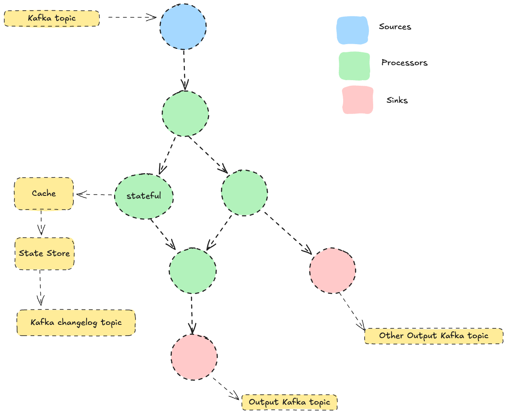
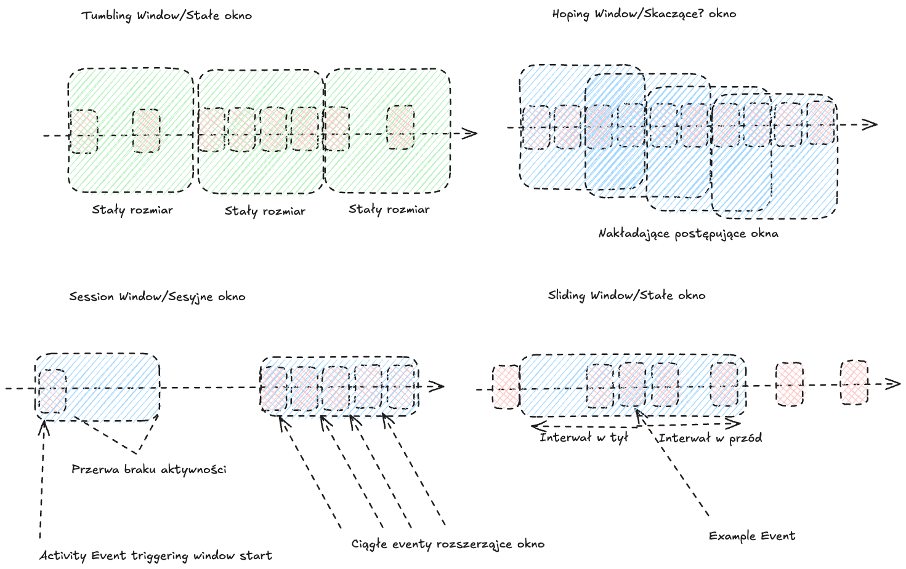

# Kafka Streams

```bash
  mvn clean package
```

```bash
  docker build -t kafka-streams .
```

```bash
  docker run --network mynetwork kafka-streams
```

### Przygotowanie środowiska


```bash
  docker run --rm --network mynetwork confluentinc/cp-kafka:7.7.1 kafka-topics --create --topic streaming-transactions --partitions 1 --replication-factor 3 --if-not-exists --bootstrap-server kafka-1:29092,kafka-2:39092,kafka-3:49092
```

```bash
  docker run --rm --network mynetwork confluentinc/cp-kafka:7.7.1 kafka-topics --create --topic streaming-prices --partitions 1 --replication-factor 3 --if-not-exists --bootstrap-server kafka-1:29092,kafka-2:39092,kafka-3:49092
```

### Topologia Kafka Streams



### Zkonfigiruj aplikację w pliku `application.yml`

```yaml
spring:
  kafka:
    streams:
      application-id: "kafka_streams_training"
      bootstrap-servers: kafka-1:29092,kafka-2:39092,kafka-3:49092
      state-dir: "/tmp/transaction_processor/instance1"
      replication-factor: 2
      properties:
        default.key.serde: org.apache.kafka.common.serialization.Serdes$StringSerde
        default.value.serde: org.apache.kafka.common.serialization.Serdes$DoubleSerde
```


### Zaimplementuj klasę `BasicStream.class`
### Celem zadania jest przetworzenie strumienia transakcji i wyfiltrowanie transakcji z instrumentem `BTC`.

### Stateless operations

| **Operacja**           | **Opis**                                                                                      | **Przykład**                                    |
|-------------------------|----------------------------------------------------------------------------------------------|------------------------------------------------|
| **`filter()`**          | Filtruje wiadomości na podstawie warunku logicznego.                                         | Odrzucanie rekordów o wartości `null`.         |
| **`map()`**             | Przekształca każdy rekord do nowej postaci (klucz i/lub wartość).                            | Modyfikacja klucza wiadomości.                 |
| **`flatMap()`**         | Przekształca jeden rekord w zero lub wiele rekordów.                                         | Rozbijanie jednego rekordu na wiele.           |
| **`peek()`**            | Wykonuje działanie dla każdego rekordu bez zmiany strumienia (np. logowanie).                | Logowanie wartości wiadomości.                 |
| **`branch()`**          | Rozdziela strumień na wiele podstrumieni na podstawie warunków.                              | Rozdzielenie strumienia na "valid" i "invalid".|
| **`merge()`**           | Łączy wiele strumieni w jeden.                                                               | Scalanie dwóch strumieni.                      |
| **`to()`**              | Zapisuje dane do określonego tematu Kafka.                                                   | Zapis rekordów do `output-topic`.              |


#### Utwórz instancje JsonSerde<Transaction> aby móc przetwarzać obiekty `Transaction` w strumieniu.

```java
JsonSerde<Transaction> transactionSerde = new JsonSerde<>(Transaction.class);
```

#### Utwórz strumień transakcji z tematu `streaming-transactions

```java
KStream<String, Transaction> transactions = builder.stream("streaming-transactions",Consumed.with(Serdes.String(), transactionSerde));
```

#### Wyfiltruj transakcje z instrumentem `BTC`

```java
final KStream<String, Transaction> filteredTransactions = transactions.filter((k, v) -> v.getInstrument().equalsIgnoreCase("BTC"));
```

#### Zmień wartości transakcji na instrument

```java
KStream<String, String> outputStream = filteredTransactions.mapValues(s -> s.getInstrument());
```

#### Zapisz dane do tematu `instruments`

```java
outputStream.to("instruments", Produced.with(Serdes.String(), Serdes.String()));
```

#### Wyświetl dane na konsoli

```java
transactions.print(Printed.<String, Transaction>toSysOut().withLabel("source stream"));
outputStream.print(Printed.<String, String>toSysOut().withLabel("sink stream"));
return outputStream;
```

### Przebuduj i uruchom aplikację
```bash
    mvn clean package
    docker build -t kafka-streams .
    docker run --network mynetwork kafka-streams
```

### Poeksperymentuj z operacjami `flatMap()`, `peek()`, `branch()`, `merge()`

### Stateful operations

| **Operacja**           | **Opis**                                                                                      | **Przykład**                                    |
|-------------------------|----------------------------------------------------------------------------------------------|------------------------------------------------|
| **`groupBy()`**         | Grupuje rekordy na podstawie klucza lub wartości.                                            | Grupowanie po kluczu `category`.               |
| **`aggregate()`**       | Tworzy stan na podstawie zgrupowanych rekordów.                                              | Sumowanie wartości w obrębie klucza.           |
| **`count()`**           | Zlicza rekordy w grupach kluczy.                                                             | Liczenie wiadomości na klucz.                  |
| **`reduce()`**          | Redukuje rekordy w grupie, łącząc je zgodnie z podaną logiką.                                | Konkatenacja wartości w grupie.                |
| **`join()`**            | Łączy dwa strumienie na podstawie wspólnego klucza.                                          | Łączenie `orders` z `payments`.                |
| **`windowedBy()`**      | Tworzy okna czasowe na zgrupowanych danych.                                                  | Grupowanie w oknach 10-minutowych.             |
| **`transform()`**       | Pozwala na niestandardowe przetwarzanie rekordów z dostępem do stanu.                        | Tworzenie własnych operacji z dostępem do stanu.|


### Zaimplementuj klasę `GroupingStream.class`


### KTable vs KStream

| **KStream**                           | **KTable**                                                                                   |
|---------------------------------------|---------------------------------------------------------------------------------------------|
| Strumień nieprzetworzonych rekordów.  | Reprezentuje bieżący stan (tabelę) na podstawie tematów kompaktowanych.                     |
| Każdy rekord jest niezależny.         | Rekordy nadpisują wcześniejsze wartości dla tego samego klucza.                             |
| Nie przechowuje stanu.                | Przechowuje stan w Kafka oraz lokalnie (state store).                                       |
| Idealne do przetwarzania zdarzeń.     | Idealne do reprezentacji bieżącego stanu systemu (np. tabele z bazy danych).                |
| Przykład: strumień zamówień.          | Przykład: tabela ze stanem użytkowników (ID -> Nazwa).                                      |


### Celem zadania jest przetworzenie strumienia transakcji i zgrupowanie ich po instrumencie.

#### Utwórz instancje JsonSerde<Transaction> aby móc przetwarzać obiekty `Transaction` w strumieniu.
#### Utwórz instancje Serde<Double> aby móc przetwarzać wartości `Double` w strumieniu.
#### Utwórz strumień transakcji z tematu `streaming-transactions

```java
JsonSerde<Transaction> transactionSerde = new JsonSerde<>(Transaction.class);
Serde<Double> doubleSerde = Serdes.Double();

KStream<String, Transaction> txnStream = builder.stream("streaming-transactions", Consumed.with(Serdes.String(), transactionSerde));
```

#### Zmodyfikuj klucz transakcji na instrument

```java
KStream<String, Double> aggregated = txnStream
                .selectKey((k, v) -> v.getInstrument())
```

#### Zmodyfikuj wartość transakcji na kwotę

```java
KStream<String, Double> aggregated = txnStream
                .selectKey((k, v) -> v.getInstrument())
                .mapValues((k, v) -> v.getAmount().doubleValue())
```

#### Zgrupuj transakcje po instrumencie

```java
KStream<String, Double> aggregated = txnStream
                .selectKey((k, v) -> v.getInstrument())
                .mapValues((k, v) -> v.getAmount().doubleValue())
                .groupByKey()
```

#### Zsumuj wartości transakcji w obrębie grupy

```java
KStream<String, Double> aggregated = txnStream
                .selectKey((k, v) -> v.getInstrument())
                .mapValues((k, v) -> v.getAmount().doubleValue())
                .groupByKey()
                .aggregate(
                        () -> 0.0, (aggKey, newValue, aggValue) -> aggValue + newValue,
                        Materialized.with(Serdes.String(), doubleSerde))
                .toStream();
```

#### Wyświetl dane na konsoli

```java
txnStream.print(Printed.<String, Transaction>toSysOut().withLabel("source stream"));
aggregated.print(Printed.<String, Double>toSysOut().withLabel("sink stream"));

return txnStream;
```

### Spróbuj zastąpić `aggregate()` operacją `reduce()`

### Przebuduj i uruchom aplikację
```bash
    mvn clean package
    docker build -t kafka-streams .
    docker run --network mynetwork kafka-streams
```

### Zaimplementuj klasę `TimeWindowStream.class`
### Celem zadania jest przetworzenie strumienia transakcji i zliczenie transakcji w oknach czasowych po 5s.

#### Utwórz instancje JsonSerde<Transaction> aby móc przetwarzać obiekty `Transaction` w strumieniu.

```java
JsonSerde<Transaction> transactionSerde = new JsonSerde<>(Transaction.class);

KStream<String, Transaction> txnStream = builder.stream("streaming-transactions", Consumed.with(Serdes.String(), transactionSerde));
```

#### Zmodyfikuj klucz transakcji na instrument

```java
KStream<Windowed<String>, Long> countInWindow = txnStream
                .selectKey((k, v) -> v.getInstrument())
```

#### Zgrupuj transakcje po instrumencie

```java
KStream<Windowed<String>, Long> countInWindow = txnStream
        .selectKey((k, v) -> v.getInstrument())
        .groupByKey()
```

#### Zdefiniuj okno czasowe 5s

```java
KStream<Windowed<String>, Long> countInWindow = txnStream
                .selectKey((k, v) -> v.getInstrument())
                .groupByKey()
                .windowedBy(TimeWindows.ofSizeWithNoGrace(Duration.ofSeconds(5)))
```

#### Zlicz transakcje w obrębie okna czasowego

```java
KStream<Windowed<String>, Long> countInWindow = txnStream
                .selectKey((k, v) -> v.getInstrument())
                .groupByKey()
                .windowedBy(TimeWindows.ofSizeWithNoGrace(Duration.ofSeconds(3)))
                .count(Materialized.with(Serdes.String(), Serdes.Long()))
                .toStream();
```

#### Wyświetl dane na konsoli

```java
txnStream.print(Printed.<String, Transaction>toSysOut().withLabel("source stream"));
countInWindow.print(Printed.<Windowed<String>, Long>toSysOut().withLabel("sink stream"));

return txnStream;
```

### Przebuduj i uruchom aplikację
```bash
    mvn clean package
    docker build -t kafka-streams .
    docker run --network mynetwork kafka-streams
```

### Inne okna czasowe?



### Zaimplementuj klasę `Joins.class`
### Celem zadania jest połączenie strumienia transakcji z cenami instrumentów.
### Pierwsze rozwiązanie z wykorzystaniem `join()` pozwala na połączenie dwóch strumieni na podstawie klucza.

### Odkomentuj kod w `SenderJob.class` i uruchom aplikację.

```java
//    @Scheduled(fixedRate = 5)
//    public void schedulePrices() {
//        PriceTick price = new PriceTick(UUID.randomUUID(), "GOLD", BigDecimal.valueOf(Math.random()));
//        kafkaTemplatePrice.send(PRICE_TOPIC, UUID.randomUUID().toString(), price);
//        PriceTick priceCrypto = new PriceTick(UUID.randomUUID(), "BTC", BigDecimal.valueOf(Math.random()));
//        kafkaTemplatePrice.send(PRICE_TOPIC, UUID.randomUUID().toString(), priceCrypto);
//    }
```

#### Utwórz instancje JsonSerde<Transaction> oraz JsonSerde<PriceTick> aby móc przetwarzać obiekty `Transaction` i `PriceTick` w strumieniu.


```java
JsonSerde<Transaction> transactionSerde = new JsonSerde<>(Transaction.class);
JsonSerde<PriceTick> priceTickSerde = new JsonSerde<>(PriceTick.class);

KStream<String, Transaction> txnStream = builder.stream(
        "streaming-transactions", Consumed.with(Serdes.String(), transactionSerde)
);
KStream<String, PriceTick> pricesStream = builder.stream(
        "streaming-prices", Consumed.with(Serdes.String(), priceTickSerde)
);
```

#### Zmodyfikuj klucz transakcji na instrument

```java
txnStream.selectKey((k, v) -> v.getInstrument())
```

#### Połącz strumień transakcji z cenami instrumentów
#### Stumienie są łączone na podstawie klucza (instrumentu) zatem strumień cen musi być przekształcony na klucz.
#### Stwórz instancje klasy `Trade` aby przechowywać dane z transakcji i ceny instrumentu.
#### Użyj operacji `join()` aby połączyć strumienie.
#### Użyj `JoinWindows.ofTimeDifferenceWithNoGrace()` aby zdefiniować okno czasowe.
#### Użyj `StreamJoined.with()` aby zdefiniować serdesy dla klucza, wartości transakcji i wartości ceny.

```java
txnStream.selectKey((k, v) -> v.getInstrument())
        .join(
        pricesStream.selectKey((k, v) -> v.getInstrument()),
        (txn, price) -> new Trade(
        txn.getInstrument(),
                                txn.getAmount().doubleValue(),
                                price.getPrice().doubleValue()
                        ),
                                JoinWindows.ofTimeDifferenceWithNoGrace(Duration.ofMillis(10)),
        StreamJoined.with(Serdes.String(), transactionSerde, priceTickSerde)
        )
```

#### Wyświetl dane na konsoli

```java
txnStream.selectKey((k, v) -> v.getInstrument())
         .join(
                 pricesStream.selectKey((k, v) -> v.getInstrument()),
                 (txn, price) -> new Trade(
                         txn.getInstrument(),
                         txn.getAmount().doubleValue(),
                         price.getPrice().doubleValue()
                 ),
                 JoinWindows.ofTimeDifferenceWithNoGrace(Duration.ofMillis(10)),
                 StreamJoined.with(Serdes.String(), transactionSerde, priceTickSerde)
         )
         .print(Printed.<String, Trade>toSysOut().withLabel("stream-join-trade"));

return txnStream;
```

### Przebuduj i uruchom aplikację
```bash
    mvn clean package
    docker build -t kafka-streams .
    docker run --network mynetwork kafka-streams
```

### Drugie rozwiązanie z wykorzystaniem `leftJoin()` pozwala na połączenie strumienia z tabelą.
### W tym przypadku, jeżeli nie ma ceny dla instrumentu, to wartość ceny wynosi 0.
### Następnego Join'a dodamy pod pierwszym.

#### Utwórz tabelę cen instrumentów
#### Zmodyfikuj klucz transakcji na instrument oraz wartość na kwotę a następnie zapisz do tabeli.

```java
KTable<String, Double> priceTable = pricesStream.selectKey((k, v) -> v.getInstrument()).mapValues(v -> v.getPrice().doubleValue()).toTable();
```

#### Połącz strumień transakcji z tabelą cen instrumentów
#### Użyj `leftJoin()` aby połączyć strumienie.
#### Użyj `Printed.<String, Trade>toSysOut().withLabel("table-join-trade")` aby wyświetlić dane na konsoli.

```java
txnStream.selectKey((k, v) -> v.getInstrument())
                .leftJoin(priceTable, (txn, price) -> new Trade(
                        txn.getInstrument(),
                        txn.getAmount().doubleValue(),
                        price == null ? 0.0 : price
                )).print(Printed.<String, Trade>toSysOut().withLabel("table-join-trade"));
```

### Przebuduj i uruchom aplikację
```bash
    mvn clean package
    docker build -t kafka-streams .
    docker run --network mynetwork kafka-streams
```

