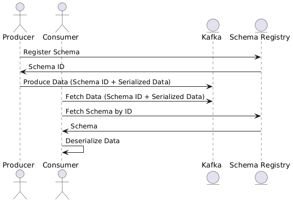

# Avro, Schema Registry i ewolucja schematów

# Ograniczenia JSON jako formatu na Apache Kafka

## Wstęp
JSON (JavaScript Object Notation) jest jednym z najczęściej używanych formatów wymiany danych dzięki swojej czytelności i prostocie. Jednak w kontekście strumieniowania danych w systemach takich jak Apache Kafka, JSON ma wiele ograniczeń, które mogą wpłynąć na wydajność i niezawodność systemu.

---

## Ograniczenia JSON

### 1. **Rozmiar danych**
JSON jest formatem tekstowym, co prowadzi do większych rozmiarów wiadomości w porównaniu do formatów binarnych, takich jak Avro czy Protocol Buffers. W przypadku dużej ilości wiadomości na Kafce, zwiększa to:
- Opóźnienia w transmisji.
- Koszty przechowywania danych.

### 2. **Brak wbudowanego wsparcia dla schematów**
- JSON nie wymusza żadnego schematu (schema-less), co prowadzi do:
    - Potencjalnych błędów, gdy struktura danych zmienia się w czasie.
    - Problemów z walidacją danych i kompatybilnością między producentami a konsumentami.

### 3. **Wydajność przetwarzania**
- Parsowanie JSON jest znacznie wolniejsze niż parsowanie formatów binarnych, co obniża wydajność w systemach o dużym natężeniu danych.

### 4. **Brak wsparcia dla typów binarnych**
- JSON nie obsługuje natywnie typów binarnych (np. obrazów, plików), co wymaga ich konwersji do Base64, zwiększając rozmiar danych.

### 5. **Debugowanie w systemach rozproszonych**
- Brak walidacji struktury danych prowadzi do trudnych do zdiagnozowania błędów w środowiskach produkcyjnych.

---

## Problemy w developmencie z JSON

- **Brak kompatybilności w czasie ewolucji danych:**
    - Nie ma wbudowanego mechanizmu do weryfikacji, czy zmieniony format danych jest zgodny z poprzednią wersją.
- **Redundancja schematu:**
    - Powtarzanie nazw pól w każdym rekordzie JSON znacząco zwiększa rozmiar danych.
- **Błędy typu:**
    - JSON nie weryfikuje typów danych, co prowadzi do błędów w runtime, takich jak wysłanie liczby tam, gdzie oczekiwany jest ciąg znaków.

---

# Frameworki Serializacji

Aby rozwiązać powyższe problemy, stosuje się frameworki serializacji danych, takie jak **Apache Avro**, **Protocol Buffers (ProtoBuf)** i **JSON Schema**.


### Przykłady

#### Avro:
```json
{
  "type": "record",
  "name": "User",
  "namespace": "com.example",
  "fields": [
    {"name": "id", "type": "string"},
    {"name": "name", "type": "string"},
    {"name": "email", "type": "string"}
  ]
}

```

#### ProtoBuf:
```protobuf
syntax = "proto3";

package com.example;

message User {
  string id = 1;
  string name = 2;
  string email = 3;
}

```

#### JSON Schema:
```
???
```

## Wprowadzenie do frameworków serializacji

1. **Apache Avro**
    - Binarny format serializacji oparty na schematach.
    - Obsługuje ewolucję schematów (backward, forward i full compatibility).
    - Kompaktowy format danych z wydajną serializacją/deserializacją.

2. **Protocol Buffers (ProtoBuf)**
    - Format binarny opracowany przez Google.
    - Wysoka wydajność i minimalny rozmiar danych.
    - Wymaga skompilowania schematów przed użyciem.

3. **JSON Schema**
    - Tekstowy format schematów dla JSON.
    - Pozwala na walidację struktury danych, ale nie rozwiązuje problemu dużych rozmiarów.

---


# Porównanie Avro, ProtoBuf i JSON

| **Cechy**                    | **Apache Avro**                      | **Protocol Buffers (ProtoBuf)**        | **JSON**                                |
|-------------------------------|---------------------------------------|----------------------------------------|-----------------------------------------|
| **Format**                   | Binarny                              | Binarny                               | Tekstowy                                |
| **Rozmiar danych**           | Kompaktowy                           | Najmniejszy                           | Duży                                    |
| **Wydajność**                | Wysoka                               | Bardzo wysoka                         | Niska                                   |
| **Wsparcie dla schematów**   | Tak, przechowywany osobno            | Tak, wymaga kompilacji                | Brak natywnego wsparcia                 |
| **Ewolucja schematów**       | Obsługiwane (backward, forward, full)| Obsługiwane (ale bardziej restrykcyjne)| Nieobsługiwane                          |
| **Czytelność**               | Niska (binarny format)               | Niska (binarny format)                | Wysoka                                  |
| **Obsługa typów binarnych**  | Tak                                  | Tak                                   | Nie (wymaga Base64)                     |


---

# Wydajność Avro, ProtoBuf, JSON i jak to naprawdę jest? Prawdy i mity.

---

# Wnioski

- **JSON** jest odpowiedni dla prostych przypadków użycia i małych aplikacji, gdzie czytelność danych jest priorytetem.
- **Apache Avro** najlepiej sprawdza się w środowiskach Big Data (np. Kafka, Hadoop), gdzie kluczowa jest ewolucja schematów i kompaktowość.
- **Protocol Buffers (ProtoBuf)** to dobry wybór do systemów o dużej wydajności, szczególnie w komunikacji między mikroserwisami.

---

# Wstęp do Apache Avro

## Co to jest Apache Avro?

Apache Avro to system serializacji danych zaprojektowany z myślą o efektywnym przesyłaniu danych w systemach rozproszonych. Avro jest częścią ekosystemu Apache Hadoop i jest powszechnie stosowany do serializacji danych w systemach Big Data. Schematy Avro są zapisane w formacie JSON, a dane są serializowane w binarnym formacie, co zapewnia kompaktowość i szybkość.

## Główne cechy Avro:
- **Schema-first**: Avro opiera się na schematach (schemas), które definiują strukturę danych.
- **Kompaktowość**: Dane Avro są przechowywane w formacie binarnym, co zmniejsza ich rozmiar.
- **Obsługa wielu języków**: Obsługuje różne języki programowania, takie jak Java, Python, C++, Ruby itp.
- **Ewolucja schematu**: Zapewnia wsparcie dla zmian schematów przy zachowaniu kompatybilności (backward, forward, i full compatibility).

---

### Przykład Schematu Avro

#### Schemat:
```json
{
  "type": "record",
  "name": "User",
  "fields": [
    {"name": "id", "type": "string"},
    {"name": "name", "type": "string"},
    {"name": "email", "type": "string"}
  ]
}
```

### Dane + schemat:

```json
{
  "schema": {
    "type": "record",
    "name": "User",
    "fields": [
      {"name": "id", "type": "string"},
      {"name": "name", "type": "string"},
      {"name": "email", "type": "string"}
    ]
  },
  "data": {
    "id": "1",
    "name": "John Doe",
    "email": "john.doe@example.com"
  }
}
```


---

## Plusy zastosowania Apache Avro

1. **Kompaktowy format**:
    - Dane są serializowane w formacie binarnym, co pozwala na zmniejszenie rozmiaru plików i szybsze przesyłanie w sieci.

2. **Szybkość**:
    - Serializacja i deserializacja w Avro jest wydajna w porównaniu do formatów tekstowych, takich jak JSON czy XML.

3. **Wsparcie dla ewolucji schematu**:
    - Możliwość dodawania, usuwania lub modyfikowania pól przy zachowaniu kompatybilności między wersjami.

4. **Zgodność z wieloma językami**:
    - Umożliwia współpracę systemów napisanych w różnych językach programowania.

5. **Wsparcie dla Big Data**:
    - Świetnie integruje się z ekosystemem Hadoop oraz platformami przetwarzania strumieniowego, takimi jak Apache Kafka.

6. **Bez metadanych w danych**:
    - Schemat danych nie jest przechowywany w każdym rekordzie, co redukuje narzut.

---

## Minusy zastosowania Apache Avro

1. **Binarny format**:
    - Dane w Avro są trudne do debugowania bez odpowiednich narzędzi (np. narzędzi Avro lub Schema Registry).

2. **Brak samodzielnego schematu w danych**:
    - Schemat musi być przechowywany oddzielnie (np. w Apache Schema Registry), co dodaje złożoności w zarządzaniu.

3. **Złożoność ewolucji schematów**:
    - Konieczność dbałości o kompatybilność schematów przy każdej zmianie.

4. **Większe wymagania wstępne**:
    - Wymaga wcześniejszego zdefiniowania schematu, co nie zawsze jest możliwe w systemach, gdzie dane są nieustrukturyzowane.

---

## Kiedy warto stosować Apache Avro?
- W systemach Big Data, gdzie ważna jest efektywna serializacja danych (np. Hadoop, Kafka).
- W środowiskach, które wymagają ewolucji schematów danych.
- Gdy potrzebny jest kompaktowy i szybki format danych do przesyłania w sieciach.

## Kiedy unikać Apache Avro?
- W systemach, gdzie dane są wysoce nieustrukturyzowane lub schematy zmieniają się dynamicznie.

---

# Apache Schema Registry, Specific i Generic Consumer oraz Flow Danych

## Co to jest Schema Registry?

**Apache Schema Registry** to centralne repozytorium schematów danych używane w systemach takich jak Apache Kafka. Jego główne zadania to:

- **Rejestrowanie schematów** – Producent rejestruje schemat w Registry i otrzymuje unikalny identyfikator (ID).
- **Walidacja zgodności schematów** – Sprawdzanie, czy nowy schemat jest zgodny z istniejącymi (Backward, Forward, Full Compatibility).
- **Odczytywanie schematów** – Konsument może pobrać schemat na podstawie ID i użyć go do deserializacji danych.

---

## Dlaczego warto używać Schema Registry?

### Problemy bez Schema Registry:

- **Powielanie schematów** – Schematy są przesyłane z każdym rekordem, co zwiększa rozmiar danych.
- **Brak walidacji zgodności** – Producent może zmienić strukturę danych w sposób, który uniemożliwi ich odczyt przez konsumenta.
- **Problemy z debugowaniem** – Niespójności schematów mogą prowadzić do trudnych do diagnozowania błędów.

### Zalety używania Schema Registry:

1. **Centralne zarządzanie schematami** – Wszystkie schematy są przechowywane w jednym miejscu, co ułatwia ich zarządzanie.
2. **Zmniejszenie rozmiaru danych** – W Kafka Topics przesyłane są tylko dane binarne zawierające ID schematu.
3. **Wsparcie dla ewolucji schematów** – Umożliwia wprowadzanie zmian w strukturze danych bez przerywania działania systemu.
4. **Obsługa różnych formatów** – Schema Registry wspiera Avro, Protocol Buffers (ProtoBuf) oraz JSON Schema.

---

## Typy Konsumentów: Specific i Generic

Konsument deserializuje dane pobrane z Kafka Topics, korzystając ze schematów przechowywanych w Schema Registry. Istnieją dwa główne podejścia: **Specific Consumer** i **Generic Consumer**.

### Specific Consumer

**Specific Consumer** korzysta z klas wygenerowanych na podstawie schematu. Klasy te są tworzone przed użyciem (np. z Avro lub ProtoBuf) i zapewniają silne typowanie.

- **Zastosowanie**:
    - Stabilne środowiska z niewielką liczbą zmian schematów.
    - Systemy, gdzie kluczowe jest silne typowanie i wydajność.

- **Zalety**:
    - Silne typowanie.
    - Łatwość użycia dzięki wbudowanej obsłudze klas w IDE.

- **Wady**:
    - Wymaga generowania kodu przy każdej zmianie schematu.
    - Mniej elastyczny w przypadku dynamicznych schematów.

- **Przykład w Javie**:
```java
  SpecificRecord record = new Transaction();
  record.setId("123");
  record.setSource("App");
```
### Generic Consumer

**Generic Consumer** nie wymaga wcześniejszego generowania klas. Dane są deserializowane na podstawie schematu pobranego z Registry w czasie działania aplikacji (**runtime**).

#### Zastosowanie:
- Dynamiczne środowiska, gdzie schematy zmieniają się często.
- Systemy integracyjne z wieloma różnorodnymi schematami.

#### Zalety:
- Brak potrzeby generowania kodu.
- Większa elastyczność w przypadku częstych zmian schematów.

#### Wady:
- Brak silnego typowania – potencjalne błędy runtime.
- Niższa wydajność niż Specific Consumer (z powodu dodatkowego obciążenia podczas runtime).

#### Przykład w Javie:
```java
GenericRecord record = (GenericRecord) consumerRecord.value();
String id = record.get("id").toString();
```

### Porównanie Specific i Generic Consumer

| **Cechy**                 | **Specific Consumer**                | **Generic Consumer**                 |
|----------------------------|--------------------------------------|--------------------------------------|
| **Generowanie kodu**       | Wymagane (np. Avro -> Java)          | Niewymagane                          |
| **Typowanie**              | Silne typowanie                     | Dynamiczne (luźne typowanie)         |
| **Wydajność**              | Wyższa                              | Niższa (runtime overhead)            |
| **Elastyczność**           | Mniej elastyczny                    | Bardziej elastyczny                  |
| **Kompatybilność schematów** | Stabilne schematy                  | Dynamiczne schematy                  |
| **Złożoność utrzymania**   | Wymaga aktualizacji wygenerowanego kodu przy zmianie schematu | Brak potrzeby aktualizacji kodu      |
| **Debugowanie**            | Łatwiejsze dzięki silnemu typowaniu  | Trudniejsze, potencjalne błędy runtime |
| **Przypadki użycia**       | Stabilne środowiska z określonymi schematami | Dynamiczne lub integracyjne środowiska |
| **Obsługa różnych schematów** | Ograniczona do wygenerowanych klas | Obsługuje wiele schematów w runtime  |

---

### Flow Danych w Systemie z Apache Avro i Schema Registry


---

### Budowanie aplikacji i uruchmienie aplikacji

```bash
  mvn clean package
```

```bash
  docker build -t spring-kafka-avro .
```

```bash
  docker run --network mynetwork spring-kafka-avro
```

### Przygotowanie środowiska

```bash
    docker run --rm --network mynetwork confluentinc/cp-kafka:7.7.1 kafka-topics --create --topic spring-avro-topic --partitions 3 --replication-factor 3 --if-not-exists --bootstrap-server kafka-1:29092,kafka-2:39092,kafka-3:49092
```

### Przygotowanie środowiska

```bash

docker run -d --rm --name schema-registry --network mynetwork -p 8081:8081 -e SCHEMA_REGISTRY_KAFKASTORE_BOOTSTRAP_SERVERS=kafka-1:29092,kafka-2:39092,kafka-3:49092 -e SCHEMA_REGISTRY_HOST_NAME=schema-registry -e SCHEMA_REGISTRY_LISTENERS=http://0.0.0.0:8081 confluentinc/cp-schema-registry:7.7.1
```

### Usuń wcześniejszą instancję Kafka UI i uruchom nową

```bash

docker run -d --rm --name kafka-ui --network mynetwork -p 8080:8080 -e KAFKA_CLUSTERS_0_NAME=local-cluster -e KAFKA_CLUSTERS_0_BOOTSTRAP_SERVERS=kafka-1:29092,kafka-2:39092,kafka-3:49092 -e KAFKA_CLUSTERS_0_SCHEMA_REGISTRY=http://schema-registry:8081 provectuslabs/kafka-ui:latest
```

### Zaimplementuj bazowy schemat

```avroschema
{
  "type": "record",
  "name": "Transaction",
  "namespace": "com.sages.avro",
  "fields": [
    {"name": "id", "type": "string"},
    {"name": "source", "type": "string"}
  ]
}
````

### Zaimplementuj wysyłanie wiadomości w klasie `SenderJob`

```java
@Scheduled(fixedRate = 15000)
public void schedule() {
    Transaction transaction = Transaction.newBuilder()
            .setId(UUID.randomUUID().toString())
            .setSource("SENDER_JOB")
            .build();
    
    kafkaTemplate.send(TOPIC, UUID.randomUUID().toString(), transaction);
}
```

### Wygeneruj schematy

```bash
  mvn generate-sources
```

### W oknie Maven wybiersz `Reload All Maven Projects`

### Przebuduj i uruchom aplikację
```bash
  mvn clean package
  docker build -t spring-kafka-avro .   
  docker run --network  mynetwork spring-kafka-avro
```

### Zaobserwuj odebrane wiadomości w logach aplikacji a następnie w Kafka UI

### Dodaj pole `desc` do schematu z domyślną wartością (zmiana wstecznie kompatybilna)

```avroschema
{
  "type": "record",
  "name": "Transaction",
  "namespace": "com.sages.avro",
  "fields": [
    {"name": "id", "type": "string"},
    {"name": "source", "type": "string"},
    {"name": "desc", "type": "string", "default": "DEFAULT"}
  ]
}
```

### Przeczytajmy od początku

```bash
  docker run --rm --network mynetwork confluentinc/cp-kafka:7.7.1 kafka-consumer-groups --bootstrap-server kafka-1:29092,kafka-2:39092,kafka-3:49092 --group my-group-avro --reset-offsets --to-earliest --execute --topic spring-avro-topic
```

### Zmiana poziomu kompatybilności schematu

### Dodaj pole `test` bez defaultowej wartości

```avroschema
{
  "type": "record",
  "name": "Transaction",
  "namespace": "com.sages.avro",
  "fields": [
    {"name": "id", "type": "string"},
    {"name": "source", "type": "string"},
    {"name": "desc", "type": "string", "default": "DEFAULT"},
    {"name": "test", "type": "string"}
  ]
}
```

### Schema Registry API

| **Endpoint**                                      | **Metoda** | **Opis**                                                                                   | **Przykład Użycia**                                                                                       |
|---------------------------------------------------|------------|-------------------------------------------------------------------------------------------|-----------------------------------------------------------------------------------------------------------|
| `/subjects/{subject}/versions`                    | `POST`     | Rejestruje nowy schemat dla określonego tematu (subject).                                 | Rejestrowanie nowego schematu.                                                                            |
| `/subjects/{subject}/versions`                    | `GET`      | Pobiera listę wszystkich wersji schematu dla tematu.                                      | `curl -X GET http://localhost:8081/subjects/Transaction-value/versions`                                   |
| `/schemas/ids/{id}`                               | `GET`      | Pobiera schemat według ID.                                                                | `curl -X GET http://localhost:8081/schemas/ids/1`                                                        |
| `/compatibility/subjects/{subject}/versions/{v}`  | `POST`     | Weryfikuje kompatybilność nowego schematu z określoną wersją istniejącego schematu.       | Sprawdzenie kompatybilności z najnowszym schematem.                                                      |
| `/subjects`                                       | `GET`      | Pobiera listę wszystkich tematycznych schematów (subjects).                               | `curl -X GET http://localhost:8081/subjects`                                                             |
| `/subjects/{subject}`                             | `DELETE`   | Usuwa wszystkie schematy dla danego tematu.                                               | `curl -X DELETE http://localhost:8081/subjects/Transaction-value`                                         |
| `/subjects/{subject}/versions/{version}`          | `DELETE`   | Usuwa określoną wersję schematu dla danego tematu.                                        | `curl -X DELETE http://localhost:8081/subjects/Transaction-value/versions/1`                              |
| `/config`                                         | `GET`      | Pobiera globalne reguły kompatybilności.                                                  | `curl -X GET http://localhost:8081/config`                                                               |
| `/config/{subject}`                               | `GET`      | Pobiera reguły kompatybilności dla danego tematu.                                         | `curl -X GET http://localhost:8081/config/Transaction-value`                                              |
| `/config`                                         | `PUT`      | Ustawia globalne reguły kompatybilności.                                                  | `curl -X PUT -H "Content-Type: application/vnd.schemaregistry.v1+json" --data '{"compatibility":"FULL"}'` |
| `/config/{subject}`                               | `PUT`      | Ustawia reguły kompatybilności dla danego tematu.                                         | `curl -X PUT -H "Content-Type: application/vnd.schemaregistry.v1+json" --data '{"compatibility":"BACKWARD"}' http://localhost:8081/config/Transaction-value` |


```bash
  curl -X PUT -H "Content-Type: application/vnd.schemaregistry.v1+json" --data '{"compatibility": "FORWARD"}' http://localhost:8081/config/spring-avro-topic-value
```

### Spróbuj wysłać wiadomość z nowym schematem

### Tabela Kompatybilności Schematów Avro

| **Typ Kompatybilności** | **Opis**                                                                                          | **Zastosowania**                                                                                     |
|--------------------------|--------------------------------------------------------------------------------------------------|------------------------------------------------------------------------------------------------------|
| **Backward**            | Nowy schemat może odczytywać dane zapisane w starszym schemacie.                                  | - Aktualizacja konsumentów przed producentami.                                                      |
| **Forward**             | Stary schemat może odczytywać dane zapisane w nowym schemacie.                                    | - Aktualizacja producentów przed konsumentami.                                                      |
| **Full**                | Łączy kompatybilność **Backward** i **Forward** – zarówno nowy, jak i stary schemat są zgodne.    | - Bezpieczna ewolucja schematów, gdzie konsument i producent mogą działać na różnych wersjach.       |
| **None**                | Brak wymagań kompatybilności – dowolne zmiany są akceptowane.                                     | - Gdy kompatybilność nie jest krytyczna (np. w eksperymentalnych aplikacjach).                      |
| **Backward Transitive** | Wszystkie wersje nowego schematu są zgodne z każdą poprzednią wersją schematu.                    | - Długoterminowe utrzymanie kompatybilności z każdą wcześniejszą wersją.                            |
| **Forward Transitive**  | Każda wcześniejsza wersja schematu jest zgodna z każdą kolejną wersją schematu.                   | - Długoterminowe utrzymanie kompatybilności przy aktualizacji producentów przed konsumentami.       |
| **Full Transitive**     | Łączy **Backward Transitive** i **Forward Transitive** – pełna zgodność między wszystkimi wersjami. | - Utrzymanie pełnej zgodności w złożonych systemach wymagających stabilności i elastyczności.       |


# Przykłady Kompatybilności Schematów Avro

## Backward Compatibility
- **Opis:** Nowy schemat może odczytywać dane zapisane w starszym schemacie.
- **Dozwolone zmiany:**
    - Dodanie pola z wartością domyślną.
    - Zmienienie pola na typ unii z `null` (np. `["null", "string"]`).
- **Niedozwolone zmiany:**
    - Usunięcie istniejącego pola.
    - Zmiana typu istniejącego pola na bardziej restrykcyjny (np. `string` na `int`).
- **Zastosowanie:** Umożliwia konsumentom działanie z nowymi danymi bez zmiany kodu.

## Forward Compatibility
- **Opis:** Stary schemat może odczytywać dane zapisane w nowym schemacie.
- **Dozwolone zmiany:**
    - Dodanie pola z wartością domyślną.
    - Usunięcie pola, które nie jest używane.
    - Zmienienie pola na bardziej ogólny typ (np. `int` na `float`).
- **Niedozwolone zmiany:**
    - Dodanie pola bez wartości domyślnej.
    - Zmiana typu na bardziej restrykcyjny (np. `float` na `int`).
- **Zastosowanie:** Umożliwia producentom przesyłanie nowych danych, nawet jeśli konsumenci używają starszych wersji schematu.

## Full Compatibility
- **Opis:** Łączy **Backward Compatibility** i **Forward Compatibility**.
- **Dozwolone zmiany:**
    - Dodanie pola z wartością domyślną.
    - Zmienienie pola na typ unii z `null` (np. `["null", "string"]`).
    - Usunięcie pola.
- **Zastosowanie:** Najlepsze dla systemów, w których różne wersje producentów i konsumentów muszą współpracować równocześnie.

## None
- **Opis:** Brak wymagań kompatybilności – dowolne zmiany są akceptowane.
- **Dozwolone zmiany:** Wszystkie.
- **Niedozwolone zmiany:** Brak ograniczeń.
- **Zastosowanie:** Prototypowanie i testowanie, gdzie zgodność między wersjami nie jest wymagana.

## Backward Transitive
- **Opis:** Wszystkie wersje nowego schematu są zgodne z każdą poprzednią wersją schematu.
- **Zastosowanie:** Długoterminowe utrzymanie kompatybilności z każdą wcześniejszą wersją.

## Forward Transitive
- **Opis:** Każda wcześniejsza wersja schematu jest zgodna z każdą kolejną wersją schematu.
- **Zastosowanie:** Długoterminowe utrzymanie kompatybilności przy aktualizacji producentów przed konsumentami.

## Full Transitive
- **Opis:** Łączy **Backward Transitive** i **Forward Transitive**.
- **Zastosowanie:** Systemy wymagające pełnej niezawodności i długoterminowej zgodności.

---

