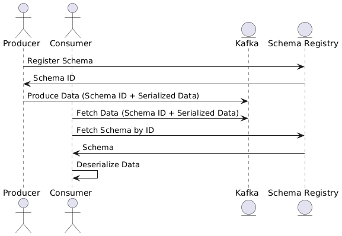

# Avro, Schema Registry i ewolucja schematów

# Ograniczenia JSON jako formatu na Apache Kafka

## Wstęp
JSON (JavaScript Object Notation) jest jednym z najczęściej używanych formatów wymiany danych dzięki swojej czytelności i prostocie. Jednak w kontekście strumieniowania danych w systemach takich jak Apache Kafka, JSON ma wiele ograniczeń, które mogą wpłynąć na wydajność i niezawodność systemu.

---

## Ograniczenia JSON

### 1. **Rozmiar danych**
JSON jest formatem tekstowym, co prowadzi do większych rozmiarów wiadomości w porównaniu do formatów binarnych, takich jak Avro czy Protocol Buffers. W przypadku dużej ilości wiadomości na Kafce, zwiększa to:
- Opóźnienia w transmisji.
- Koszty przechowywania danych.

### 2. **Brak wbudowanego wsparcia dla schematów**
- JSON nie wymusza żadnego schematu (schema-less), co prowadzi do:
    - Potencjalnych błędów, gdy struktura danych zmienia się w czasie.
    - Problemów z walidacją danych i kompatybilnością między producentami a konsumentami.

### 3. **Wydajność przetwarzania**
- Parsowanie JSON jest znacznie wolniejsze niż parsowanie formatów binarnych, co obniża wydajność w systemach o dużym natężeniu danych.

### 4. **Brak wsparcia dla typów binarnych**
- JSON nie obsługuje natywnie typów binarnych (np. obrazów, plików), co wymaga ich konwersji do Base64, zwiększając rozmiar danych.

### 5. **Debugowanie w systemach rozproszonych**
- Brak walidacji struktury danych prowadzi do trudnych do zdiagnozowania błędów w środowiskach produkcyjnych.

---

## Problemy w developmencie z JSON

- **Brak kompatybilności w czasie ewolucji danych:**
    - Nie ma wbudowanego mechanizmu do weryfikacji, czy zmieniony format danych jest zgodny z poprzednią wersją.
- **Redundancja schematu:**
    - Powtarzanie nazw pól w każdym rekordzie JSON znacząco zwiększa rozmiar danych.
- **Błędy typu:**
    - JSON nie weryfikuje typów danych, co prowadzi do błędów w runtime, takich jak wysłanie liczby tam, gdzie oczekiwany jest ciąg znaków.

---

# Frameworki Serializacji

Aby rozwiązać powyższe problemy, stosuje się frameworki serializacji danych, takie jak **Apache Avro**, **Protocol Buffers (ProtoBuf)** i **JSON Schema**.


### Przykłady

#### Avro:
```json
{
  "type": "record",
  "name": "User",
  "namespace": "com.example",
  "fields": [
    {"name": "id", "type": "string"},
    {"name": "name", "type": "string"},
    {"name": "email", "type": "string"}
  ]
}

```

#### ProtoBuf:
```protobuf
syntax = "proto3";

package com.example;

message User {
  string id = 1;
  string name = 2;
  string email = 3;
}

```

#### JSON Schema:
```
???
```

## Wprowadzenie do frameworków serializacji

1. **Apache Avro**
    - Binarny format serializacji oparty na schematach.
    - Obsługuje ewolucję schematów (backward, forward i full compatibility).
    - Kompaktowy format danych z wydajną serializacją/deserializacją.

2. **Protocol Buffers (ProtoBuf)**
    - Format binarny opracowany przez Google.
    - Wysoka wydajność i minimalny rozmiar danych.
    - Wymaga skompilowania schematów przed użyciem.

3. **JSON Schema**
    - Tekstowy format schematów dla JSON.
    - Pozwala na walidację struktury danych, ale nie rozwiązuje problemu dużych rozmiarów.

---


# Porównanie Avro, ProtoBuf i JSON

| **Cechy**                    | **Apache Avro**                      | **Protocol Buffers (ProtoBuf)**        | **JSON**                                |
|-------------------------------|---------------------------------------|----------------------------------------|-----------------------------------------|
| **Format**                   | Binarny                              | Binarny                               | Tekstowy                                |
| **Rozmiar danych**           | Kompaktowy                           | Najmniejszy                           | Duży                                    |
| **Wydajność**                | Wysoka                               | Bardzo wysoka                         | Niska                                   |
| **Wsparcie dla schematów**   | Tak, przechowywany osobno            | Tak, wymaga kompilacji                | Brak natywnego wsparcia                 |
| **Ewolucja schematów**       | Obsługiwane (backward, forward, full)| Obsługiwane (ale bardziej restrykcyjne)| Nieobsługiwane                          |
| **Czytelność**               | Niska (binarny format)               | Niska (binarny format)                | Wysoka                                  |
| **Obsługa typów binarnych**  | Tak                                  | Tak                                   | Nie (wymaga Base64)                     |


---

# Wydajność Avro, ProtoBuf, JSON i jak to naprawdę jest? Prawdy i mity.

---

# Wnioski

- **JSON** jest odpowiedni dla prostych przypadków użycia i małych aplikacji, gdzie czytelność danych jest priorytetem.
- **Apache Avro** najlepiej sprawdza się w środowiskach Big Data (np. Kafka, Hadoop), gdzie kluczowa jest ewolucja schematów i kompaktowość.
- **Protocol Buffers (ProtoBuf)** to dobry wybór do systemów o dużej wydajności, szczególnie w komunikacji między mikroserwisami.

---

# Wstęp do Apache Avro

## Co to jest Apache Avro?

Apache Avro to system serializacji danych zaprojektowany z myślą o efektywnym przesyłaniu danych w systemach rozproszonych. Avro jest częścią ekosystemu Apache Hadoop i jest powszechnie stosowany do serializacji danych w systemach Big Data. Schematy Avro są zapisane w formacie JSON, a dane są serializowane w binarnym formacie, co zapewnia kompaktowość i szybkość.

## Główne cechy Avro:
- **Schema-first**: Avro opiera się na schematach (schemas), które definiują strukturę danych.
- **Kompaktowość**: Dane Avro są przechowywane w formacie binarnym, co zmniejsza ich rozmiar.
- **Obsługa wielu języków**: Obsługuje różne języki programowania, takie jak Java, Python, C++, Ruby itp.
- **Ewolucja schematu**: Zapewnia wsparcie dla zmian schematów przy zachowaniu kompatybilności (backward, forward, i full compatibility).

---

### Przykład Schematu Avro

#### Schemat:
```json
{
  "type": "record",
  "name": "User",
  "fields": [
    {"name": "id", "type": "string"},
    {"name": "name", "type": "string"},
    {"name": "email", "type": "string"}
  ]
}
```

### Dane + schemat:

```json
{
  "schema": {
    "type": "record",
    "name": "User",
    "fields": [
      {"name": "id", "type": "string"},
      {"name": "name", "type": "string"},
      {"name": "email", "type": "string"}
    ]
  },
  "data": {
    "id": "1",
    "name": "John Doe",
    "email": "john.doe@example.com"
  }
}
```


---

## Plusy zastosowania Apache Avro

1. **Kompaktowy format**:
    - Dane są serializowane w formacie binarnym, co pozwala na zmniejszenie rozmiaru plików i szybsze przesyłanie w sieci.

2. **Szybkość**:
    - Serializacja i deserializacja w Avro jest wydajna w porównaniu do formatów tekstowych, takich jak JSON czy XML.

3. **Wsparcie dla ewolucji schematu**:
    - Możliwość dodawania, usuwania lub modyfikowania pól przy zachowaniu kompatybilności między wersjami.

4. **Zgodność z wieloma językami**:
    - Umożliwia współpracę systemów napisanych w różnych językach programowania.

5. **Wsparcie dla Big Data**:
    - Świetnie integruje się z ekosystemem Hadoop oraz platformami przetwarzania strumieniowego, takimi jak Apache Kafka.

6. **Bez metadanych w danych**:
    - Schemat danych nie jest przechowywany w każdym rekordzie, co redukuje narzut.

---

## Minusy zastosowania Apache Avro

1. **Binarny format**:
    - Dane w Avro są trudne do debugowania bez odpowiednich narzędzi (np. narzędzi Avro lub Schema Registry).

2. **Brak samodzielnego schematu w danych**:
    - Schemat musi być przechowywany oddzielnie (np. w Apache Schema Registry), co dodaje złożoności w zarządzaniu.

3. **Złożoność ewolucji schematów**:
    - Konieczność dbałości o kompatybilność schematów przy każdej zmianie.

4. **Większe wymagania wstępne**:
    - Wymaga wcześniejszego zdefiniowania schematu, co nie zawsze jest możliwe w systemach, gdzie dane są nieustrukturyzowane.

---

## Kiedy warto stosować Apache Avro?
- W systemach Big Data, gdzie ważna jest efektywna serializacja danych (np. Hadoop, Kafka).
- W środowiskach, które wymagają ewolucji schematów danych.
- Gdy potrzebny jest kompaktowy i szybki format danych do przesyłania w sieciach.

## Kiedy unikać Apache Avro?
- W systemach, gdzie dane są wysoce nieustrukturyzowane lub schematy zmieniają się dynamicznie.

---

# Apache Schema Registry, Specific i Generic Consumer oraz Flow Danych

## Co to jest Schema Registry?

**Apache Schema Registry** to centralne repozytorium schematów danych używane w systemach takich jak Apache Kafka. Jego główne zadania to:

- **Rejestrowanie schematów** – Producent rejestruje schemat w Registry i otrzymuje unikalny identyfikator (ID).
- **Walidacja zgodności schematów** – Sprawdzanie, czy nowy schemat jest zgodny z istniejącymi (Backward, Forward, Full Compatibility).
- **Odczytywanie schematów** – Konsument może pobrać schemat na podstawie ID i użyć go do deserializacji danych.

---

## Dlaczego warto używać Schema Registry?

### Problemy bez Schema Registry:

- **Powielanie schematów** – Schematy są przesyłane z każdym rekordem, co zwiększa rozmiar danych.
- **Brak walidacji zgodności** – Producent może zmienić strukturę danych w sposób, który uniemożliwi ich odczyt przez konsumenta.
- **Problemy z debugowaniem** – Niespójności schematów mogą prowadzić do trudnych do diagnozowania błędów.

### Zalety używania Schema Registry:

1. **Centralne zarządzanie schematami** – Wszystkie schematy są przechowywane w jednym miejscu, co ułatwia ich zarządzanie.
2. **Zmniejszenie rozmiaru danych** – W Kafka Topics przesyłane są tylko dane binarne zawierające ID schematu.
3. **Wsparcie dla ewolucji schematów** – Umożliwia wprowadzanie zmian w strukturze danych bez przerywania działania systemu.
4. **Obsługa różnych formatów** – Schema Registry wspiera Avro, Protocol Buffers (ProtoBuf) oraz JSON Schema.

---

## Typy Konsumentów: Specific i Generic

Konsument deserializuje dane pobrane z Kafka Topics, korzystając ze schematów przechowywanych w Schema Registry. Istnieją dwa główne podejścia: **Specific Consumer** i **Generic Consumer**.

### Specific Consumer

**Specific Consumer** korzysta z klas wygenerowanych na podstawie schematu. Klasy te są tworzone przed użyciem (np. z Avro lub ProtoBuf) i zapewniają silne typowanie.

- **Zastosowanie**:
    - Stabilne środowiska z niewielką liczbą zmian schematów.
    - Systemy, gdzie kluczowe jest silne typowanie i wydajność.

- **Zalety**:
    - Silne typowanie.
    - Łatwość użycia dzięki wbudowanej obsłudze klas w IDE.

- **Wady**:
    - Wymaga generowania kodu przy każdej zmianie schematu.
    - Mniej elastyczny w przypadku dynamicznych schematów.

- **Przykład w Javie**:
```java
  SpecificRecord record = new Transaction();
  record.setId("123");
  record.setSource("App");
```
### Generic Consumer

**Generic Consumer** nie wymaga wcześniejszego generowania klas. Dane są deserializowane na podstawie schematu pobranego z Registry w czasie działania aplikacji (**runtime**).

#### Zastosowanie:
- Dynamiczne środowiska, gdzie schematy zmieniają się często.
- Systemy integracyjne z wieloma różnorodnymi schematami.

#### Zalety:
- Brak potrzeby generowania kodu.
- Większa elastyczność w przypadku częstych zmian schematów.

#### Wady:
- Brak silnego typowania – potencjalne błędy runtime.
- Niższa wydajność niż Specific Consumer (z powodu dodatkowego obciążenia podczas runtime).

#### Przykład w Javie:
```java
GenericRecord record = (GenericRecord) consumerRecord.value();
String id = record.get("id").toString();
```

### Porównanie Specific i Generic Consumer

| **Cechy**                 | **Specific Consumer**                | **Generic Consumer**                 |
|----------------------------|--------------------------------------|--------------------------------------|
| **Generowanie kodu**       | Wymagane (np. Avro -> Java)          | Niewymagane                          |
| **Typowanie**              | Silne typowanie                     | Dynamiczne (luźne typowanie)         |
| **Wydajność**              | Wyższa                              | Niższa (runtime overhead)            |
| **Elastyczność**           | Mniej elastyczny                    | Bardziej elastyczny                  |
| **Kompatybilność schematów** | Stabilne schematy                  | Dynamiczne schematy                  |
| **Złożoność utrzymania**   | Wymaga aktualizacji wygenerowanego kodu przy zmianie schematu | Brak potrzeby aktualizacji kodu      |
| **Debugowanie**            | Łatwiejsze dzięki silnemu typowaniu  | Trudniejsze, potencjalne błędy runtime |
| **Przypadki użycia**       | Stabilne środowiska z określonymi schematami | Dynamiczne lub integracyjne środowiska |
| **Obsługa różnych schematów** | Ograniczona do wygenerowanych klas | Obsługuje wiele schematów w runtime  |

---

### Flow Danych w Systemie z Apache Avro i Schema Registry


---

### Budowanie aplikacji i uruchmienie aplikacji

```bash
  mvn clean package
```

```bash
  docker build -t spring-kafka-avro .
```

```bash
  docker run --network mynetwork spring-kafka-avro
```

### Przygotowanie środowiska

```bash
    docker run --rm --network mynetwork confluentinc/cp-kafka:7.7.1 kafka-topics --create --topic spring-avro-topic --partitions 3 --replication-factor 3 --if-not-exists --bootstrap-server kafka-1:29092,kafka-2:39092,kafka-3:49092
```

### Przygotowanie środowiska

```bash

docker run -d --rm --name schema-registry --network mynetwork -p 8081:8081 -e SCHEMA_REGISTRY_KAFKASTORE_BOOTSTRAP_SERVERS=kafka-1:29092,kafka-2:39092,kafka-3:49092 -e SCHEMA_REGISTRY_HOST_NAME=schema-registry -e SCHEMA_REGISTRY_LISTENERS=http://0.0.0.0:8081 confluentinc/cp-schema-registry:7.7.1
```

### Usuń wcześniejszą instancję Kafka UI i uruchom nową

```bash

docker run -d --rm --name kafka-ui --network mynetwork -p 8080:8080 -e KAFKA_CLUSTERS_0_NAME=local-cluster -e KAFKA_CLUSTERS_0_BOOTSTRAP_SERVERS=kafka-1:29092,kafka-2:39092,kafka-3:49092 -e KAFKA_CLUSTERS_0_SCHEMA_REGISTRY=http://schema-registry:8081 provectuslabs/kafka-ui:latest
```

### Zaimplementuj bazowy schemat

```avroschema
{
  "type": "record",
  "name": "Transaction",
  "namespace": "com.sages.avro",
  "fields": [
    {"name": "id", "type": "string"},
    {"name": "source", "type": "string"}
  ]
}
````

### Zaimplementuj wysyłanie wiadomości w klasie `SenderJob`

```java
@Scheduled(fixedRate = 15000)
public void schedule() {
    Transaction transaction = Transaction.newBuilder()
            .setId(UUID.randomUUID().toString())
            .setSource("SENDER_JOB")
            .build();
    
    kafkaTemplate.send(TOPIC, UUID.randomUUID().toString(), transaction);
}
```

### Wygeneruj schematy

```bash
  mvn generate-sources
```

### W oknie Maven wybiersz `Reload All Maven Projects`

### Przebuduj i uruchom aplikację
```bash
  mvn clean package
  docker build -t spring-kafka-avro .   
  docker run --network  mynetwork spring-kafka-avro
```

### Zaobserwuj odebrane wiadomości w logach aplikacji a następnie w Kafka UI

### Dodaj pole `desc` do schematu z domyślną wartością (zmiana wstecznie kompatybilna)

```avroschema
{
  "type": "record",
  "name": "Transaction",
  "namespace": "com.sages.avro",
  "fields": [
    {"name": "id", "type": "string"},
    {"name": "source", "type": "string"},
    {"name": "desc", "type": "string", "default": "DEFAULT"}
  ]
}
```

### Przeczytajmy od początku

```bash
  docker run --rm --network mynetwork confluentinc/cp-kafka:7.7.1 kafka-consumer-groups --bootstrap-server kafka-1:29092,kafka-2:39092,kafka-3:49092 --group my-group-avro --reset-offsets --to-earliest --execute --topic spring-avro-topic
```

### Zmiana poziomu kompatybilności schematu

### Dodaj pole `test` bez defaultowej wartości

```avroschema
{
  "type": "record",
  "name": "Transaction",
  "namespace": "com.sages.avro",
  "fields": [
    {"name": "id", "type": "string"},
    {"name": "source", "type": "string"},
    {"name": "desc", "type": "string", "default": "DEFAULT"},
    {"name": "test", "type": "string"}
  ]
}
```

### Schema Registry API

| **Endpoint**                                      | **Metoda** | **Opis**                                                                                   | **Przykład Użycia**                                                                                       |
|---------------------------------------------------|------------|-------------------------------------------------------------------------------------------|-----------------------------------------------------------------------------------------------------------|
| `/subjects/{subject}/versions`                    | `POST`     | Rejestruje nowy schemat dla określonego tematu (subject).                                 | Rejestrowanie nowego schematu.                                                                            |
| `/subjects/{subject}/versions`                    | `GET`      | Pobiera listę wszystkich wersji schematu dla tematu.                                      | `curl -X GET http://localhost:8081/subjects/Transaction-value/versions`                                   |
| `/schemas/ids/{id}`                               | `GET`      | Pobiera schemat według ID.                                                                | `curl -X GET http://localhost:8081/schemas/ids/1`                                                        |
| `/compatibility/subjects/{subject}/versions/{v}`  | `POST`     | Weryfikuje kompatybilność nowego schematu z określoną wersją istniejącego schematu.       | Sprawdzenie kompatybilności z najnowszym schematem.                                                      |
| `/subjects`                                       | `GET`      | Pobiera listę wszystkich tematycznych schematów (subjects).                               | `curl -X GET http://localhost:8081/subjects`                                                             |
| `/subjects/{subject}`                             | `DELETE`   | Usuwa wszystkie schematy dla danego tematu.                                               | `curl -X DELETE http://localhost:8081/subjects/Transaction-value`                                         |
| `/subjects/{subject}/versions/{version}`          | `DELETE`   | Usuwa określoną wersję schematu dla danego tematu.                                        | `curl -X DELETE http://localhost:8081/subjects/Transaction-value/versions/1`                              |
| `/config`                                         | `GET`      | Pobiera globalne reguły kompatybilności.                                                  | `curl -X GET http://localhost:8081/config`                                                               |
| `/config/{subject}`                               | `GET`      | Pobiera reguły kompatybilności dla danego tematu.                                         | `curl -X GET http://localhost:8081/config/Transaction-value`                                              |
| `/config`                                         | `PUT`      | Ustawia globalne reguły kompatybilności.                                                  | `curl -X PUT -H "Content-Type: application/vnd.schemaregistry.v1+json" --data '{"compatibility":"FULL"}'` |
| `/config/{subject}`                               | `PUT`      | Ustawia reguły kompatybilności dla danego tematu.                                         | `curl -X PUT -H "Content-Type: application/vnd.schemaregistry.v1+json" --data '{"compatibility":"BACKWARD"}' http://localhost:8081/config/Transaction-value` |


```bash
  curl -X PUT -H "Content-Type: application/vnd.schemaregistry.v1+json" --data '{"compatibility": "FORWARD"}' http://localhost:8081/config/spring-avro-topic-value
```

### Spróbuj wysłać wiadomość z nowym schematem

### Tabela Kompatybilności Schematów Avro

| **Typ Kompatybilności** | **Opis**                                                                                          | **Zastosowania**                                                                                     |
|--------------------------|--------------------------------------------------------------------------------------------------|------------------------------------------------------------------------------------------------------|
| **Backward**            | Nowy schemat może odczytywać dane zapisane w starszym schemacie.                                  | - Aktualizacja konsumentów przed producentami.                                                      |
| **Forward**             | Stary schemat może odczytywać dane zapisane w nowym schemacie.                                    | - Aktualizacja producentów przed konsumentami.                                                      |
| **Full**                | Łączy kompatybilność **Backward** i **Forward** – zarówno nowy, jak i stary schemat są zgodne.    | - Bezpieczna ewolucja schematów, gdzie konsument i producent mogą działać na różnych wersjach.       |
| **None**                | Brak wymagań kompatybilności – dowolne zmiany są akceptowane.                                     | - Gdy kompatybilność nie jest krytyczna (np. w eksperymentalnych aplikacjach).                      |
| **Backward Transitive** | Wszystkie wersje nowego schematu są zgodne z każdą poprzednią wersją schematu.                    | - Długoterminowe utrzymanie kompatybilności z każdą wcześniejszą wersją.                            |
| **Forward Transitive**  | Każda wcześniejsza wersja schematu jest zgodna z każdą kolejną wersją schematu.                   | - Długoterminowe utrzymanie kompatybilności przy aktualizacji producentów przed konsumentami.       |
| **Full Transitive**     | Łączy **Backward Transitive** i **Forward Transitive** – pełna zgodność między wszystkimi wersjami. | - Utrzymanie pełnej zgodności w złożonych systemach wymagających stabilności i elastyczności.       |


### Zmiany kompatybilne w Schema Registry

| Rodzaj zmiany                     | Backward | Forward | Full |
|----------------------------------|:--------:|:-------:|:----:|
| Dodanie pola z `default`         | ✅       | ✅      | ✅   |
| Dodanie pola bez `default`       | ❌       | ✅      | ❌   |
| Usunięcie pola                   | ✅       | ❌      | ❌   |
| Zmiana typu                      | ❌       | ❌      | ❌   |
| Kolejność pól                    | ✅       | ✅      | ✅   |
| Typ prosty → unia z `null`       | ✅       | ❌      | ❌   |
| Unia z `null` → typ prosty       | ❌       | ✅      | ❌   |
| Dodanie pola `["null", typ]`     | ✅       | ✅      | ✅   |
| Zmiana nazwy z aliasem           | ✅       | ❌      | ❌   |

---

# ENG

# Avro, Schema Registry and Schema Evolution

# Limitations of JSON as a format on Apache Kafka

## Introduction
JSON (JavaScript Object Notation) is one of the most widely used data exchange formats due to its readability and simplicity. However, in the context of data streaming systems such as Apache Kafka, JSON has several limitations that can impact system performance and reliability.

---

## JSON Limitations

### 1. **Message size**
JSON is a text-based format, which results in larger message sizes compared to binary formats such as Avro or Protocol Buffers. With high message volumes in Kafka, this increases:
- Transmission latency
- Data storage costs

### 2. **No built‑in schema support**
- JSON is schema‑less, which leads to:
    - Potential errors when the data structure evolves over time
    - Challenges with data validation and compatibility between producers and consumers

### 3. **Processing performance**
- Parsing JSON is significantly slower than parsing binary formats, reducing throughput in high‑volume systems.

### 4. **No native binary type support**
- JSON does not natively support binary types (e.g., images, files), requiring Base64 encoding which further increases message size.

### 5. **Debugging in distributed systems**
- The lack of structural validation can lead to hard‑to‑diagnose errors in production environments.

---

## Development Challenges with JSON

- **Lack of backwards/forwards compatibility:**  
  No built‑in mechanism to verify that a changed data format remains compatible with previous versions.
- **Schema redundancy:**  
  Repeating field names in every JSON record significantly increases message size.
- **Type errors:**  
  JSON does not enforce data types, leading to runtime errors (e.g., sending a number where a string is expected).

---

# Serialization Frameworks

To address these issues, data serialization frameworks such as **Apache Avro**, **Protocol Buffers (ProtoBuf)**, and **JSON Schema** are commonly used.

### Examples

#### Avro:
```json
{
  "type": "record",
  "name": "User",
  "namespace": "com.example",
  "fields": [
    {"name": "id", "type": "string"},
    {"name": "name", "type": "string"},
    {"name": "email", "type": "string"}
  ]
}

```

#### ProtoBuf:
```protobuf
syntax = "proto3";

package com.example;

message User {
  string id = 1;
  string name = 2;
  string email = 3;
}

```

#### JSON Schema:
```
???
```

## Introduction to Serialization Frameworks

1. **Apache Avro**
    - A binary, schema‑based serialization format.
    - Supports schema evolution (backward, forward, and full compatibility).
    - Compact data format with efficient serialization/deserialization.

2. **Protocol Buffers (ProtoBuf)**
    - A binary format developed by Google.
    - High performance and minimal message size.
    - Requires compiling schemas before use.

3. **JSON Schema**
    - A text‑based schema format for JSON.
    - Allows data structure validation but does not solve the large‑message‑size problem.

---

# Comparison of Avro, ProtoBuf, and JSON

| **Feature**                   | **Apache Avro**                          | **Protocol Buffers (ProtoBuf)**        | **JSON**                                |
|--------------------------------|------------------------------------------|----------------------------------------|-----------------------------------------|
| **Format**                    | Binary                                   | Binary                                 | Text                                    |
| **Message size**              | Compact                                  | Smallest                               | Large                                   |
| **Performance**               | High                                     | Very high                              | Low                                     |
| **Schema support**            | Yes, stored separately                   | Yes, requires compilation              | No native support                       |
| **Schema evolution**          | Supported (backward, forward, full)      | Supported (but more restrictive)       | Not supported                           |
| **Readability**               | Low (binary format)                      | Low (binary format)                    | High                                    |
| **Binary type support**       | Yes                                      | Yes                                    | No (requires Base64)                    |

---

# Real‑World Performance: Avro, ProtoBuf, JSON – Myths & Truths

---

# Conclusions

- **JSON** is suitable for simple use cases and small applications where data readability is the priority.
- **Apache Avro** excels in Big Data environments (e.g., Kafka, Hadoop) where schema evolution and compactness are critical.
- **Protocol Buffers (ProtoBuf)** are ideal for high‑performance systems, especially in microservices communication.

---

# Introduction to Apache Avro

## What is Apache Avro?

Apache Avro is a data serialization system designed for efficient data exchange in distributed systems. It is part of the Apache Hadoop ecosystem and is widely used for data serialization in Big Data platforms. Avro schemas are defined in JSON, and data is serialized in a compact binary format to ensure efficiency and speed.

## Key Features of Avro:
- **Schema‑first**: Relies on schemas that define the structure of the data.
- **Compactness**: Stores data in a binary format to reduce message size.
- **Multi‑language support**: Works with Java, Python, C++, Ruby, and more.
- **Schema evolution**: Supports schema changes while maintaining compatibility (backward, forward, and full).

---

### Avro Schema Example

#### Schema:
```json
{
  "type": "record",
  "name": "User",
  "fields": [
    {"name": "id", "type": "string"},
    {"name": "name", "type": "string"},
    {"name": "email", "type": "string"}
  ]
}
```

### Data + Schema:

```json
{
  "schema": {
    "type": "record",
    "name": "User",
    "fields": [
      {"name": "id", "type": "string"},
      {"name": "name", "type": "string"},
      {"name": "email", "type": "string"}
    ]
  },
  "data": {
    "id": "1",
    "name": "John Doe",
    "email": "john.doe@example.com"
  }
}
```

---
## Advantages of Using Apache Avro

1. **Compact format**
    - Data is serialized in a binary format, reducing file size and speeding up network transfer.

2. **Speed**
    - Avro serialization and deserialization are more efficient compared to text formats like JSON or XML.

3. **Schema evolution support**
    - You can add, remove, or modify fields while maintaining compatibility between versions.

4. **Multi‑language compatibility**
    - Works across systems written in different programming languages.

5. **Big Data integration**
    - Integrates seamlessly with the Hadoop ecosystem and streaming platforms such as Apache Kafka.

6. **No per‑record metadata overhead**
    - Schemas are stored separately, not with each record, reducing message overhead.

---

## Disadvantages of Using Apache Avro

1. **Binary format**
    - Avro data is not human‑readable without specialized tools (e.g., Avro tools or Schema Registry UI).

2. **External schema storage**
    - Schemas must be stored separately (e.g., in Apache Schema Registry), adding operational complexity.

3. **Schema evolution complexity**
    - You must carefully maintain compatibility rules whenever schemas change.

4. **Up‑front schema requirement**
    - Schemas must be defined in advance, which isn’t always possible for highly unstructured data.

---

## When to Use Apache Avro?
- In Big Data systems where efficient data serialization is critical (e.g., Hadoop, Kafka).
- In environments that require schema evolution.
- When you need a compact, high‑performance binary format for network transmission.

## When to Avoid Apache Avro?
- In systems with highly unstructured data or where schemas change too frequently to manage.

---

# Apache Schema Registry, Specific vs. Generic Consumers, and Data Flow

## What is Schema Registry?

The **Apache Schema Registry** is a central repository for data schemas used by systems like Apache Kafka. Its main functions are:

- **Schema registration** – Producers register schemas in the registry and receive a unique schema ID.
- **Compatibility validation** – Ensures new schemas are compatible with existing ones (backward, forward, or full compatibility).
- **Schema retrieval** – Consumers fetch schemas by ID to deserialize data.

---

## Why Use Schema Registry?

### Problems Without Schema Registry:
- **Schema duplication** – Schemas are sent with every record, inflating message size.
- **No compatibility checks** – Producers can change data structures in ways that break consumers.
- **Debugging challenges** – Schema mismatches cause hard‑to‑diagnose errors.

### Benefits of Using Schema Registry:
1. **Centralized schema management** – All schemas are stored in one place, simplifying administration.
2. **Reduced message size** – Kafka topics carry only the binary data plus the schema ID.
3. **Schema evolution support** – Change data structures without downtime.
4. **Multi‑format support** – Works with Avro, Protocol Buffers, and JSON Schema.

---

## Consumer Types: Specific vs. Generic

Consumers deserialize data from Kafka topics using schemas stored in Schema Registry. There are two main approaches: **Specific Consumer** and **Generic Consumer**.

### Specific Consumer

**Specific Consumers** use classes generated from the schema ahead of time (e.g., via Avro or ProtoBuf tools), providing strong typing.

- **Use cases**
    - Stable environments with infrequent schema changes.
    - Systems that prioritize strong typing and performance.

- **Advantages**
    - Strongly typed objects.
    - IDE support for generated classes.

- **Disadvantages**
    - Requires regenerating code whenever schemas change.
    - Less flexible for dynamic schemas.


- **Java Example**:
```java
  SpecificRecord record = new Transaction();
  record.setId("123");
  record.setSource("App");
```
### Generic Consumer

**Generic Consumer** does not require pre‑generated classes. Data is deserialized at runtime using the schema fetched from the Registry.

#### Use cases
- Dynamic environments where schemas change frequently.
- Integration systems handling many diverse schemas.

#### Advantages
- No code generation required.
- Greater flexibility for frequent schema changes.

#### Disadvantages
- Lack of strong typing – potential runtime errors.
- Lower performance compared to Specific Consumer due to runtime schema handling.


#### Java Example:
```java
GenericRecord record = (GenericRecord) consumerRecord.value();
String id = record.get("id").toString();
```

### Comparison: Specific vs. Generic Consumer

| **Feature**                    | **Specific Consumer**                                             | **Generic Consumer**                                              |
|--------------------------------|-------------------------------------------------------------------|-------------------------------------------------------------------|
| **Code generation**            | Required (e.g., Avro → Java)                                      | Not required                                                      |
| **Typing**                     | Strong typing                                                    | Dynamic (loose typing)                                            |
| **Performance**                | Higher                                                           | Lower (runtime overhead)                                          |
| **Flexibility**                | Less flexible                                                    | More flexible                                                    |
| **Schema compatibility**       | Stable schemas                                                   | Dynamic schemas                                                  |
| **Maintenance complexity**     | Requires updating generated code when schemas change             | No code updates needed                                           |
| **Debugging**                  | Easier due to strong typing                                      | Harder, with potential runtime errors                            |
| **Use cases**                  | Stable environments with fixed schemas                           | Dynamic or integration environments                              |
| **Multi‑schema support**       | Limited to generated classes                                     | Supports multiple schemas at runtime                             |


### Data Flow in Avro and Schema Registry System


---

### Building and Running the Application

```bash
  mvn clean package
```

```bash
  docker build -t spring-kafka-avro .
```

```bash
  docker run --network mynetwork spring-kafka-avro
```

### Prepare the Environment

```bash
    docker run --rm --network mynetwork confluentinc/cp-kafka:7.7.1 kafka-topics --create --topic spring-avro-topic --partitions 3 --replication-factor 3 --if-not-exists --bootstrap-server kafka-1:29092,kafka-2:39092,kafka-3:49092
```

### Prepare the Environment

```bash

docker run -d --rm --name schema-registry --network mynetwork -p 8081:8081 -e SCHEMA_REGISTRY_KAFKASTORE_BOOTSTRAP_SERVERS=kafka-1:29092,kafka-2:39092,kafka-3:49092 -e SCHEMA_REGISTRY_HOST_NAME=schema-registry -e SCHEMA_REGISTRY_LISTENERS=http://0.0.0.0:8081 confluentinc/cp-schema-registry:7.7.1
```

### Remove the previous Kafka UI instance and run a new one

```bash

docker run -d --rm --name kafka-ui --network mynetwork -p 8080:8080 -e KAFKA_CLUSTERS_0_NAME=local-cluster -e KAFKA_CLUSTERS_0_BOOTSTRAP_SERVERS=kafka-1:29092,kafka-2:39092,kafka-3:49092 -e KAFKA_CLUSTERS_0_SCHEMA_REGISTRY=http://schema-registry:8081 provectuslabs/kafka-ui:latest
```

### Implement the base schema

```avroschema
{
  "type": "record",
  "name": "Transaction",
  "namespace": "com.sages.avro",
  "fields": [
    {"name": "id", "type": "string"},
    {"name": "source", "type": "string"}
  ]
}
````

### Implement sending messages in the `SenderJob` class

```java
@Scheduled(fixedRate = 15000)
public void schedule() {
    Transaction transaction = Transaction.newBuilder()
            .setId(UUID.randomUUID().toString())
            .setSource("SENDER_JOB")
            .build();
    
    kafkaTemplate.send(TOPIC, UUID.randomUUID().toString(), transaction);
}
```

### Generate Schemas

```bash
  mvn generate-sources
```

### In the Maven window, select `Reload All Maven Projects`

### Rebuild and run the application
```bash
  mvn clean package
  docker build -t spring-kafka-avro .   
  docker run --network  mynetwork spring-kafka-avro
```

### Observe received messages in the application logs and then in Kafka UI

### Add a `desc` field to the schema with a default value (backward compatible change)

```avroschema
{
  "type": "record",
  "name": "Transaction",
  "namespace": "com.sages.avro",
  "fields": [
    {"name": "id", "type": "string"},
    {"name": "source", "type": "string"},
    {"name": "desc", "type": "string", "default": "DEFAULT"}
  ]
}
```

### Read from the beginning

```bash
  docker run --rm --network mynetwork confluentinc/cp-kafka:7.7.1 kafka-consumer-groups --bootstrap-server kafka-1:29092,kafka-2:39092,kafka-3:49092 --group my-group-avro --reset-offsets --to-earliest --execute --topic spring-avro-topic
```

### Change the schema compatibility level

### Add a `test` field without a default value

```avroschema
{
  "type": "record",
  "name": "Transaction",
  "namespace": "com.sages.avro",
  "fields": [
    {"name": "id", "type": "string"},
    {"name": "source", "type": "string"},
    {"name": "desc", "type": "string", "default": "DEFAULT"},
    {"name": "test", "type": "string"}
  ]
}
```

### Schema Registry API

| **Endpoint**                                      | **Method** | **Description**                                                                                   | **Example Usage**                                                                                       |
|---------------------------------------------------|------------|---------------------------------------------------------------------------------------------------|---------------------------------------------------------------------------------------------------------|
| `/subjects/{subject}/versions`                    | `POST`     | Registers a new schema for the specified subject.                                                | Register a new schema.                                                                                  |
| `/subjects/{subject}/versions`                    | `GET`      | Retrieves a list of all schema versions for the subject.                                         | `curl -X GET http://localhost:8081/subjects/Transaction-value/versions`                                 |
| `/schemas/ids/{id}`                               | `GET`      | Fetches a schema by its ID.                                                                      | `curl -X GET http://localhost:8081/schemas/ids/1`                                                      |
| `/compatibility/subjects/{subject}/versions/{v}`  | `POST`     | Checks compatibility of a new schema against a specific version of an existing schema.           | Verify compatibility against the latest schema version.                                                |
| `/subjects`                                       | `GET`      | Retrieves a list of all subjects (schema topics).                                                | `curl -X GET http://localhost:8081/subjects`                                                           |
| `/subjects/{subject}`                             | `DELETE`   | Deletes all schemas under the specified subject.                                                 | `curl -X DELETE http://localhost:8081/subjects/Transaction-value`                                       |
| `/subjects/{subject}/versions/{version}`          | `DELETE`   | Deletes a specific schema version under the subject.                                             | `curl -X DELETE http://localhost:8081/subjects/Transaction-value/versions/1`                            |
| `/config`                                         | `GET`      | Retrieves the global compatibility rules.                                                        | `curl -X GET http://localhost:8081/config`                                                             |
| `/config/{subject}`                               | `GET`      | Retrieves compatibility rules for the specified subject.                                         | `curl -X GET http://localhost:8081/config/Transaction-value`                                            |
| `/config`                                         | `PUT`      | Sets global compatibility rules.                                                                 | `curl -X PUT -H "Content-Type: application/vnd.schemaregistry.v1+json" --data '{"compatibility":"FULL"}'` |
| `/config/{subject}`                               | `PUT`      | Sets compatibility rules for the specified subject.                                              | `curl -X PUT -H "Content-Type: application/vnd.schemaregistry.v1+json" --data '{"compatibility":"BACKWARD"}' http://localhost:8081/config/Transaction-value` |


```bash
  curl -X PUT -H "Content-Type: application/vnd.schemaregistry.v1+json" --data '{"compatibility": "FORWARD"}' http://localhost:8081/config/spring-avro-topic-value
```

### Try sending a message with the new schema

### Schema Compatibility Table

| **Compatibility Type**         | **Description**                                                                                       | **Use Cases**                                                                                             |
|--------------------------------|-------------------------------------------------------------------------------------------------------|-----------------------------------------------------------------------------------------------------------|
| **Backward**                   | New schema can read data written by the previous schema.                                              | - Update consumers before producers.                                                                      |
| **Forward**                    | Old schema can read data written by the new schema.                                                   | - Update producers before consumers.                                                                      |
| **Full**                       | Combines **Backward** and **Forward** compatibility—both new and old schemas are compatible.           | - Safe schema evolution when producers and consumers run different versions simultaneously.               |
| **None**                       | No compatibility requirements—any change is accepted.                                                  | - When compatibility is not critical (e.g., experimental applications).                                   |
| **Backward Transitive**        | Every version of the new schema is compatible with every previous schema version.                     | - Long‑term maintenance of compatibility with all past versions.                                          |
| **Forward Transitive**         | Every previous schema version is compatible with every subsequent version.                           | - Long‑term maintenance of producer‑first updates before consumers.                                        |
| **Full Transitive**            | Combines **Backward Transitive** and **Forward Transitive**—full compatibility across all versions.    | - Ensuring end‑to‑end compatibility in complex systems requiring stability and flexibility.               |

---

### Compatible Schema Changes in Schema Registry

| Type of Change                             | Backward | Forward | Full |
|--------------------------------------------|:--------:|:-------:|:----:|
| Adding a field with a `default`            | ✅       | ✅      | ✅   |
| Adding a field without a `default`         | ❌       | ✅      | ❌   |
| Removing a field                           | ✅       | ❌      | ❌   |
| Changing a field type                      | ❌       | ❌      | ❌   |
| Changing field order                       | ✅       | ✅      | ✅   |
| Simple type → union with `null`            | ✅       | ❌      | ❌   |
| Union with `null` → simple type            | ❌       | ✅      | ❌   |
| Adding a field of type `["null", type]`    | ✅       | ✅      | ✅   |
| Renaming a field using `aliases`           | ✅       | ❌      | ❌   |


---
